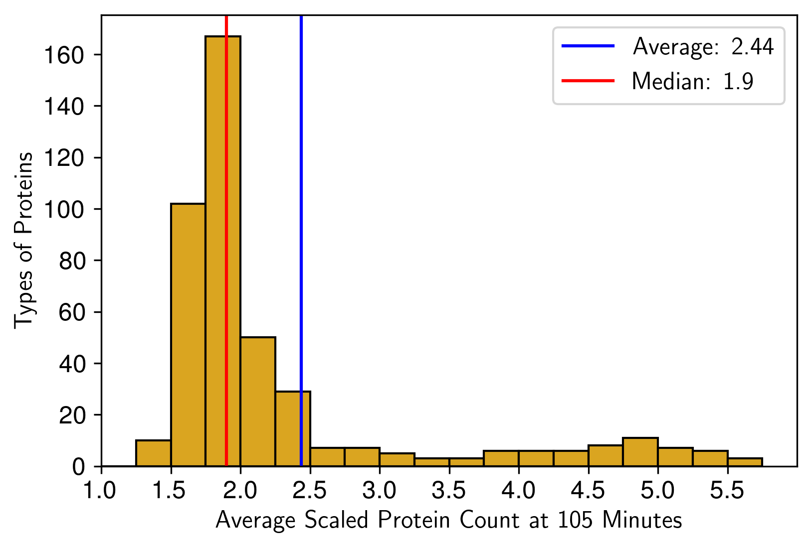

# 4D Whole-Cell Model (4DWCM) of *JCVI-syn3A*

## Description:


In the ***4D Whole-Cell Model (4DWCM) of JCVI-syn3A*** tutorial, you will explore the trajectories of the most comprehensive computational model of a living minimal cell. The 4DWCM integrates four numerical algorithms (RDME-CME-ODE-BD) to simulate every molecular event during the entire 105-minute division cycle of the genetically minimal bacterium JCVI-syn3A[^thornburg_4DWCM]. Due to the fact that 4DWCM will take several days even on A100 GPUs to finish the cell cycle, you will **analyze and visualize** spatially heterogeneous trajectories from pre-computed simulations, and examine how reaction-diffusion master equations (RDME) on GPUs capture the spatial organization of cellular processes including protein synthesis, mRNA degradation, and complex assembly. 

*This tutorial was prepared for the STC-QCB Summer School in July 2026.*

## Outline:

0. [Run 4DWCM simulation](4DWCM_Simulation/README.md)
1. [File Organization](#1-file-organization)
2. [Visualize 3D trajectories over the cell cycle](#2-visualize-3d-trajectories-over-the-cell-cycle)
3. [Hybrid 4D Simulation incorporating RDME, BD, CME, and ODE](#3-hybrid-4d-simulation-incorporating-rdme-bd-cme-and-ode)
4. [Analyze Ensemble Statistics from pre-computed 4DWCM trajectories](#4-analyze-ensemble-statistics-from-pre-computed-4dwcm-trajectories)
5. [Cell growth: surface area, volume and DNA doubling](#5-cell-growth-surface-area-volume-and-dna-doubling)
6. [Complex assembly and their activities](#6-complex-assembly-and-their-activities)
7. [Proteomics doubling at the end of cell cycle](#7-proteomics-doubling-at-the-end-of-cell-cycle)
8. [Whole-cell energetics: ATP production and expenditure](#8-whole-cell-energetics-atp-production-and-expenditure)

## 1. File Organization

For 4DWCM module, you should see:

```
SummerSchool_2026/4DWCM/          ← your cloned copy (notebooks & scripts)
├── 4DWCM_Simulation/              # run optimized 4DWCM via SSH + Slurm (see README inside)
│   └── 4DWCM_ssh/                 # Slurm launch scripts
├── 4DWCM_analysis.ipynb         # analyze ensemble statistics (§4)
├── analysis_scripts/            # Python helpers + sim_properties_1_9.pkl
├── vmd_guide.md                 # visualize and render 4D traj in VMD2
└── readme.md                    # you are here
```

Pre-computed trajectories (CSVs, LM and LAMMPS files) are **NOT** in the git-cloned repository (they are too large for git). We will read them from the shared bgvl data folder:

```
/projects/bgvl/SummerSchool_2026/4DWCM/   ← shared read-only data on bgvl
├── data/                            # 50 counts_and_fluxes.*.csv files
└── trajectory/                      # MinCell_1–4.lm for VMD
```

---

## 2. Visualize 3D trajectories over the cell cycle

Visualize 4DWCM trajs on Open OnDemand platform: see [vmd_guide.md](vmd_guide.md).

---

## 3. Hybrid 4D Simulation incorporating RDME, BD, CME, and ODE

The 4DWCM[^thornburg_4DWCM] integrates four numerical algorithms so that every molecular event of a living minimal cell can be followed for its entire 105-min division cycle:

1. A **reaction-diffusion master-equation (RDME) solver** on the GPU advances Brownian motion and local reactions in 10 nm lattice voxels with 50 µs steps. Every 12.5 ms of biological time the RDME is paused and three auxiliary solvers are called:

2. A **global chemical-master-equation module** for low-copy, well-stirred reactions such as transcription initiation and tRNA charging

3. An **ordinary-differential-equation solver** for the essential metabolic network

4. A **Brownian-dynamics simulation** running on a second GPU that evolves the coarse-grained chromosome, replication forks and SMC-loop extrusion

<p align="center">
   <br>
  <b>Figure 1. 4DWCM hybrid simulation flowchart showing the integration of four numerical algorithms[^thornburg_4DWCM].</b>
</p>


### 3.1 Initialization

* The simulation begins by **initializing the model**
* **RDME state is copied to the GPU**, and the first **4-second LAMMPS simulation** is launched (LAMMPS handles particle-level dynamics for DNA and its interaction with cell membrane)

### 3.2 Core Hybrid Loop (Iterates over 2 hours of biological time)

#### Hook Timings:

* Every **RDME** timestep is 50 μs
* After every **12.5 ms**, the RDME state is:
  * **Copied back to the CPU**, and
  * **Hook routines are executed** to determine whether further biological updates are needed

* If **4 seconds** of simulation time have passed:
  * **Update Ribosomes** (to check translation states)

* If **1 second** of biological time has passed:
  * **Update Global CME** (for transcription and tRNA charging):
    * Update RNAP/translation costs
    * Execute **global CME for 1 s** of biological time
    * Communicate molecule usage back to **ODE metabolism module**
  * Run **ODE metabolism** (glycolysis, nucleotide/lipid synthesis)
  * **Communicate new concentrations** back to global counts

### 3.3 Spatial Cell Modeling with Brownian Dynamics

* When **growth or division** is triggered:
  * **Cell surface area and volume (SA/V)** are updated from lipid/protein data
  * If a new division event occurs:
    * Read **chromosomes from LAMMPS**
    * **Constrain DNA to daughter cell boundaries**
    * Update the **morphology** of the cell (region site types)
    * **Move particles to stay inside** the membrane
  * **New 4-second LAMMPS simulation** is triggered in the background

### 3.4 Output and Termination

* Every second, the workflow checks whether **data should be written**
* If simulation time exceeds **2 biological hours**, the run ends
* If not, it loops back to the next 50 μs RDME step

### 3.5 Functional Process Handling 

| Module                       | Processes Handled                                     |
| ---------------------------- | ----------------------------------------------------- |
| **RDME**                     | Replication initiation, Transcription initiation, Translation, Protein translocation, mRNA degradation     |
| **Global CME**               | Transcription elongation, tRNA charging, cost propagation       |
| **ODE**                      | Metabolism: nucleotide, lipid synthesis, ...             |
| **Brownian Dynamics** | DNA replication, chromosome motions, ,SMC extrusions, topoisomerases |
| **Free-DTS**                 | Cell morphology (Alternative methods not used)                                       |

---

## 4. Analyze Ensemble Statistics from pre-computed 4DWCM trajectories

`4DWCM_analysis.ipynb` reads CSVs of multi-omics of 50 cells from the bgvl `data/` path automatically. The original data are also archived on [Zenodo:15579159](https://zenodo.org/records/15579159).

> [!NOTE]
> For RDME notebooks, select the **LM 2.5 (Python 3.7)** kernel when prompted.

In the Jupyter file browser, open [`4DWCM_analysis.ipynb`](4DWCM_analysis.ipynb) in **`SummerSchool_2026/RDME/`** to explore ensemble averages from 50 pre-computed whole-cell trajectories. The notebook reads CSVs from **`/projects/bgvl/SummerSchool_2026/RDME/data/`** and saves plots to **`my_results/`** in your clone. Sections below walk through the key results.

---

## 5. Cell growth: Surface Area, Volume and DNA Doubling

The simulated cell begins as a sphere of radius 200 nm and grows isotropically until its volume doubles (~68 min), after which an invagination appears and constriction proceeds until cytokinesis at ~106 min. Membrane synthesis continues throughout, so surface area does not plateau until division is complete. DNA replication initiates after a short B-period of ~5 min, finishes at ~51 min, and the combined timing of DNA and membrane growth predicts an ori:ter ratio of 1.28, remarkably close to the experimental value of 1.21. The staggered vertical lines in the figure below mark, respectively, the mean times at which DNA, volume and surface area have doubled in the 50-cell ensemble.

<p align="center">
   <br>
  <b>Figure 2. Cell geometry dynamics showing surface area, volume, and DNA doubling over time.</b>
</p>

## 6. Complex assembly and their activities

By the time the average cell reaches the division point (~105 min) it contains 881 ribosomes, 176 RNA polymerases and 192 degradosomes. Because the subunits of RNAP and the degradosome are placed unassembled at t = 0, these complexes self-assemble within the first biological second and then track gene expression demand throughout the cycle. Roughly 55% of ribosomes are translating, 70% of RNAP are elongating, and 10% of degradosomes are actively degrading at any instant, values that fall within the broad ranges measured for bacteria with richer proteomes.

<p align="center">
   <br>
  <b>Figure 3. Complex assembly statistics and active counts for the first 5 trajectories.</b>
</p>

## 7. Proteomics doubling at the end of cell cycle

Replication typically starts five minutes after birth but can be delayed to as late as 46 min in outlier cells.  When the same cells are inspected at 105 min, the distribution of the "scaled protein count" (protein copies at 105 min divided by the initial copy number) peaks just below two, revealing that the model falls slightly short of perfect protein doubling for the average gene, especially for long, slow-translated proteins . The corresponding mRNA distribution is broader—owing to stochastic transcription–degradation—but its median also lies beneath 2, confirming that underproduction of transcripts is a principal cause of the modest protein shortfall.

<p align="center">
   <br>
  <b>Figure 4. Protein distribution relative to replication initiation timing.</b>
</p>

## 8. Whole-Cell Energetics: ATP Production and Expenditure

The figure below parses every ATP-consuming reaction each second of the cycle. Averaged over the population, the biosynthetic and maintenance costs of translation, transcription, transport, lipid insertion and other processes nearly match the ATP made by glycolysis and substrate-level phosphorylation; a narrow surplus keeps the nucleotide triphosphate pool from depletion. Because DNA synthesis draws ATP only while forks are active, a transient shoulder appears in the fractional-cost curve during replication. The shoulder broadens into a 60–90 min plateau because the one cell that delayed initiation until 46 min remained in C-period after its peers had already finished. In single-cell traces (Subfigure C) the ATP demand fluctuates sharply with bursts of gene expression and septal growth, whereas the population mean appears smooth, highlighting the role of stochastic expression in metabolic load balancing.

<p align="center">
   <br>
  <b>Figure 5. ATP production and expenditure analysis showing whole-cell energetics.</b>
</p>

## References
[^thornburg_4DWCM]: Thornburg, Z. R., Maytin, A., Kwon, J., Brier, T. A., Gilbert, B. R., Fu, E., Gao, Y.-L., Quenneville, J., Wu, T., Li, H., Long, T., Pezeshkian, W., Sun, L., Glass, J. I., Mehta, A. P., Ha, T., & Luthey-Schulten, Z. (2026). Bringing the genetically minimal cell to life on a computer in 4D. Cell, 189(9), 2582–2597.e27. https://doi.org/10.1016/j.cell.2026.02.009
