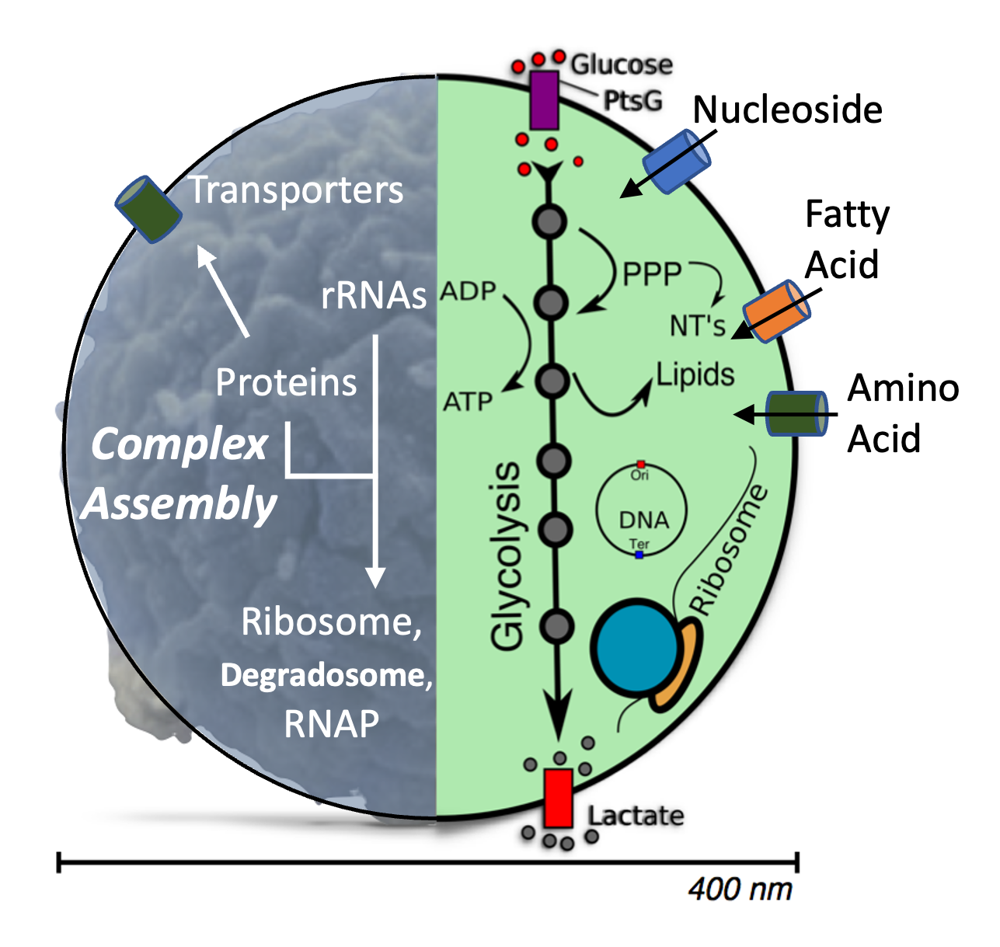

# Coupled Genetic Information Processes and Metabolism in Minimal Cell, JCVI-syn3A

## Description:



In ***Coupled Genetic Information Processes and Metabolism in the Minimal Cell*** tutorial, you will first learn the basics of stochastic kinetic simulation using a [bimolecular reaction](bimolecule/), followed by a model of [genetic information processing](GIP/) solved using chemical master equations (**CMEs**). The essential metabolism[^breuer_metabolism] in Syn3A imports nutrients from the growth medium and further converts them to generate ATP molecules, which energize cellular processes, and monomers for the synthesis of proteins, RNAs, and the chromosome. To simulate the [co-evolution of GIP and metabolism in Syn3A](WCM/), we employ a hybrid stochastic-deterministic algorithm[^bianchi_CMEODE], where stepwise communication describes the interactions between these two subsystems.

*This tutorial was prepared for the NSF Science and Technology Center for Quantitative Cell Biology Summer School organized in July.*

## Outline:

1. Set Up the tutorial on Delta  
2. Introduction to Lattice Microbe, a GPU-Accelerated Stochastic Simulation Platform  
3. Tutorial: Bimolecular Reaction Solved Stochastically in CME  
4. Tutorial: Stochastic Genetic Information Processes in CME  
5. Tutorial: CME-ODE Whole-Cell Model of a Genetically Minimal Cell, JCVI-Syn3A  

## 1. Set up the tutorial on Delta

You will SSH into [NCSA Delta](https://docs.ncsa.illinois.edu/systems/delta/en/latest/quick_start.html) to conduct the computational tasks.

### Log In to Delta 

```bash
ssh USERNAME@login.delta.ncsa.illinois.edu
```
> [!WARNING]
> ***Replace*** `USERNAME` with your Delta username. 

To successfully log in, you need to type your password for NCSA and complete two-factor authentication (2FA).

###  Copy Tutorials into Your Own Directory

Navigate to your user directory `/projects/beyi/$USER` that automatically created after Delta adding you to this project.

```bash
cd /projects/beyi/$USER
```

Copy the prepared materials to your directory. This step may take several minutes due to the precomputed CME-ODE WCM trajectories.

```bash
cp -r /projects/beyi/enguang/CME ./
```

### Launch Jupyter Notebook on Delta
>[!NOTE]
>You will use Jupyter Notebook to run Tutorials bimolecule, GIP, and the analysis part of Tutorial WCM. The advantage of Jupyter Notebook is that you could navigate the folders and run the `.ipynb` files with an graphical interface.

- **First**: Submit a job to a Delta GPU node.  
    Here `srun` launches interactive job onto Delta, `partition` claims A100 GPU node, and for four hours `time`. A four digit number is randomly generated to specify the `port` for Jupyter Notebook. 

  ```bash
  srun --account=beyi-delta-gpu --partition=gpuA40x4 --time=04:00:00 --mem=64g --gpus-per-node=1 --tasks-per-node=1 --cpus-per-task=16 --nodes=1 apptainer exec --nv --containall --bind /projects/beyi/$USER/:/workspace /projects/beyi/enguang/summer2025.sif bash -c "source /root/miniconda3/etc/profile.d/conda.sh && conda activate lm_2.5_dev && jupyter notebook /workspace/ --no-browser --port=$((RANDOM%9000+1000)) --ip=0.0.0.0 --allow-root"
  ```  

  Then you should wait for Delta to allocate the resources for your request, which usually takes less than 1 minute. When you see similar things as the following, you are good to proceed to the second step.

  ```bash
  srun: job 3546627 queued and waiting for resources
  srun: job 3546627 has been allocated resources
  WARNING: could not mount /etc/localtime: not a directory
  [I 19:07:57.203 NotebookApp] Writing notebook server cookie secret to /u/$USER/.local/share/jupyter/runtime/notebook_cookie_secret
  [I 19:07:58.314 NotebookApp] [jupyter_nbextensions_configurator] enabled 0.6.3
  [I 19:07:58.316 NotebookApp] Serving notebooks from local directory: /workspace
  [I 19:07:58.316 NotebookApp] Jupyter Notebook 6.4.12 is running at:
  [I 19:07:58.316 NotebookApp] http://$DeltaNode.ncsa.illinois.edu:8811/?token=b2e7ca15cd9dc3a6893a1273e359c88869225bc29d66c80c
  [I 19:07:58.316 NotebookApp]  or http://127.0.0.1:$Port/?token=b2e7ca15cd9dc3a6893a1273e359c88869225bc29d66c80c
  [I 19:07:58.316 NotebookApp] Use Control-C to stop this server and shut down all kernels (twice to skip confirmation).
  [C 19:07:58.329 NotebookApp]

      To access the notebook, open this file in a browser:
          file:///u/$USERNAME/.local/share/jupyter/runtime/nbserver-13-open.html
      Or copy and paste one of these URLs:
          http://$DeltaNode.delta.ncsa.illinois.edu:$Port/?token=b2e7ca15cd9dc3a6893a1273e359c88869225bc29d66c80c
      or http://127.0.0.1:$Port/?token=b2e7ca15cd9dc3a6893a1273e359c88869225bc29d66c80c
  ```
>[!NOTE]
> The second to the last line contains the Delta GPU node `$DeltaNode`, which is assgined by Delta to run your job. The `$Port` is four digits randomly generated.

- **Second**: SSH into the Delta GPU node.  
  Open **another** terminal and run the following command after replacing.
>[!WARNING]
>***Replace*** `$DeltaNode` with the node assgined by Delta.    
>***Replace*** `$USERNAME` with your Delta username.   
>***Replace*** TWO `$Port` with the 4 digit number generated.

  ```bash
  ssh -l $USERNAME  -L 127.0.0.1:$Port:$DeltaNode.delta.internal.ncsa.edu:$Port dt-login.delta.ncsa.illinois.edu
  ```
  You need to type you password and do 2FA **AGAIN**.


- **Third**: Open Jupyter Notebook in a webpage.   
  Copy the last URL in the first terminal and paste to one browser (Firefox, Chrome, ...) to open Jupyter Notebook.

## 2. Introduction to Lattice Microbe and Stochastic Simulation

**Go to [Introduction](introduction/)**

## 3. Tutorial: Bimolecular Reaction Solved in ODE and CME

**Go to [bimolecule](bimolecule/)**

## 4. Tutorial: Genetic Information Processs in CME

**Go to [Genetic Information Processes](GIP/)**

## 5. Tutorial: CME-ODE Whole-Cell Model of a Genetically Minimal Cell, JCVI-Syn3A

**Go to [CME-ODE WCM of Syn3A](WCM/)**

## References:
[^breuer_metabolism]: Breuer, M., Earnest, T. M., Merryman, C., Wise, K. S., Sun, L., Lynott, M. R., Hutchison, C. A., Smith, H. O., Lapek, J. D., Gonzalez, D. J., De Crécy-Lagard, V., Haas, D., Hanson, A. D., Labhsetwar, P., Glass, J. I., & Luthey-Schulten, Z. (2019). Essential metabolism for a minimal cell. eLife, 8. https://doi.org/10.7554/elife.36842

[^bianchi_CMEODE]: Bianchi, D. M., Peterson, J. R., Earnest, T. M., Hallock, M. J., & Luthey‐Schulten, Z. (2018). Hybrid CME–ODE method for efficient simulation of the galactose switch in yeast. IET Systems Biology, 12(4), 170–176. https://doi.org/10.1049/iet-syb.2017.0070
