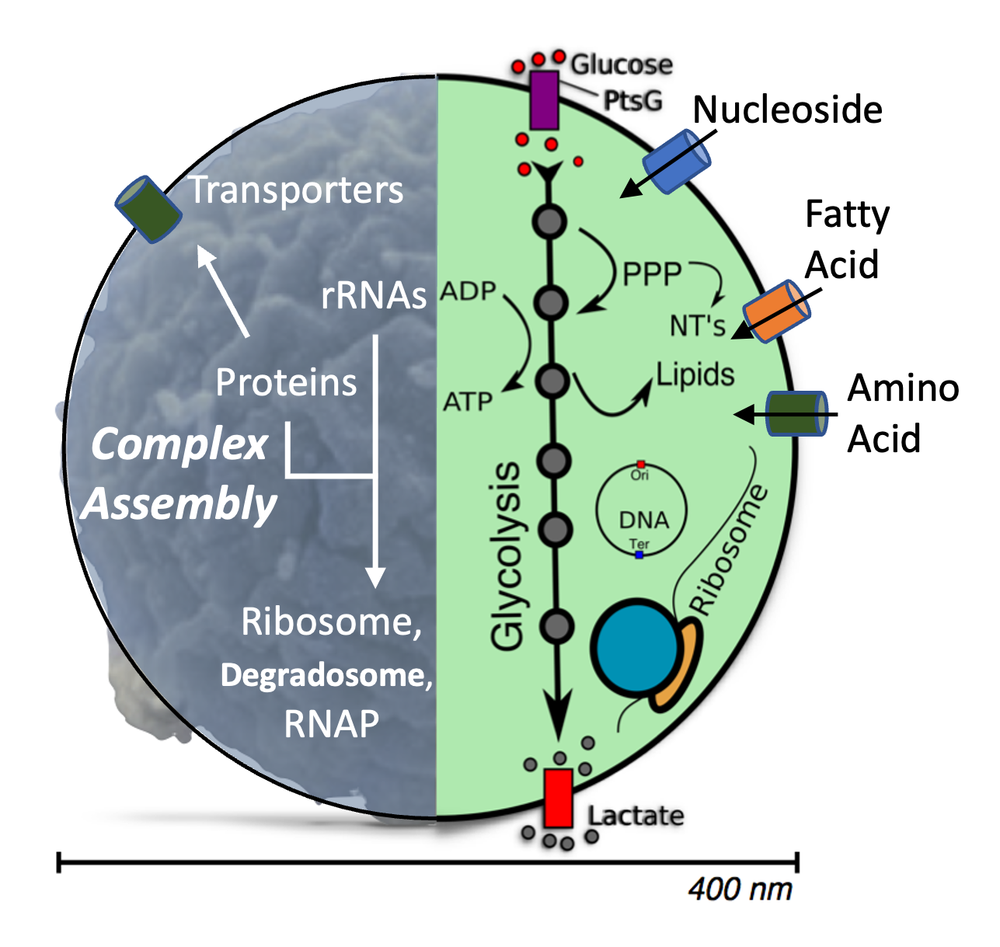

# Coupled Genetic Information Processes and Metabolism in Minimal Cell, JCVI-syn3A

## Description:



In ***Coupled Genetic Information Processes and Metabolism in the Minimal Cell*** tutorial, you will first learn the basics of stochastic kinetic simulation using a [bimolecular reaction](bimolecule/), followed by a model of [genetic information processing](GIP/) solved using chemical master equations (**CMEs**). The essential metabolism[^breuer_metabolism] in Syn3A imports nutrients from the growth medium and further converts them to generate ATP molecules, which energize cellular processes, and monomers for the synthesis of proteins, RNAs, and the chromosome. To simulate the [co-evolution of GIP and metabolism in Syn3A](WCM/), we employ a hybrid stochastic-deterministic algorithm[^bianchi_CMEODE], where stepwise communication describes the interactions between these two subsystems.

*This tutorial was prepared for the NSF Science and Technology Center for Quantitative Cell Biology Summer School organized in July.*

## Outline:

1. Set Up the tutorial on QCB Delta Gateway
2. Open the gateway in your browser
3. Allocate compute resources on the Gateway
4. Clone the tutorial repository
5. Introduction to Lattice Microbe, a GPU-Accelerated Stochastic Simulation Platform  
6. Tutorial: Bimolecular Reaction Solved Stochastically in CME  
7. Tutorial: Stochastic Genetic Information Processes in CME  
8. Tutorial: CME-ODE Whole-Cell Model of a Genetically Minimal Cell, JCVI-Syn3A  

## 1. Set up the tutorial on QCB Delta Gateway

> You are in the **CME** module. Complete steps 1–4 below once to set up the Gateway, then work through sections 5–8 in order.

See the [Getting Started: QCB Delta Gateway](../README.md#getting-started-qcb-delta-gateway) section in the top-level README for full instructions. In short:

Open a terminal on your laptop and run the following command. Replace `USERNAME` with your NCSA username:

```bash
ssh -L 8000:dt-svc-bbkw01.hsn.cm.delta.internal.ncsa.edu:8000 USERNAME@login.delta.ncsa.illinois.edu
```

You will be prompted for your **NCSA password** and **two-factor authentication (2FA)**. Once you’re in, **leave the terminal open** — closing it tears down the tunnel.

## 2. Open the gateway in your browser

Once the SSH tunnel is up, open this URL in any browser on your laptop:

```
https://dt-svc-bbkw01.delta.ncsa.illinois.edu:8000/hub/org/
```

Click on the **QCB Gateway** tab. You should see the **JupyterHub login page** for the QCB Delta Gateway.


Click **CI Logon** and sign in with your NCSA Delta credentials.


> [!NOTE]
> If your Gateway account is not approved, please ask the admin, Alfia Parvez, at alfiap@illinois.edu to approve it first.

After logging in, choose compute resources before your Jupyter session starts (see **Step 3** below).

## 3. Allocate compute resources on the Gateway

After logging in, choose the following settings on the resource allocation form (see [Step 3 in the top-level README](../README.md#getting-started-qcb-delta-gateway) for all screenshots):

| Setting | Value |
| --- | --- |
| **Allocation** | **A100 GPU - up to 8 (bgvl-delta-gpu)** — **Batch** (non-interactive) |
| **Number of CPUs** | **8** |
| **GPU Environment** | **4DCell (LAMMPS/LM)** |
| **Number of GPUs** | **1** |
| **Memory** | **64 GB** |
| **Time limit** | **3 hours** |


Click **Start** and wait for your session to launch.

## 4. Clone the tutorial repository and open CME

When your Jupyter session starts, an **Untitled.ipynb** notebook will already be open in JupyterLab (see screenshot below).


In a **code cell**, run:

```python
%cd /projects/beyi/$USER
!git clone https://github.com/Luthey-Schulten-Lab/SummerSchool_2026.git
%cd SummerSchool_2026/CME
```

In the Jupyter file browser, open **`SummerSchool_2026/CME/`**. You should see:

```
CME/
├── introduction/          # start here (§5)
├── bimolecule/            # Tut1.1 and Tut1.2 (§6)
├── GIP/                   # genetic information processing (§7)
├── WCM/                   # whole-cell CME–ODE model (§8)
└── README.md              # you are here
```

> [!NOTE]
> For CME notebooks, select the **LM 2.5 (Python 3.7)** kernel when prompted (shown in the Launcher under **Notebook**).

If you already cloned the repo in a previous session, pull updates instead:

```python
%cd /projects/beyi/$USER/SummerSchool_2026
!git pull origin main
%cd CME
```

---

## 5. Introduction to Lattice Microbe and Stochastic Simulation

**Go to [introduction/](introduction/)** and read through the material to learn how Lattice Microbe and jLM are used in the CME tutorials.

---

## 6. Tutorial: Bimolecular Reaction Solved in ODE and CME

**Go to [bimolecule/](bimolecule/)** and open these notebooks in order:

1. [`bimolecule/Tut1.1-ODEBimol.ipynb`](bimolecule/Tut1.1-ODEBimol.ipynb) — deterministic ODE simulation  
2. [`bimolecule/Tut1.2-CMEBimol.ipynb`](bimolecule/Tut1.2-CMEBimol.ipynb) — stochastic CME simulation with jLM  

See the [bimolecule README](bimolecule/README.md) for background and discussion questions.

---

## 7. Tutorial: Genetic Information Processs in CME

**Go to [GIP/](GIP/)** and open:

- [`GIP/Tut.2.1-GeneticInformationProcess.ipynb`](GIP/Tut.2.1-GeneticInformationProcess.ipynb)

See the [GIP README](GIP/README.md) for the reaction scheme and discussion questions.

---

## 8. Tutorial: CME-ODE Whole-Cell Model of a Genetically Minimal Cell, JCVI-Syn3A

**Go to [WCM/](WCM/)** and follow the [WCM README](WCM/README.md) to launch the hybrid CME–ODE whole-cell simulation and analyze the results.

## References:
[^breuer_metabolism]: Breuer, M., Earnest, T. M., Merryman, C., Wise, K. S., Sun, L., Lynott, M. R., Hutchison, C. A., Smith, H. O., Lapek, J. D., Gonzalez, D. J., De Crécy-Lagard, V., Haas, D., Hanson, A. D., Labhsetwar, P., Glass, J. I., & Luthey-Schulten, Z. (2019). Essential metabolism for a minimal cell. eLife, 8. https://doi.org/10.7554/elife.36842

[^bianchi_CMEODE]: Bianchi, D. M., Peterson, J. R., Earnest, T. M., Hallock, M. J., & Luthey‐Schulten, Z. (2018). Hybrid CME–ODE method for efficient simulation of the galactose switch in yeast. IET Systems Biology, 12(4), 170–176. https://doi.org/10.1049/iet-syb.2017.0070
