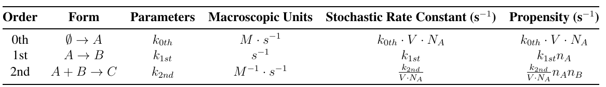
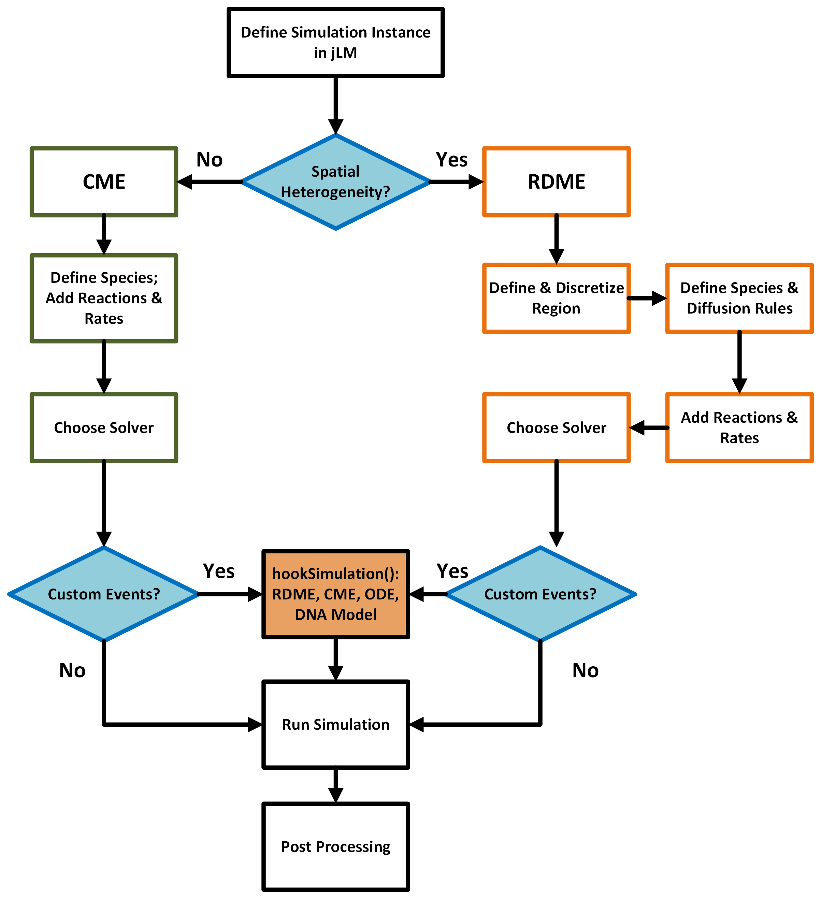

# Chemical Kinetics in Spatially Homogeneous Systems #
Our analysis of chemical kinetics begins with systems that are treated as spatially homogeneous. We often refer to these systems as "well-mixed", an assumption that means the probability of chemical reactions taking place does not depend on the locations of molecules within the system. In fact, in the well-mixed regime, we will often assume that chemical species are distributed evenly across space, thereby negating the need to track molecular positions within the system.

The assumption that a system is well-mixed does not tell us whether we will treat the chemical events as being deterministic or stochastic. Both types of treatments are possible and are briefly described below.

## 1. Deterministic Chemical Kinetics in Spatially Homogeneous Systems ##
Deterministic chemical kinetics are often modeled using systems of ordinary differential equations (ODEs), where each chemical species in the system receives its own individual equation. This type of treatment will be familiar to those who have had introductory courses in chemical kinetics and useful applications of these techniques are seen in the Michaelis-Menten equation or Hill functions. However, as systems become larger and more complex, analytical solutions to these equations become intractable, and these systems need to be solved by numerical integration. Many open-source ODE-solvers are available for these purposes. The solution to a system of ODEs is what we term chemical species trajectories, the quantity of each chemical species in the system at every timepoint of the simulation.

## 2. Stochastic Chemical Kinetics in Spatially Homogeneous Systems ##
Alternatively, stochastic chemical kinetics are often treated using a specific form of the generalized master equation. The master equation is used in multiple scientific disciplines and represents the probability of a system being in a given state at a given time. For the case of chemical kinetics in a well-stirred system, we use the Chemical Master Equation (CME): 

```math
\frac{dP(\mathbf{x},t)}{dt}=\sum_{r}^{R} [a_r({{\mathbf{x}}}-\mathbf{S_r}) P({{\mathbf{x}}}-\mathbf{S_r},t)-a_r({{\mathbf{x}}}) P({{\mathbf{x}}},t)]
```

where $\textbf{x}$ represents a vector of the abundances (or counts) of all individual chemical species, $t$ represents time, $P$ represents a function that returns the probability of the system being in a given state (specific molecular abundances of each species) at a given time, $a_r$ represents the propensity function for reaction $r$ as a function of the state of the system, $S_r$ represents the stoichiometric vector for reaction $r$, and $R$ represents all reactions in the system. In essence, this equation represents the probability of flowing into the current state from neighboring states, and the second term represents the probability of flowing out from the current state to a neighboring state.

As with deterministic treatments, analytical solutions to the CME for anything but very simple systems become intractable. Here, we will also resort to using numeric solvers, but these specific solvers will introduce randomness into the system. 

The most well known algorithm for approximating the time-evolution of the CME is the stochastic simulation algorithm (SSA), commonly known as the Gillespie algorithm. Although there are various implementations of this algorithm, Lattice Microbes implements what is called the "direct" method. This method can be described as follows:


1. Initialize the time as $t = t_0$ and the molecular count vector as $\textbf{x} = \textbf{x}_0$.
2. Compute all individual reaction propensities and the overall sum of these propensities for the system at its current state.
3. Generate two random numbers *$r_1$* and *$r_2$*, each from a uniform distribution on [0,1].
4. Compute the time-to-next-reaction ($\tau$) and which reaction will fire next ($j$).
5. Effect the next reaction by replacing $t$ with $t + \tau$ and $x$ with $x + \nu_j$.
6. Record the state of the system and repeat steps 2-6 until simulation has run its set time.

Here, we would like to note three things about this method. First, $\tau$ and $j$ can be computed as follows:

```math
\tau = \frac{1}{\sum_{j}a_j(\textbf{x})}\log(\frac{1}{r_1})
```

```math
j = \text{smallest integer satisfying} \sum_{j'=1}^{j}a_{j'}(\textbf{x}) > r_2 \sum_{j}a_j(\textbf{x})
```

Second, $\nu_j$ represents the stoichiometric vector for reaction $j$. Third, this method involves quantities called "reaction propensities", $a_r(\textbf{x})$, which are functionally equivalent to reaction rates in deterministic regimes and can be formulated using the law of mass action as follows:

```math
a_r(\textbf{x}) = k_{r}\prod_{i=1}^{S}n_{i}
```

Where $k_r$ is the reaction-specific rate constant, $n$ is the number of molecules of species $i$, and $S$ represents all chemical species that participate in the reaction being considered. It should be noted that because we are using numbers of molecules rather than concentrations, the reaction-specific rate constant may need to be converted to the appropriate units (see **Table 1**).

<p align="left">
   <br>
  <b>Table 1. Rate Constant Conversion Chart</b>
</p>

It should also be noted that the Gillespie algorithm provides an accurate solution to the CME if all reactions within the system are either 0th, 1st, or 2nd order. Rate equations such as the Michaelis-Menten and the Hill function are not supported and must be modeled using other methods.

The results of performing the Gillespie algorithm on a system is similar to that of solving the system deterministically. However, a deterministic solution to a system will result in the same trajectories if the initial conditions are identical. In a stochastic simulation, the resulting trajectories will not be guaranteed to be identical, even if initial conditions are the same. As such, we will often perform multiple replicates or "runs" using the same initial conditions and show the distribution of resulting chemical trajectories.


## 3. Using Lattice Microbes to Model Stochastic Chemical Kinetics in Spatially Homogeneous Systems ##
Tutorials on how to use well-mixed deterministic methods (ODEs) to solve for a system's trajectories have already been created, and we encourage you to read through these. Therefore, we will only spend a short amount of time on these types of treatments, and will spend the majority of our time becoming familiar with how to use Lattice Microbes to solve these systems stochastically.

A flowchart of the general steps required to solve for a system's trajectories using Lattice Microbes is shown in **Figure 1**. 

<p align="center">
   <br>
  <b>Figure 1. Lattice Microbes Flowchart</b>
</p>

The first step is to define a simulation object in jLM. Next, for now, we will only consider the left-hand side of the chart in which spatial heterogeneity is not being modeled (CME). The next steps are to define all chemical species and set initial abundances for each species within the simulation object. Next, we must add all possible chemical reactions as well as all reaction rates to the simulation object. We also must specify the following parameters: simulation volume, length of biological time to be simulated, how often we want to record the state of the system, the output file name, and the number of replicates. Next, one must choose a solver, which in the case of stochastic well-mixed systems will be the CME solver (lm::cme::GillespieDSolver). Finally, with all of this information included in the simulation object, you will run the simulation and perform any subsequent analyses on the generated trajectories. The specific syntax to complete each of these steps will be described within the tutorials and a comprehensive overview of all CME-related functions used in the tutorials can be found in the [CME_FunctionReference](./CME_FunctionReference.md) document.


