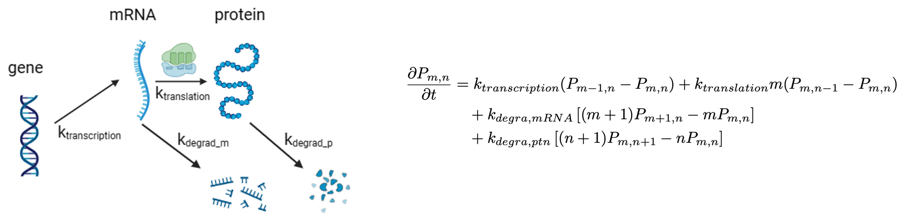

# Well-Mixed Stochastic Treatment of Genetic Information Processing Reactions (Transcription, Translation, RNA Degradation and Protein Degradation) #

## Introduction ##
Now that we have gone over the basic requirements of setting up and stochastically solving a well-mixed chemical system in Lattice Microbes, we will turn our attention to how these methods can be applied to biological systems. We begin this process by considering a simplified biological system that includes genetic information processing reactions for a single gene and its RNA and protein products.

"Genetic information processing" (GIP) reactions include all types of reactions included in the reading, interpreting, and expressing of genetic material. They also include replication reactions (such as DNA replication) and degradation reactions (such as RNA and protein degradation). These types of reactions are present in all biological systems and form the foundation of biological chemical systems. As previously stated, the treatment of genetic information processing in this tutorial is intentionally simplified so as to serve as an introduction to how complex biological systems can be modeled. The model presented here can be found in the classic article: [Analytical distributions for stochastic gene expression](https://www.pnas.org/doi/full/10.1073/pnas.0803850105).

Our classic and simplified GIP model consists of 3 species (a gene and its corresponding mRNA and protein products). In tutorial 2.1, these are labeled as "gene", "mRNA", and "protein", respectively. For initial conditions, we assume the gene copy number is fixed at 1, the initial mRNA count is 1, and the initial protein count is 148 (derived from proteomics studies). 

Next, we will define our allowable reactions, which will consist of 4 1st-order reactions. The reaction network begins with the transcription of a gene into mRNA. The mRNA can be translated into protein or degraded into its monomers. The resulting protein can also undergo degradation. The reaction scheme and associated rate constants are shown below in **Figure 1**.

     
  <b>Figure 1. Genetic information processing model and its corresponding chemical master equation, where <i>m</i> and <i>n</i> are the counts of mRNAs and proteins, respectively.</b>

In our current system, we will not need to convert concentration-based rate constants to particle-based rate constants because all reactions are 1st-order. The rate constants here are those used for the *DnaA* system in the minimal cell JCVI-Syn3A. To calculate the first three rate constants, we used the concentrations of nucleotides and aminoacyl-tRNAs, the length of the gene/mRNA/protein molecules, and the active ratio of RNAP, ribosomes, and degradosomes as reported in [Thornburg et al., 2022](https://www.cell.com/cell/fulltext/S0092-8674(21)01488-4?_returnURL=https%3A%2F%2Flinkinghub.elsevier.com%2Fretrieve%2Fpii%2FS0092867421014884%3Fshowall%3Dtrue). The protein degradation rate was estimated based on a half-life of 25 using data from [Maier et al, 2011](https://www.embopress.org/doi/full/10.1038/msb.2011.38). Information on all 4 reactions included in the GIP system are included in **Table 1**.

**Table 1. GIP Reaction Information**

| **Names**              | **Reaction**                          | **Rate Constant (s-1)**                              | **Propensity (s-1)**                              |
|------------------------|----------------------------------------|------------------------------------------------------|---------------------------------------------------|
| Transcription          | Gene → Gene + mRNA                            | *k*transcription = 6.41×10-4   | *k*transcription                       |
| Degradation of mRNA    | mRNA → ∅                               | *k*deg,m = 2.59×10-3           | *k*deg,m · *N*mRNA          |
| Translation            | mRNA → mRNA + Protein                  | *k*translation = 7.20×10-2     | *k*translation · *N*mRNA    |
| Degradation of Protein | Protein → ∅                            | *k*deg,p = 7.70×10-6           | *k*deg,p · *N*ptn           |

## Run the Jupyter Notebook ##

Run the notebook `Tut.2.1-GeneticInformationProcessing.ipynb` to simulate this toy model of GIP. 

By default:
- The total simulation time `simtime` is set to 6300 seconds, representing the full cell cycle of the minimal cell.
- We simulate 10 independent cells (`reps = 10`).
- Trajectories are recorded at intervals of 1 second (`writeInterval = 1`).

## Further Investigation ##
### 1. How can we interpret the average abundances of mRNA and protein products? ###
The population-averaged mRNA abundance fluctuates below 1 throughout the cell cycle, while protein levels increase steadily.
 - What does it mean for the mRNA levels to be at an average of below 1 molecule?
 - Are the mean mRNA and protein abundances significantly correlated on a population level? What about for individual cell replicates?

### 2. Can we observe steady-state values for mRNA or protein in our GIP system? ###
 - Do mRNA and protein levels reach a steady state during the 6300-second simulation? How can you tell from the plots? If the fluctuations are too large, try increasing the number of replicates `reps` from 10 to 100.

### 3. How does protein abundance change across the cell cycle? ###
We started with 148 copies of the DnaA protein in our system. 

 - What is the average count of DnaA at the end of our simulations?
 - Does this number make sense biologically? Why or why not?