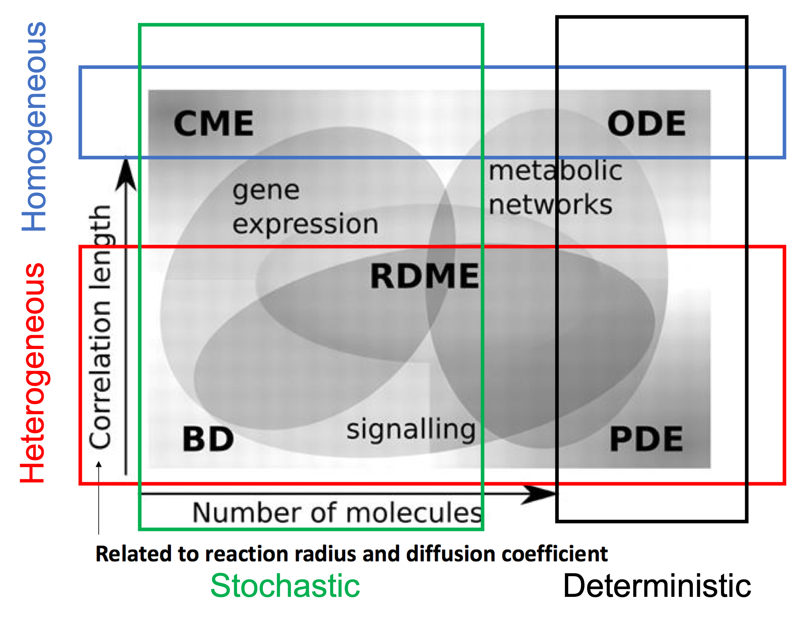
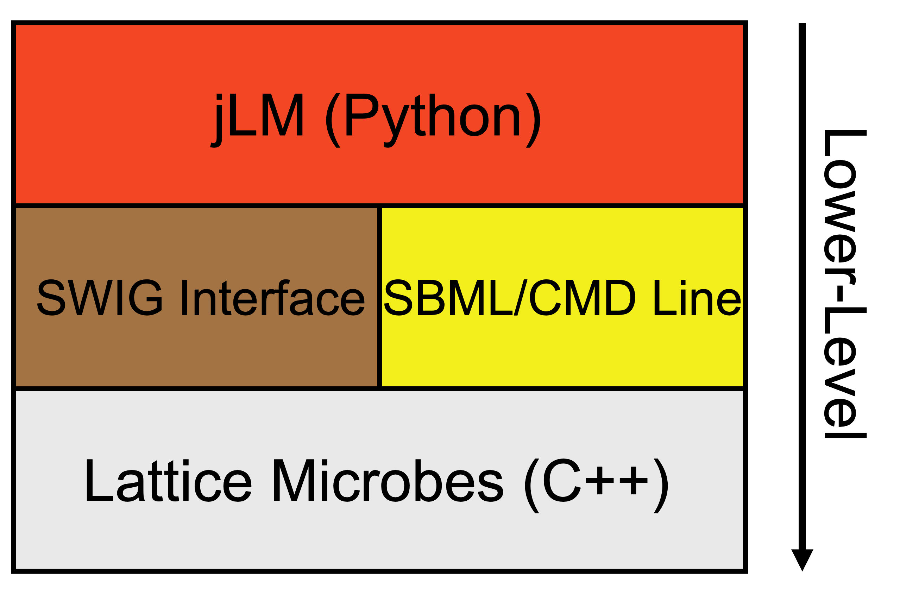

# 1. An Introduction to Chemical Kinetics, Molecular Dynamics, Biological Systems, and Lattice Microbes Modules #

## 1.1. Introduction ##
The Lattice Microbes modules of the 2026 NSF STC QCB Summer School will introduce you to the following broad topics: chemical kinetics, coarse-grained molecular dynamics, applications of chemical kinetics and molecular dynamics to biological systems, and using Lattice Microbes as a simulation engine to model these processes.

## 1.2. Chemical Kinetics ##
Chemical kinetics, in a general sense, in the study of how much stuff you have in a system and how the amount of this stuff changes across time. As such, one of the fundamental results from performing chemical kinetics analyses is what we term "trajectories" for all chemical species in the system. A species trajectory is simply knowledge of the amount of that species present in the system at any given time and is often represented using a simple graph with time on the x-axis and species amount on the y-axis.

In order to determine species trajectories, the following information must be known/modeled: 1) the identity of all possible chemical species in the system, 2) all possible chemical reactions represented as a system of stoichiometrically-balanced chemical equations, and 3) rate laws (usually derived from the system of chemical equations) for each chemical species along with their respective kinetic parameters. Chemical identities tell us *what* is in the system. Chemical reactions tell us *how* chemical species can be interconverted. Rate laws and kinetic parameters tell us *when* these conversions take place.

In these Lattice Microbes modules, you will model the kinetics of various chemical and biological systems using both deterministic and stochastic approaches. In essence, the difference between a deterministic and stochastic representation of chemical kinetics is that deterministic treatments always result in a single outcome (trajectory), whereas a stochastic treatment will result in a distribution of outcomes (trajectories). Traditional liquid-phase chemical kinetics, where solutions contain relatively large numbers of reactant molecules, have generally been treated with deterministic reaction frameworks. Such frameworks model chemical systems as evolving without randomness, and if initial conditions are the same across runs, the resulting system behavior will also be the same. However, as we will soon see, chemical reactions are inherently stochastic events, and although these processes can be treated deterministically when there are enough molecules present, at low molecular copy numbers, modeling stochasticity becomes more important to accurately model the system's behavior. 

## 1.3. Molecular Dynamics ##
In addition to participating in reactions, chemical species are also dynamic with respect to their locations in space. The field of molecular dynamics aims to understand and predict these movements, as has been discussed in the Martini modules. Here, we briefly mention molecular dynamics simply to say that some approaches to modeling chemical kinetics also include a treatment of species' localities. In fact, it is both the number of molecules in a system and the permitted reaction distances of these molecules that often guides what approaches we use to modeling the system. Furthermore, approaches that model the locations and quantities of chemical species within a system can be conceptualized as existing on a 2-dimensional plot where the number of molecules is represented on one axis and the permitted length scales of chemical reactions is on the other (see **Figure 1**).

    
  <b>Figure 1. Treatment Regimes for Chemical Kinetics Systems</b>

## 1.4. Biological Systems ##
All biological systems arise from the principles of physics and chemistry. As such, it should be theoretically possible to understand, model, predict, and control biological systems using both chemical kinetics and molecular dynamics techniques. In fact, when we aim to construct whole-cell models, a critical aspect of these models is tracking both the locations and quantities of biomolecules within the system. Knowledge of both the amounts and the locations of biomolecules enables us to make predictions about the emergent behavior of the cell such as its growth rate, viability, and ability to communicate with other nearby cells.

Predicting the emergent biological behavior of cellular systems using chemistry and physics is at the heart of whole-cell modeling. And whole-cell modeling provides a unifying framework for understanding cellular and molecular biology. The fields of whole-cell modeling and quantitative cell biology are still young, and these disciplines need the help of dedicated and bright minds to make significant progress. In the following modules, we hope to provide an introduction to some of the methodological skills necessary to construct whole-cell models, thereby encouraging participants to contribute to these growing fields.

## 1.5. An Overview of Lattice Microbes Modules ##
We will begin the Lattice Microbes modules by considering systems that are well-mixed, or in other words, systems that do not place requirements on the distances with which molecules in the system can react. First, we will briefly use a deterministic approach to modeling a simple bimolecular chemical system. This will be done using stand-alone packages that are not part of Lattice Microbes. We will then introduce how to use Lattice Microbes to stochastically model this same system. After getting used to the basics of stochastic simulations, we will begin to model more complex biological processes such as transcription, translation, and mRNA/protein degradation using stochastic methods. Finally, we will finish the spatially-homogeneous tutorials by performing a whole-cell simulation of the minimal bacterial cell JCVI-Syn3A.

After covering spatially-homogeneous systems, we will then move to modeling systems which have stricter requirements for the distances at which chemical reactions can take place. To do this, we will also be required to keep track of the locations of molecules and the architectures/geometries our system. Although we have already learned how to do this using traditional molecular dynamics techniques, in these modules we will model the movement of molecules using more coarse-grained approximations so we can simulate time scales that extend to the length of an individual bacterial cell cycle. In these tutorials, all spatially-heterogeneous systems we model will be stochastic. First, we will revisit the stochastic treatment of the simple bimolecular reaction, but we will now require that molecules be located within a given distance before allowing them to react. We will see how the initial positioning of molecules affects predicted species trajectories. Next, we will extend this framework to model more complex biological processes such as transcription, translation, and mRNA/protein degradation. 

Finally, we will finish the Lattice Microbes tutorials by demonstrating how deterministic and stochastic chemical kinetic methods can be combined into hybrid simulation approaches that incorporate an arbitrary number of additional methods to model chemical kinetics and molecular dynamics. To do this, we will perform a hybrid whole-cell simulation of the minimal bacterial cell JCVI-Syn3A, modeling all molecular processes at their respective time and length scales.

# 2. A Brief Introduction to Lattice Microbes #
## 2.1. Lattice Microbes Overview ##
Lattice Microbes is a software package designed to efficiently simulate stochastic chemical reaction kinetics in the context of cellular/biological systems. LM contains two overarching regimes with which to conduct stochastic simulations: 1) spatially homogeneous environments where molecular diffusion and cellular geometries/architectures are not considered and 2) spatially heterogeneous environments in which molecular diffusion and cellular geometries/architectures are included. Both modes of simulation can be run independently on individual systems, or can be combined within a hybrid system format. This hybrid format is often used in whole-cell modeling scenarios where multi-scale modeling is required. 

Lattice Microbes was designed to aid in performing whole-cell simulations, and while Lattice Microbes is a critical component of these simulations, it can be used at other scales such as to simulate individual biological processes or colonies of cells. We will use Lattice Microbes as our simulation engine across these modules and details about its implementation will be described along the way. 

## 2.2. Lattice Microbes Code Architecture ##
Lattice Microbes software is written in C++/CUDA but can be accessed through "jLM", a Python-based Problem Solving Environment designed to integrate seamlessly with Jupyter Notebooks. jLM was developed in 2018 as a successor to "pyLM" (from 2013, now outdated). jLM sits on top of a SWIG interface that allows the C++ backend to be accessed from the Python terminal. Using jLM allows users to set up, run, and analyze Lattice Microbes simulations within a single script, while the computations are still executed using the base C++/CUDA code. A simple schematic of the software design is found in **Figure 2**.

    
  <b>Figure 2. Lattice Microbes Software Architecture</b>

## 2.3. Lattice Microbes Tutorial Syntax ##
The specific Lattice Microbes syntax used in the tutorials can get somewhat confusing to new users. To help you feel comfortable with all the functions being used, we have provided a [CME](./CME/CME_FunctionReference.md) and [RDME](./RDME/RDME_FunctionReference.md) function reference sheet in each of the respective directories. These documents can help you orient yourself to the workflow, functions, flags, and syntax used for each part of the tutorials.