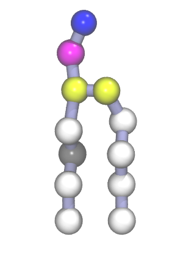
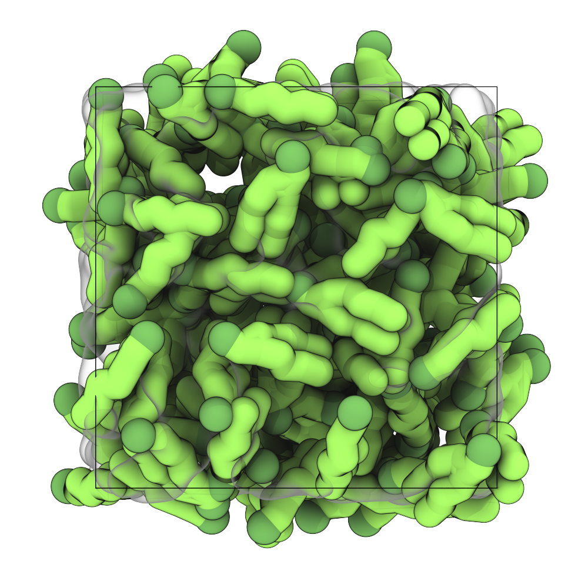
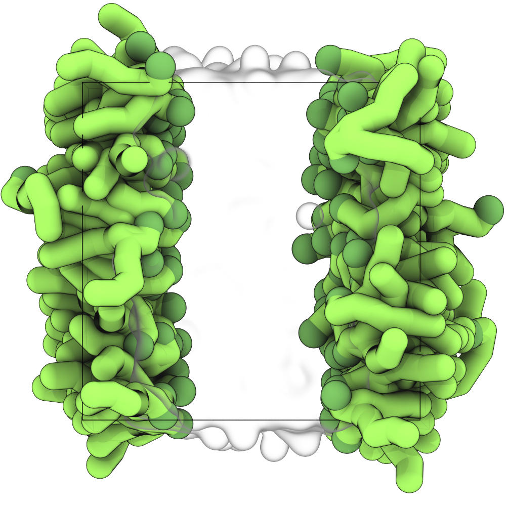
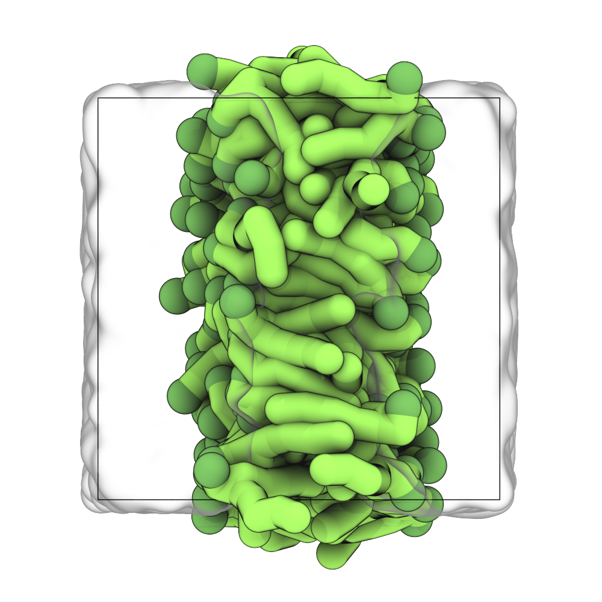

# Tutorial I: Bilayer Self-Assembly

> **Time:** ~30 minutes <br>
> **Software:** _GROMACS 2024.3_ · _VMD 2_ · _Xmgrace_ <br>
> **Based on:** [Martini Online Workshop 2025 — Lipid Bilayers I](https://cgmartini.nl/docs/tutorials/Martini3/LipidsI/) <br>

The Martini coarse-grained (CG) model was initially developed for lipids
[^marrink2004][^marrink2007]. The underlying philosophy of Martini is to build
an extendable CG model from simple modular building blocks, using only a few
parameters and standard interaction potentials to maximize applicability and
transferability. Martini 3 greatly expanded the number of possible
interactions while retaining this building-block approach[^souza2021]. As a
result, a large set of lipid types has been parameterized; the full set of
parameters can be downloaded from the
[Martini downloads page](https://cgmartini.nl/docs/downloads/). The lipidome
has recently been refined and expanded, with improved phase behavior across
the parameter set[^pedersen2025].

---

### Overview

In this tutorial, we self-assemble a Martini 3 lipid bilayer and analyze its
properties. The steps are:

1. Build a random starting configuration of POPC lipids in water.
2. Run a short MD simulation to let the bilayer self-assemble.
3. Equilibrate the bilayer with semi-isotropic pressure coupling.
4. Analyze the bilayer thickness and lateral diffusion.

### Prerequisites

- `gmx` from a GROMACS 2024.3 installation.
- `xmgrace` or another viewer for `.xvg` files.
- Common command-line utilities and a text editor.

Navigate to the tutorial directory.

```sh
cd 01_bilayer_self_assembly
```

---

## 1. Prepare the starting structure

<div align="center">
    
	<br>
    <sub><i>Figure 1. Martini representation of a POPC lipid.</i></sub>
</div>

We use POPC (1-palmitoyl-2-oleoyl-*sn*-glycero-3-phosphocholine) as our model
lipid. It is one of the more abundant lipids in the JCVI-Syn3A minimal cell.
A render of its Martini representation is shown in Figure 1.

To self-assemble a bilayer, we first need a random starting configuration of
lipids and water in the simulation box. We start from a file containing a
single POPC molecule, provided in the current directory:

```sh
cat POPC.gro
```

The GROMACS tool `gmx insert-molecules` takes this single-molecule
conformation and places it in the simulation box at random positions and
orientations, checking for overlaps between consecutively placed molecules:

```sh
gmx insert-molecules -ci POPC.gro -box 7.5 7.5 7.5 -nmol 128 \
                     -radius 0.21 -try 500 -o 128_POPC.gro
```

The `-radius` flag (default van der Waals radius) is increased from its
default atomistic value (0.105 nm) to reflect the larger size of Martini CG
beads.

> [!TIP]
> Add the `-h` flag to any GROMACS tool for inline help.

---

## 2. Build the topology

To run an MD simulation we need both a starting structure and a topology. The
topology defines all bonded and non-bonded interactions in the system, which
together with the positions determine the forces and dynamics. Here, we
assemble the topology ourselves by combining the Martini parameters for water
and POPC.

The Martini 3 force field files are provided in the current directory:

```sh
ls -lH martini_v3.0.0
```

```text
martini_v3.0.0.itp
martini_v3.0.0_ffbonded_v2.itp
martini_v3.0.0_ions_v1.itp
martini_v3.0.0_solvents_v1.itp
martini_v3.0.0_phospholipids_PC_v2.itp
martini_v3.0.0_sterols_v1.itp
...
```

The Martini 3 release is split into several `.itp` files, each defining a
class of molecules. The lipid classes (PC, PG, CL, SM) share many bonded,
angle, and dihedral definitions, which have been factored out into a
common `ffbonded` file. This file must be included before any lipid-class
file. For this tutorial we only need:

- `martini_v3.0.0.itp` — particle definitions (always required).
- `martini_v3.0.0_ffbonded_v2.itp` — shared bonded parameters. Include before any lipid file.
- `martini_v3.0.0_solvents_v1.itp` — defines the water bead.
- `martini_v3.0.0_phospholipids_PC_v2.itp` — defines POPC and other PC lipids.

Create a file `topol.top` in your editor of choice (`gedit`, `vi`, etc.) and
paste the template below. Semicolons mark comments; hashtags are preprocessor
directives — the `#include` directive pulls the molecule definitions from the
`.itp` files into the topology.

```text
#include "martini_v3.0.0/martini_v3.0.0.itp"                     ; particle definitions (always first)
#include "martini_v3.0.0/martini_v3.0.0_ffbonded_v2.itp"         ; shared bonded parameters (before lipids)
#include "martini_v3.0.0/martini_v3.0.0_solvents_v1.itp"         ; water
#include "martini_v3.0.0/martini_v3.0.0_phospholipids_PC_v2.itp" ; POPC (PC lipids)

[ system ]
POPC BILAYER SELF-ASSEMBLY

[ molecules ]
; Molecule types and their numbers in the order they appear in the structure file
POPC 128
```

---

## 3. Solvate the system

We use `gmx solvate` to add water beads. The tool needs an equilibrated
water-box template (`water.gro`, provided in `mdp_files/`) to fill the empty
space around the lipids:

```sh
gmx solvate -cp 128_POPC.gro -cs mdp_files/water.gro -radius 0.21 \
            -p topol.top -o 128_POPC_solvated.gro
```

As before, the `-radius` flag is increased to reflect the Martini bead size.
The `-p topol.top` flag updates the topology automatically; a new `W` line
appears at the bottom of `topol.top`.

<div align="center">

<br>
<sub><i>Figure 2. Starting structure: a random configuration of POPC lipids in water.</i></sub>
</div>

---

## 4. Energy minimization

A brief energy minimization relieves any high forces from beads that ended up
too close after random insertion. The settings file `em.mdp` is provided in
`mdp_files/`. Feel free to inspect it before running:

```sh
mkdir -p em
gmx grompp -f mdp_files/em.mdp -c 128_POPC_solvated.gro -p topol.top -o em/em.tpr
gmx mdrun -v -deffnm em/em
```

---

## 5. Self-assembly MD run

Now run the self-assembly simulation. A short 50 ns run (2.5 million steps at
20 fs per step) is enough to observe the bilayer forming:

```sh
mkdir -p md
gmx grompp -f mdp_files/md.mdp -c em/em.gro -p topol.top -o md/md.tpr -maxwarn 1
gmx mdrun -v -deffnm md/md
```

This takes about 10 minutes on a single CPU; by default `gmx mdrun` uses all
available CPUs. The `-v` flag shows an estimated time to completion. See
`gmx mdrun -h` for options on tuning the parallel threads.

---

## 6. Visualize the trajectory with VMD 2

You can monitor progress during the run or inspect the final structure with
[VMD 2](https://www.ks.uiuc.edu/Research/vmd/), which reads GROMACS output
files directly (`.gro`, `.tpr`, `.xtc`). For atomistic systems, VMD infers
bonds from typical experimental bond distances. This does not work for
coarse-grained models, where the bonds between beads are different from the
typical atomistic distances. Loading a `.gro` file therefore shows the beads
but no bonds, which can still be visualized using a VDW representation.

For Martini, loading the `.tpr` is the most practical option. It carries the
bonded information from the topology, which lets you visualize the lipids with
licorice or other bond-aware representations. Note that VMD does not guarantee
that all bonds are drawn. Particles can have a maximum of 12 bonds in VMD and
additional bonds are not drawn (higher bond numbers are not uncommon in CG
models). For exact visualizations such as for publication figures or visually
inspecting the topology, we recommend the dedicated
[martini-glass](https://github.com/Martini-Force-Field-Initiative/martini-glass)
tool.

VMD 2 is provided as a module. Load it into your environment:

```sh
module use /projects/bgvl/alfiaparvez/modulefiles
module load vmd/2.0.0
```

The workshop ships a `vmdrc` with default representations for Martini systems.
Copy it to your home directory so VMD reads it on startup:

```sh
cp ../files/base.vmd ~/.vmdrc
```

Before opening the trajectory, make the molecules whole. During the
simulation, lipids diffuse across the box faces and get split by the
periodic boundary, so they appear as fragments on opposite sides of the box
in VMD. `gmx trjconv -pbc whole` reconnects each molecule into a single
unit in the periodic image closest to its center of mass:

```sh
gmx trjconv -f md/md.xtc -s md/md.tpr -o md/md_whole.xtc -pbc whole
    > System     [Enter]
```

Open the trajectory:

```sh
vmd md/md.tpr md/md_whole.xtc
```

Your VMD window should look similar to one of the panels in Figure 3.

<div id="image-table">
    <table>
	    <tr>
    	    <td style="padding:10px" width="50%">
                
      	    </td>
    	    <td style="padding:10px" width="50%" float="center">
                
            </td>
        </tr>
    </table>
    <sub><i>
        Figure 3. Left. A typical result after self-assembly. It is common for
        the bilayer to appear inverted, but in reality the bilayer center simply
        spans the periodic boundary conditions.<br>
        Right. The same bilayer, but translated such that the bilayer is placed
        in the center of the box. This centered representation is common, but
        both are correct.
    </i></sub>
</div>

---

## 7. Bilayer equilibration

Before continuing, check whether your bilayer formed in the *xy*-plane.
If not, rotate the system:

```sh
gmx editconf -f md/md.gro -rotate 90 0 0 -o md/md.gro
```

The self-assembly run used isotropic pressure coupling, which leaves the
bilayer under tension. We now switch to semi-isotropic pressure coupling so the
xy- and z-dimensions of the simulation box can change independently. This
allows the bilayer area (_xy_-area) to equilibrate independently of the box
height (z-dimension), and reach zero surface tension. Run the simulation for
another 50 ns:

```sh
mkdir -p eq
gmx grompp -f mdp_files/eq.mdp -c md/md.gro -p topol.top -o eq/eq.tpr
gmx mdrun -v -deffnm eq/eq
```

<details>
<summary><b>Good practices in membrane simulations</b></summary>
<br>

To properly sample in an isothermal-isobaric ensemble, switch to the
Parrinello-Rahman barostat at this point (a typical `tau-p` is 12 ps).
Parrinello-Rahman is less robust than Berendsen and may crash if the system
is far from equilibrium, so it is typically used in production runs while
Berendsen is used in preparation.

Heat transfer across the membrane-water interface can be poor. To prevent
unequal heat accumulation, couple the solvent and membrane groups to
*separate* thermostats via the `tc-grps` option in the `.mdp`.

Numerical-precision errors can give the system an overall momentum, which
the thermostat interprets as temperature and counteracts, resulting in an
excessively cooled system. Correct this center-of-mass motion (COMM) with
`comm-mode = linear`. In membrane systems, the membrane and water phases can
also gain momentum relative to each other, even without precision errors:
correct each phase separately via `comm-grps`. In some applications, each
leaflet should be corrected separately as well.

</details>

---

## 8. Analysis

With the bilayer equilibrated, we can measure its properties. Keep the
outputs together in an analysis directory:

```sh
mkdir -p analysis
```

The analyses below plot `.xvg` files with `xmgrace`. Load it the same way as
VMD:

```sh
module use /projects/bgvl/alfiaparvez/modulefiles
module load grace
```

### 8.1 Bilayer thickness

We estimate the bilayer thickness from the distance between the headgroup
density peaks, using `gmx density`. First build an index group for the
phosphate beads:

```sh
gmx make_ndx -f eq/eq.gro
    > a P*       [Enter]
    > q          [Enter]
```

Then compute the density along the bilayer normal:

```sh
gmx density -f eq/eq.xtc -s eq/eq.tpr -b 15000 -trestart 500 \
		    -n index.ndx -o analysis/p-density.xvg
    > P*         [Enter]
```

Open the result in Xmgrace:

```sh
xmgrace analysis/p-density.xvg
```

A more accurate comparison to experimental measurements uses the electron
density profile, also supported by `gmx density` via the `-ei electrons.dat`
flag. The required data file format is described in the GROMACS manual and
is not covered here.

Compare your results to small-angle neutron scattering measurements
[^Balgavy2001]:

- Thickness: 4.98 ± 0.15 nm
- Area per lipid: 0.65 ± 0.05 nm²

### 8.2 Lateral diffusion

Calculate the lateral diffusion of the lipids in the membrane with `gmx msd`.
Before that, remove jumps over the box boundaries with `gmx trjconv -pbc nojump`:

```sh
gmx trjconv -f eq/eq.xtc -s eq/eq.tpr -pbc nojump -o eq/nojump.xtc
    > POPC       [Enter]
```

Then run `gmx msd` with `-lateral z`, removing the center-of-mass motion
(`-rmcomm`). Later, you may want to refine the measurement by fitting the line
only to the linear regime of the mean-square-displacement curve  (`-beginfit`
and `-endfit`):

```sh
gmx msd -f eq/nojump.xtc -s eq/eq.tpr -lateral z -b 15000 \
        -o analysis/msd.xvg
    > POPC       [Enter, Ctrl-D]
```

Open the result:

```sh
xmgrace analysis/msd.xvg
```

Martini diffusion coefficients are typically faster than experimental values
because of the smoother free-energy landscape. Note that the use of a fixed
conversion factor between CG and atomistic timescales is no longer
recommended, as it varies significantly with the molecule of interest. Also
note that `gmx msd` averages over all lipids. It is generally more accurate
to analyze each lipid individually and remove the center-of-mass motion per
leaflet.

---

## References

[^marrink2004]: Marrink, S. J., De Vries, A. H., & Mark, A. E. (2004). Coarse
    grained model for semiquantitative lipid simulations. *J. Phys. Chem. B*,
    108, 750–760. [doi:10.1021/jp036508g](https://doi.org/10.1021/jp036508g)

[^marrink2007]: Marrink, S. J., Risselada, H. J., Yefimov, S., Tieleman, D. P.,
    & De Vries, A. H. (2007). The MARTINI force field: coarse-grained model
    for biomolecular simulations. *J. Phys. Chem. B*, 111, 7812–7824.
    [doi:10.1021/jp071097f](https://doi.org/10.1021/jp071097f)

[^souza2021]: Souza, P. C. T., Alessandri, R., Barnoud, J., et al. (2021).
    Martini 3: a general-purpose force field for coarse-grained molecular
    dynamics. *Nat. Methods*, 18, 382–388.
    [doi:10.1038/s41592-021-01098-3](https://doi.org/10.1038/s41592-021-01098-3)

[^pedersen2025]: Pedersen, K. B., Ingólfsson, H. I., Ramirez-Echemendia, D. P.,
    et al. (2025). The Martini 3 Lipidome: Expanded and Refined Parameters
    Improve Lipid Phase Behavior. *ACS Cent. Sci.*, 11, 1598–1610.
    [doi:10.1021/acscentsci.5c00755](https://doi.org/10.1021/acscentsci.5c00755)

[^Balgavy2001]: Balgavy, P., Dubnicková, M., Kucerka, N., Kiselev, M. A., Yaradaikin,
    S. P., and Uhrikova, D. (2001) Bilayer thickness and lipid interface area in
    unilamellar extruded 1,2-diacylphosphatidylcholine liposomes: a small-angle neutron
    scattering study. Biochim. Biophys. Acta 1512, 40–52.
    [doi:10.1016/S0005-2736(01)00298-X](https://doi.org/10.1016/S0005-2736(01)00298-X)
