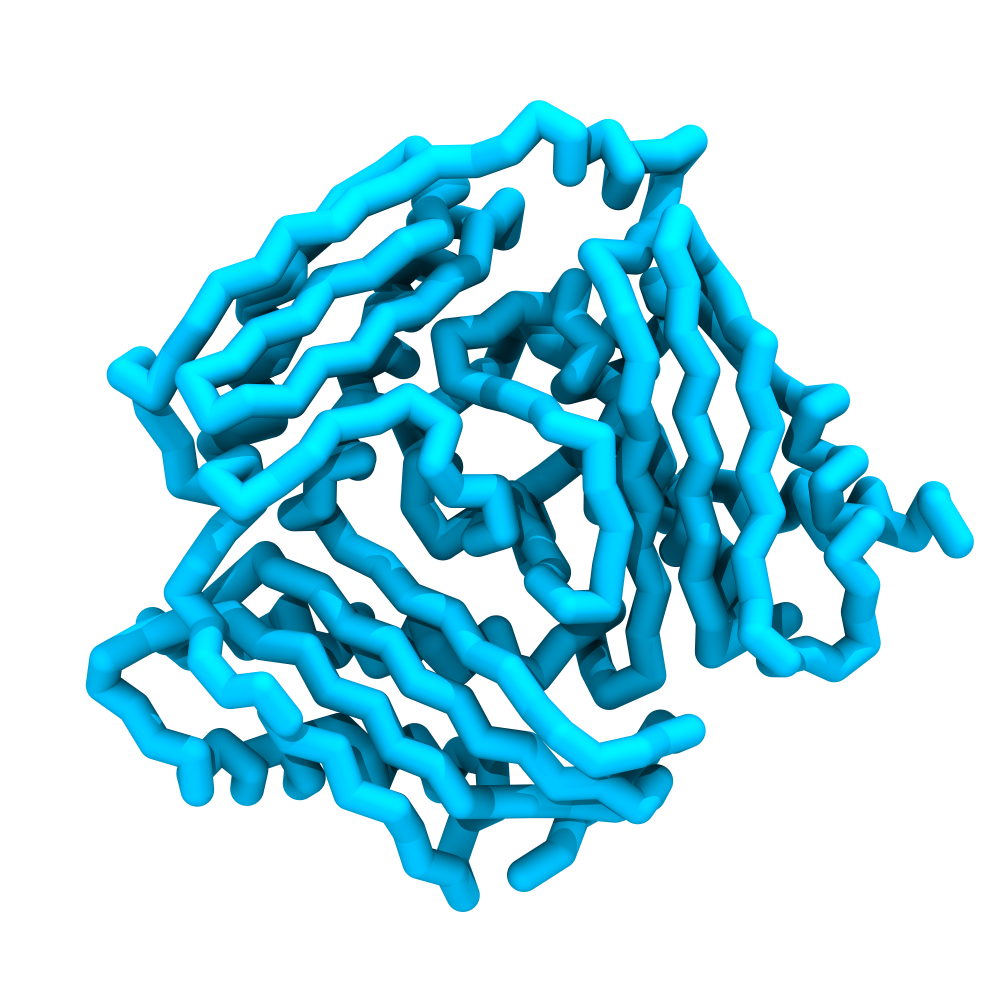
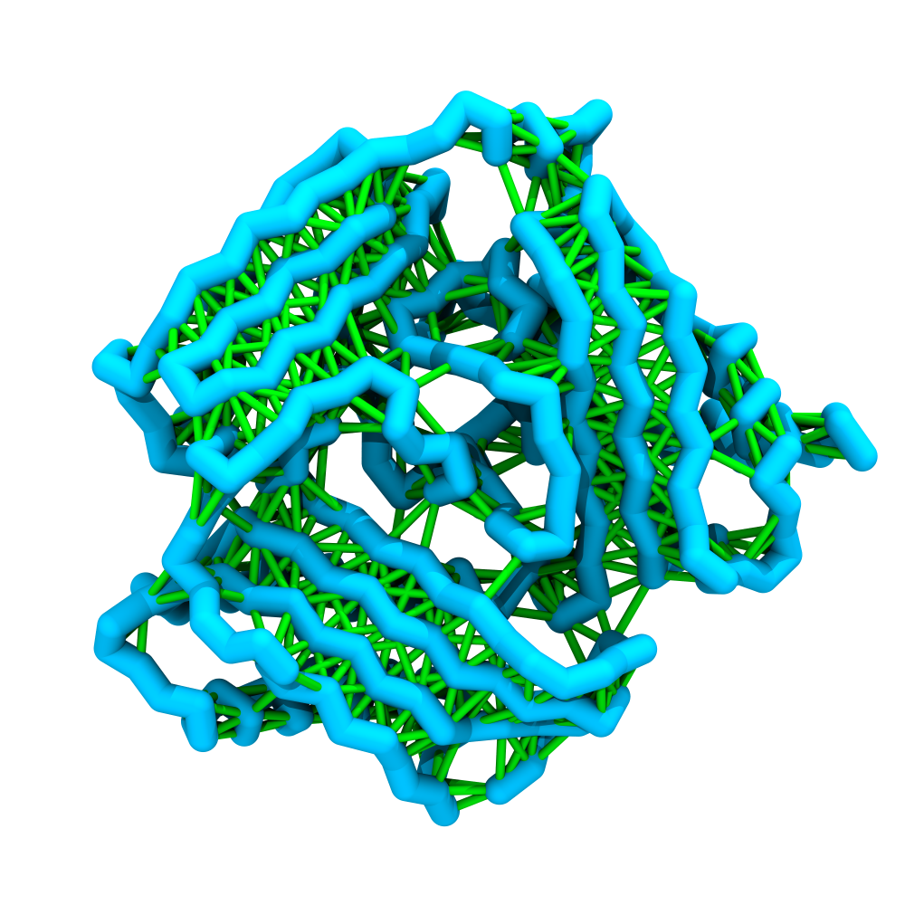
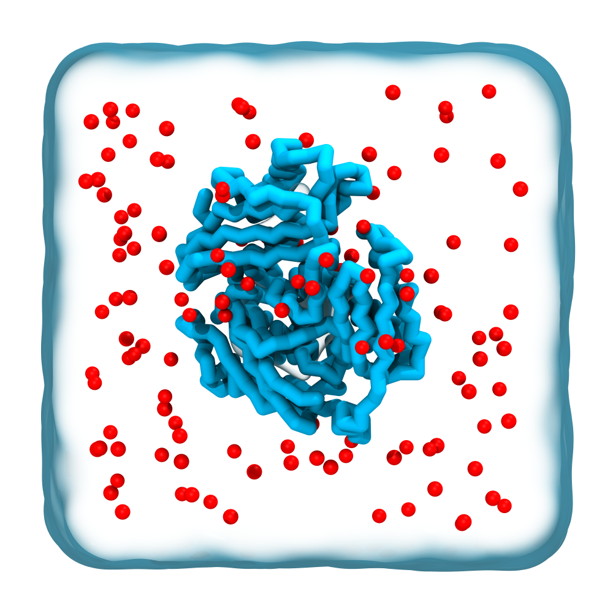

# Tutorial II: Simulating a Protein with Martini 3

> **Time:** ~30 minutes <br>
> **Software:** _GROMACS 2024.3_ · _martinize2_ · _VMD 2_ · _Xmgrace_ <br>
> **Based on:** [Martini Online Workshop 2025 — Proteins](https://cgmartini.nl/docs/tutorials/Martini3/ProteinsI/) and [Duve et al. 2025](https://doi.org/10.1101/2025.03.17.643608)<br>

The Martini 3 protein model uses a 4-to-1 mapping of heavy atoms to
coarse-grained beads, with one bead for the backbone and one or more for the
side chains. The Martini protein model defines the mapping, bead types, and
bonded terms. On top of that, a structure bias maintains the secondary,
tertiary, and quaternary structure[^duve2025]. The bias is needed because the
isotropic Martini potentials lack the directionality that hydrogen bonds
provide in atomistic models, so the non-bonded interactions alone cannot
preserve the native fold.

In this tutorial, we generate a Martini 3 CG protein model with `martinize2`
and run a short MD simulation. At the coarse-graining step we introduce the
three options natively supported by `martinize2` (Elastic Network, GōMartini,
and no structure bias) and let you choose one.

The protein is **S-adenosylmethionine synthase**, a soluble enzyme from the
*JCVI-Syn3A* proteome[^protein_uniprot]. The atomistic starting structure
was predicted with AlphaFold2.

---

### Overview

1. Download the atomistic structure.
2. Choose a structure bias model and coarse-grain the protein with `martinize2`.
3. Build the topology, set up the box, solvate, and add ions.
4. Run energy minimization, equilibration, and production.
5. Visualize the trajectory and analyze backbone RMSD and per-residue RMSF.

Navigate to the tutorial directory.

```sh
cd 02_protein_basics
```

`martinize2` ships as part of the `vermouth` package. Install it into the
active environment:

```sh
pip install vermouth
```

---

## 1. Obtain the input structure

Download the AlphaFold2 model from the AlphaFold Protein Structure Database
and save it as `protein.pdb`:

```sh
wget https://alphafold.ebi.ac.uk/files/AF-P47293-F1-model_v6.pdb -O protein.pdb
```

AlphaFold structures are already in a clean form, so we can move directly to
coarse-graining. For experimental structures, you may first need to remove
crystallographic waters, ligands, and other non-protein atoms.

---

## 2. Coarse-grain with martinize2

We use `martinize2`[^martinize2] to generate the CG structure and topology
from the atomistic input. `martinize2` also applies the structure bias. The
choice has a clear effect on the backbone dynamics seen later in the
analysis[^duve2025].

### The three options

| Model | Description |
| :--- | :--- |
| **Elastic Network (EN)** | Harmonic restraints between backbone beads within a distance cutoff. The most robust and straightforward option, traditionally used in Martini. |
| **GōMartini** | Lennard-Jones contacts derived from a native contact map. Often preferred as it balances stability and flexibility, and allows contact dissociation. |
| **No structure bias** | Appropriate for intrinsically disordered proteins (IDPs), but not for folded ones. Included in this tutorial as a demonstration on a folded model protein. |

For a research simulation of this folded protein, choose either **EN** or
**GōMartini** and run the matching `martinize2` command below. The rest of
the tutorial follows the same workflow regardless of the choice. GōMartini
needs a small extra setup step, shown in the collapsible under its command.
The third option, no structure bias, is included only as a demonstration of
what happens to a folded protein without stabilization.

### Option A — Elastic Network (EN)

```sh
martinize2 -f protein.pdb -x protein_cg.pdb -o topol.top -name protein \
           -ff martini3001 -p backbone -dssp \
           -elastic -ef 700 -el 0 -eu 0.85
```

### Option B — GōMartini

GōMartini uses Lennard-Jones contacts derived from a native contact map.
Recent versions of `martinize2` generate the contact map internally, so no
external webserver or script is needed.

```sh
martinize2 -f protein.pdb -x protein_cg.pdb -o topol.top -name protein \
           -ff martini3001 -p backbone -dssp -go
```

<details>
<summary><b>Extra setup for GōMartini</b></summary>
<br>

`martinize2` writes two additional files for the Gō network:
`go_atomtypes.itp` and `go_nbparams.itp`. These need to be included in
`martini_v3.0.0.itp` once, with the following two commands:

```sh
sed -i 's/\[ nonbond_params \]/#ifdef GO_VIRT\n#include "go_atomtypes.itp"\n#endif\n\n[ nonbond_params ]/' martini_v3.0.0/martini_v3.0.0.itp

echo -e "\n#ifdef GO_VIRT\n#include \"go_nbparams.itp\"\n#endif" >> martini_v3.0.0/martini_v3.0.0.itp

cp go_atomtypes.itp go_nbparams.itp martini_v3.0.0
```

Run them only once. Then add `#define GO_VIRT` at the very top of `topol.top`
so the includes activate.

</details>

### Demonstration — No structure bias

```sh
martinize2 -f protein.pdb -x protein_cg.pdb -o topol.top -name protein \
           -ff martini3001 -p backbone -dssp
```

> [!WARNING]
> Do not use this for folded proteins in research or production
> simulations. Here we run it as a demonstration because we know this
> folded protein will unfold without a bias. For intrinsically disordered
> proteins, no structure bias is a valid choice, since there is no fold
> to maintain.

<details>
<summary><b>What do the shared martinize2 flags mean?</b></summary>
<br>

- `-f`, `-x`, `-o`: input structure, CG output structure, topology output.
- `-name`: molecule type name (also the output `.itp` filename).
- `-ff martini3001`: target the Martini 3 force field.
- `-p backbone`: add position restraints on the backbone beads, used during equilibration via `-DPOSRES`.
- `-dssp`: add secondary-structure-dependent bonded potentials. By default `martinize2` uses `mdtraj` to compute the secondary structure.

In `martinize2` 0.12.0 and newer, side-chain dihedral corrections (`-scfix`)
and automatic detection of disulfide bridges (`-cys auto`) are applied by
default and do not need to be specified.

</details>


<div id="image-table">
    <table>
	    <tr>
    	    <td style="padding:10px" align="center">
                
      	    </td>
    	    <td style="padding:10px" align="center">
                
            </td>
        </tr>
    </table>

<div align="center">
<sub><i>Figure 1. Left: CG protein model. Right: CG protein model with secondary structure bias drawn (elastic network). Protein backbone is shown in blue, additional restraints in green.</i></sub>
</div>
</div>

---

## 3. Build the topology

The `topol.top` written by `martinize2` is minimal. Add the Martini 3 force
field includes at the top so the system has water and ion parameters
available for the next steps:

```text
#include "martini_v3.0.0/martini_v3.0.0.itp"
#include "martini_v3.0.0/martini_v3.0.0_ions_v1.itp"
#include "martini_v3.0.0/martini_v3.0.0_solvents_v1.itp"
#include "protein_0.itp"

[ system ]
S-adenosylmethionine synthase

[ molecules ]
protein_0 1
```

> [!IMPORTANT]
> If you chose **GōMartini**, also add `#define GO_VIRT` as the very first
> line (above the `#include` lines), and make sure `go_atomtypes.itp` and
> `go_nbparams.itp` were patched into `martini_v3.0.0.itp` (see Section 2).

---

## 4. Set up the simulation box

Place the protein in a cubic box with a 2.0 nm margin to its periodic
images:

```sh
gmx editconf -f protein_cg.pdb -d 2.0 -bt cubic -o protein_box.gro
```

The last line of `protein_box.gro` shows the box vectors:

```sh
tail -n 1 protein_box.gro
```

---

## 5. Solvate and add ions

Add Martini 3 water beads:

```sh
gmx solvate -cp protein_box.gro -cs mdp_files/water.gro -radius 0.21 \
            -p topol.top -o sol.gro
```

The `-radius 0.21` flag adjusts the default van der Waals radius from the
atomistic value (0.105 nm) to one suitable for Martini beads. The `-p
topol.top` flag updates the topology with the added water beads.

Neutralize the system and bring it to 0.15 M NaCl:

```sh
gmx grompp -f mdp_files/ions.mdp -c sol.gro -p topol.top \
           -o ions.tpr -maxwarn 1
echo W | gmx genion -s ions.tpr -p topol.top -neutral -conc 0.15 \
                    -o sol_neutral.gro
```

<details>
<summary><b>Why the <code>-maxwarn 1</code>?</b></summary>
<br>

The system has a non-zero net charge before we add the ions. GROMACS warns
that Ewald electrostatics on a charged system can produce artifacts. Since
the next step (`gmx genion`) is exactly the one that neutralizes the
charge, we accept the warning with `-maxwarn 1`.

</details>

<div align="center">

<br>
<sub><i>Figure 2. Starting structure of the solvated system. Protein backbone in blue, water as a transparent surface, ions in red.</i></sub>
</div>

---

## 6. Run the simulation

The standard Martini protocol is energy minimization, followed by a
position-restrained NPT equilibration, followed by an unrestrained
production run.

```sh
# Energy minimization
mkdir -p em
gmx grompp -f mdp_files/em.mdp -p topol.top -c sol_neutral.gro -r sol.gro \
           -o em/em.tpr
gmx mdrun -v -deffnm em/em

# Equilibration (NPT, position-restrained, 10 fs timestep)
mkdir -p eq
gmx grompp -f mdp_files/eq.mdp -p topol.top -c em/em.gro -r sol.gro \
           -o eq/eq.tpr -maxwarn 3
gmx mdrun -v -deffnm eq/eq

# Production (50 ns, 20 fs timestep)
mkdir -p md
gmx grompp -f mdp_files/md.mdp -p topol.top -c eq/eq.gro -o md/md.tpr
gmx mdrun -v -deffnm md/md
```

The production run is 2.5 million steps at 20 fs, which corresponds to 50 ns.
Snapshots are written every 50,000 steps, giving 50 frames in the trajectory.

<details>
<summary><b>What are the warnings about?</b></summary>
<br>

During equilibration, GROMACS warns about the Berendsen thermostat and
barostat, and about pressure coupling with absolute position restraints.
These are acceptable here, because equilibration is meant to bring the
system to a stable state quickly. The production `.mdp` uses
velocity-rescaling and Parrinello-Rahman instead, and the position
restraints are lifted, so these warnings no longer apply.

</details>

---

## 7. Visualize the trajectory

Enable VMD in your terminal by running:

```sh
module use /projects/bgvl/alfiaparvez/modulefiles
module load vmd/2.0.0
```

Before opening VMD, fix the periodic-boundary artifacts so the protein stays
whole and centered in the box:

```sh
echo -e "Protein\nSystem" | gmx trjconv -s md/md.tpr -f md/md.xtc \
                                        -pbc whole -center -o md/traj.xtc
```

Open the trajectory in VMD 2 with the `.tpr` as the topology (see Tutorial I
for the rationale):

```sh
vmd md/md.tpr md/traj.xtc
```

---

## 8. Analyze backbone dynamics

Two standard metrics for evaluating a protein structure bias model are the
backbone root-mean-square deviation (RMSD) over time and the per-residue
root-mean-square fluctuation (RMSF)[^duve2025]. The RMSD shows how far the
structure has drifted from the starting configuration, and the RMSF
highlights which regions of the protein are most flexible.

```sh
mkdir -p analysis

# RMSD over time
echo -e "Protein\nProtein" | gmx rms -s md/md.tpr -f md/traj.xtc \
                                     -o analysis/rmsd.xvg

# RMSF per residue
echo "Protein" | gmx rmsf -s md/md.tpr -f md/traj.xtc \
                          -o analysis/rmsf.xvg -res
```

Enable the graph viewer, `xmgrace`, used during the following analyses:

```sh
module use /projects/bgvl/alfiaparvez/modulefiles
module load grace
```

Open the results:

```sh
xmgrace analysis/rmsd.xvg
xmgrace analysis/rmsf.xvg
```

> [!NOTE]
> What you see in the RMSD and RMSF plots depends on the structure bias
> model you chose in Section 2:
>
> - **EN** keeps the structure most rigid. The RMSD plateaus quickly at low
>   values, and the RMSF is suppressed across all residues, including
>   flexible loops.
> - **GōMartini** allows local fluctuations while preserving native
>   contacts. The RMSD plateaus at intermediate values, and the RMSF shows
>   residue-level variation with loops standing out.
> - **No structure bias** lets the protein unfold over time. The RMSD
>   grows steadily and can reach values well above 1 nm. The RMSF is
>   high across the entire chain, including normally rigid regions.
>
> For a quantitative comparison against an atomistic reference, with
> parameter scans for each model, see Figures 5–8 of the primer[^duve2025].

To see the differences first-hand, save your current curves under a
model-specific name, then rerun the tutorial with a different option and
overlay them:

```sh
# After running with one model:
mv analysis/rmsd.xvg analysis/rmsd_en.xvg
mv analysis/rmsf.xvg analysis/rmsf_en.xvg

# After rerunning with another:
xmgrace analysis/rmsd_en.xvg analysis/rmsd_go.xvg
xmgrace analysis/rmsf_en.xvg analysis/rmsf_go.xvg
```

---

## References

[^protein_uniprot]: S-adenosylmethionine synthase from *Mycoplasma mycoides*.
    [UniProt entry P47293](https://www.uniprot.org/uniprotkb/P47293/entry).

[^martinize2]: Kroon, P. C., Grunewald, F., Barnoud, J., et al. (2024).
    Martinize2 and Vermouth: Unified Framework for Topology Generation.
    *eLife*, 12:RP90627.
    [doi:10.7554/eLife.90627](https://doi.org/10.7554/eLife.90627)

[^duve2025]: Duve, T., Wang, L., Borges-Araújo, L., Marrink, S. J., Souza, P.
    C. T., & Thallmair, S. (2025). Martini 3 Protein Models: A Practical
    Introduction to Different Structure Bias Models and their Comparison.
    *bioRxiv*.
    [doi:10.1101/2025.03.17.643608](https://doi.org/10.1101/2025.03.17.643608)
