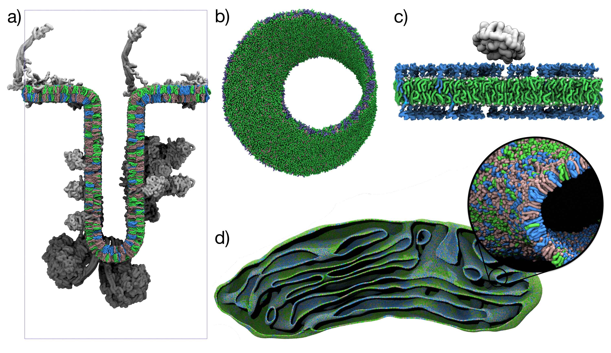
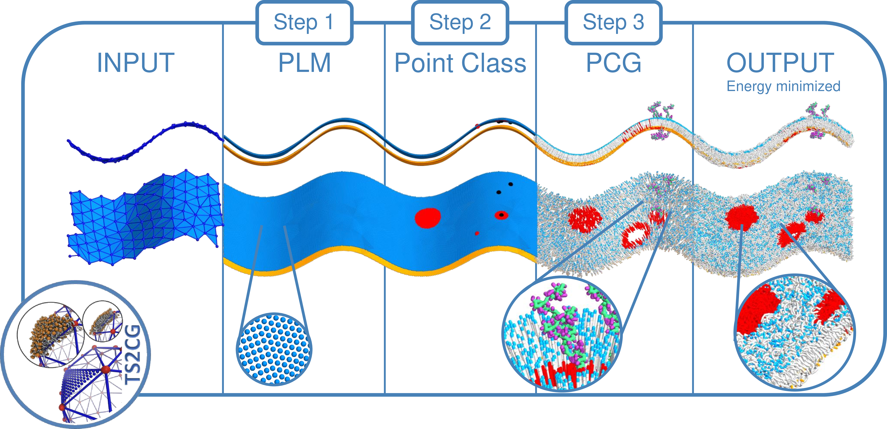
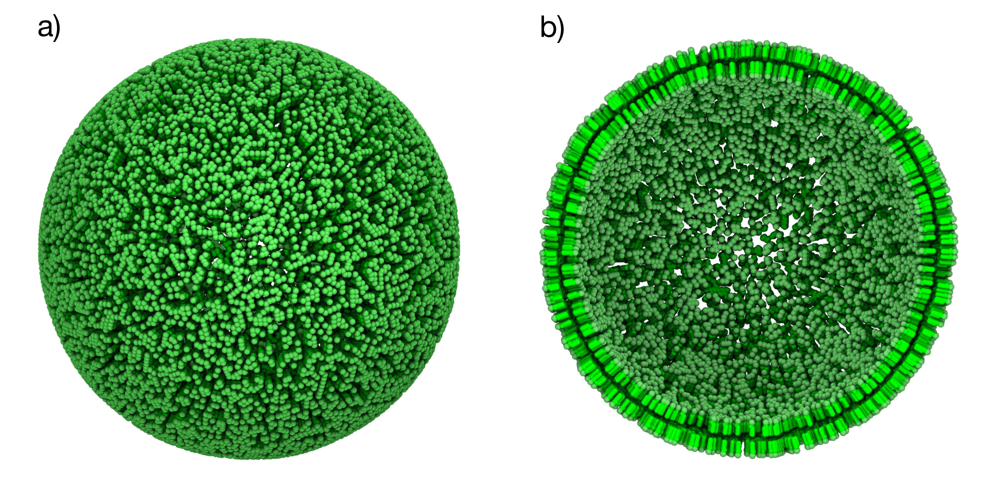
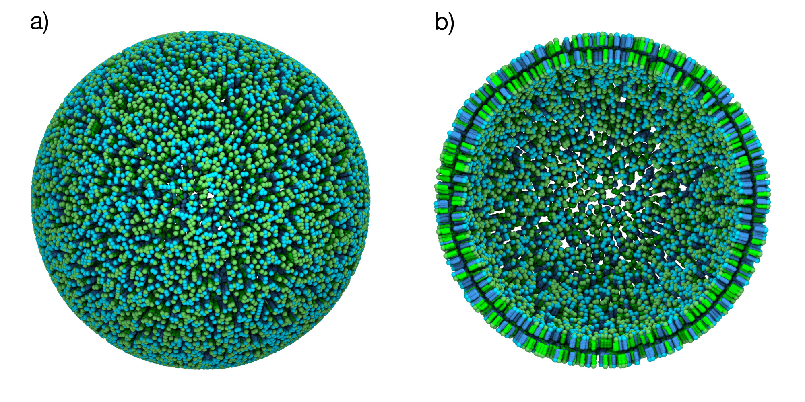
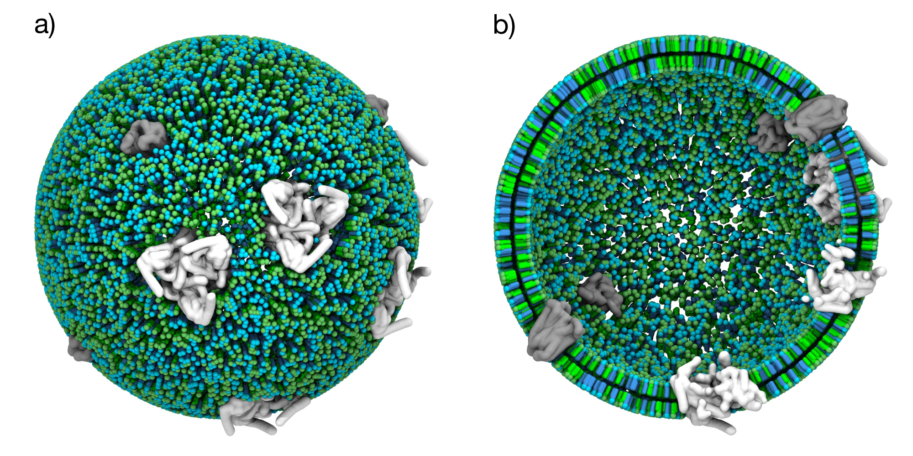
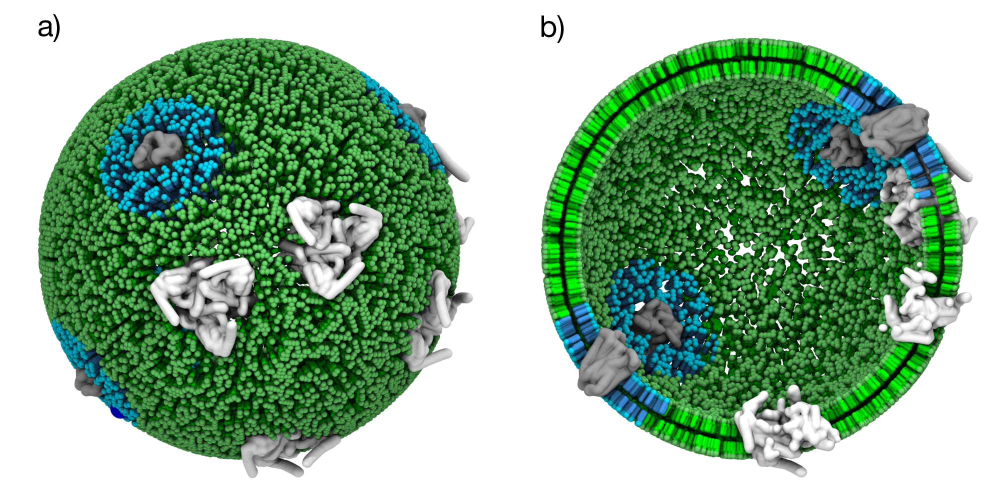
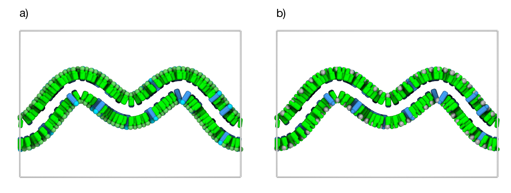
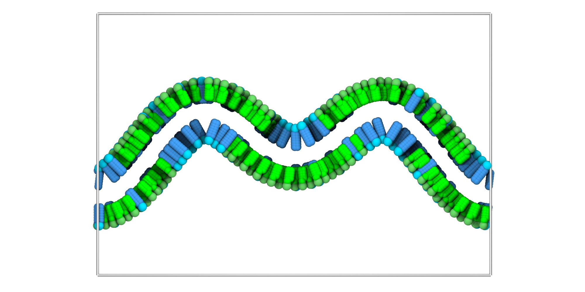

# Tutorial III: Building Membranes with TS2CG 2.0

> **Time:** ~30 minutes <br>
> **Software:** _GROMACS 2024.3_ · _TS2CG 2.0_ · _VMD 2_ <br>
> **Based on:** [TS2CG 2.0 workshop tutorial](https://cgmartini.nl/docs/tutorials/Martini3/TS2CG/) by J.A. Stevens and F. Schuhmann

TS2CG builds coarse-grained membrane models with user-defined and
experimentally informed shapes and compositions[^ts2cg]. It generates
simulation-ready membrane models for molecular dynamics from triangulated
surfaces or analytical shape definitions, and it can also be used as a
backmapping tool that converts dynamically triangulated surface (DTS)
simulations into CG MD simulations[^backmapping][^freedts].

The latest release, TS2CG 2.0, introduces automated protein placement,
curvature-informed lipid distributions, and a Python API that streamlines
integration with other tools. Although the code is force field agnostic, the
current lipid library targets the Martini coarse-grained force
field[^martini3]. Its scope ranges from simple bilayers to whole mitochondrial
cristae reconstructed from cryo-EM data[^cristae], as shown in the gallery
below.


In this tutorial we walk through TS2CG by building increasingly complex
membrane models. Sections 1 to 4 start with a simple vesicle and progressively
add lipid mixtures, membrane proteins, and protein-specific lipid domains.
Sections 5 to 6 introduce an alternative workflow that builds membranes from
analytical shapes, and apply curvature-informed lipid placement.

<div align="center">

<br>
<sub><i>Figure 1. TS2CG 2.0 showcase models. (a) Mitochondrial crista with
curvature-sorted lipids and proteins[^cristae]. (b) Martini 3 Möbius strip
membrane. (c) Glycolipid membrane with CTxB peripheral membrane protein. (d)
Mitochondrial membrane from cryo-ET data with curvature-dependent lipid
placement.</i></sub>
</div>
<br>

---

### Overview

1. Build a basic POPC vesicle using the Mesh → PLM → PCG workflow.
2. Add a lipid mixture (POPC/DOPC).
3. Embed membrane proteins with the INU tool.
4. Create lipid domains around proteins with the DAI tool.
5. Build a membrane from an analytical shape.
6. Apply curvature-based lipid placement with the DOP tool.

### The TS2CG workflow

The TS2CG workflow consists of a few key steps:

- **Input.** A triangulated surface (`.tsi`, `.q`, `.dat`) or an analytical
  shape definition.
- **Pointillism (PLM).** Generates monolayer point distributions from a
  triangulated surface and stores them in a point folder.
- **Point folder customization.** Three tools modify the point folder before
  lipids are placed:
  - **INU** adds inclusions (proteins) and exclusions (membrane pores).
  - **DAI** creates circular lipid domains around protein types.
  - **DOP** optimizes lipid placement based on curvature preferences.
- **Membrane building (PCG).** Places lipids and proteins on the customized
  point distribution.
- **Output.** Simulation-ready coordinate and topology files for GROMACS.

<div align="center">

<br>
<sub><i>Figure 2. TS2CG 2.0 workflow. The workflow can start from an analytical
shape or an arbitrary triangulated surface. PLM (or PCG) creates a point
directory which can then be manipulated using the Python API to place proteins,
exclusions, or lipid domains. PCG then turns the point folder into a membrane
model ready for MD simulation.</i></sub>
</div>

### Installation

TS2CG 2.0 is not shipped with the workshop environment. Install the current
version from GitHub:

```sh
pip install git+https://github.com/weria-pezeshkian/TS2CG-v2.0.git
```

The `TS2CG` command becomes available in the terminal after installation.

Visualization throughout the tutorial uses VMD 2, provided as a module. Load it
into your environment now:

```sh
module use /projects/bgvl/alfiaparvez/modulefiles
module load vmd/2.0.0
```

---

Navigate to the tutorial directory.

```sh
cd 03_membranes_and_vesicles
```

The tutorial directory contains:

- **`structures/`** — molecular structures: proteins (`protein_1.gro`,
  `protein_2.gro`), solvent (`water.gro`), and triangulated meshes
  (`sphere.tsi`) and protein topologies (`protein_1.itp`, `protein_2.itp`).
- **`martini_v3.0.0/`** — Martini 3 force field files.
- **`Martini3.LIB`** — TS2CG lipid library defining molecular connectivity for
  membrane building.

---

## 1. Basic vesicle

We start with the core TS2CG workflow by building a simple POPC vesicle. This
section walks through the essential file formats (`.tsi` mesh, `input.str`
composition, `Martini3.LIB` lipid library) and runs the **Mesh → PLM → PCG**
sequence end to end. Everything in the later sections builds on this pattern.

### Generate the point folder with PLM

Convert the spherical triangulated surface (`sphere.tsi`) into a point
distribution using pointillism (PLM), which transforms the mesh into discrete
points that guide membrane construction. The `.tsi` format contains vertex
coordinates and triangle connectivity. For the full specification, see the
[TS2CG documentation](https://github.com/weria-pezeshkian/TS2CG-v2.0).

```sh
TS2CG PLM -TSfile structures/sphere.tsi -bilayerThickness 3 \
          -rescalefactor 5 5 5 -Mashno 4
```

**PLM parameters**

- `-TSfile` — input triangulated surface file.
- `-bilayerThickness` — distance between monolayers (nm).
- `-rescalefactor` — scaling factors for x, y, z dimensions.
- `-Mashno` — pointillism iterations to increase mesh resolution (typically 1
  to 4).

This creates a `point/` folder with the bilayer point distributions, an
`extended.tsi` with increased resolution, and a `pcg.log` file. The
`pointvisualization_data/` folder contains files to inspect the generated
structure. Open them in VMD:

```sh
vmd -m pointvisualization_data/Upper.gro pointvisualization_data/Lower.gro
```
You should see two leaflets of points representing the bilayer where lipids
will later be placed. Each point carries an associated coordinate frame
defining the local membrane normal and tangent directions. Take a moment to
examine how the points are distributed before continuing.

### Create the lipid composition file

Define the membrane composition by creating a file named `input.str`:

```text
[Lipids List]
Domain 0
POPC 1 1 0.64
End
```

**Format**

- `Domain 0` — default domain for all lipids.
- `POPC 1 1 0.64` — lipid type, upper leaflet ratio, lower leaflet ratio, area
  per lipid (nm²).

### Build the membrane with PCG

Place lipids on the point distribution to produce the final membrane
structure:

```sh
TS2CG PCG -dts point -str input.str -Bondlength 0.2 -LLIB Martini3.LIB -defout output
```

**PCG parameters**

- `-dts` — folder with the point distributions from PLM.
- `-str` — membrane composition file.
- `-Bondlength` — bond length between lipid beads (nm).
- `-LLIB` — lipid library file containing the lipid definitions.
- `-defout` — base name for generated files (default: `output`).

PCG performs the actual membrane assembly by placing lipids and writes
`output.gro` (coordinates), `output.top` (GROMACS topology), and `pcg.log`. The
number of lipids placed is determined by the specified area per lipid (APL) and
the available points. The bond length is intentionally set small so that lipids
can expand during energy minimization to form a continuous bilayer.

> [!TIP]
> When running PLM you can use `-monolayer 1` or `-monolayer -1` to create
> only the upper or lower monolayer. The rest of the steps stay the same.

### Visualize

```sh
vmd output.gro
```

You should see a complete bilayer vesicle with no overlapping lipid
placements.

<div align="center">

<br>
<sub><i>Figure 3. Basic POPC vesicle. (a) Spherical vesicle containing only POPC lipids (green). (b) Cross-sectional view showing both membrane leaflets.</i></sub>
</div>

---

## 2. Lipid mixtures

Real biological membranes contain multiple lipid types at concentrations that
can differ between leaflets. This section extends the basic workflow to a mixed
composition by editing only the `input.str`.

### Create a mixed composition

```text
[Lipids List]
Domain 0
POPC 0.5 0.5 0.64
DOPC 0.5 0.5 0.67
End
```

We added a second lipid definition for a 50:50 mixture of POPC and DOPC. DOPC
has a slightly larger APL (0.67 nm²) than POPC (0.64 nm²). When working with
lipid mixtures, make sure the APL values are realistic for your chosen lipids
and force field.

### Rebuild the membrane

Place the mixed composition on the existing point distribution:

```sh
TS2CG PCG -str input.str -Bondlength 0.2 -LLIB Martini3.LIB
```

The algorithm distributes the two lipid types randomly across the point
distribution.

> [!WARNING]
> This overwrites the `output.gro` and `output.top` from Section 1.

### Visualize

```sh
vmd output.gro
```

You should see a complete bilayer vesicle with randomly mixed POPC and DOPC
lipids in both leaflets.

<div align="center">

<br>
<sub><i>Figure 4. Mixed POPC/DOPC vesicle. (a) Spherical vesicle with 50% POPC (green) and 50% DOPC (cyan). (b) Cross-sectional view showing both leaflets.</i></sub>
</div>

---

## 3. Membrane proteins

Integral and peripheral membrane proteins are essential components of most
biological membranes. This section uses TS2CG's INU tool to place proteins in
the membrane while preventing lipid-protein and protein-protein clashes.

### Add proteins to the composition

Modify `input.str` to include a protein section:

```text
include structures/protein_1.gro
include structures/protein_2.gro

[Lipids List]
Domain 0
POPC 0.5 0.5 0.64
DOPC 0.5 0.5 0.67
End

[Protein List]
;proteinname  type  i         j     k     shift
protein_1     1     0.01      0     0     -2
protein_2     2     0.01      0     0     -2
End Protein
```

**Format**

- `proteinname` — must match the header of the `.gro` file.
- `type_id` — unique integer assigned to each protein type.
- `surface_coverage` — fraction of membrane area occupied by proteins
  (typically around 0.01).
- Two unused parameters — set to 0 for now.
- `z_offset` — distance to move the protein along the membrane normal.

> [!TIP]
> To identify the transmembrane region of a protein and orient it correctly
> along the membrane normal, use the [PPM webserver](https://opm.phar.umich.edu/ppm_server).
> It determines the optimal membrane insertion depth and orientation from the
> structure and hydrophobicity profile.

### Place proteins with INU

```sh
TS2CG INU --protein-type 1 --radius 5  --num-proteins 5
TS2CG INU --protein-type 2 --radius 10 --num-proteins 5
```

**INU parameters**

- `-p, --point-dir` — input point directory from PLM.
- `-t, --protein-type` — protein type identifier (matches `[Protein List]`).
- `-r, --radius` — exclusion radius around proteins (nm).
- `-n, --num-proteins` — number of proteins to place.
- `-o, --output` — output point directory with proteins.

INU randomly places the two protein types in the membrane while avoiding
protein-protein overlaps within the exclusion radius.

### Rebuild the membrane with PCG

```sh
TS2CG PCG -str input.str -Bondlength 0.2 -LLIB Martini3.LIB \
          -incdirtype Local -Rcutoff 0.65
```

**Additional PCG flags**

- `-incdirtype Local` — use local reference frames for proteins placed by INU
  (required when using INU).
- `-Rcutoff` — cutoff distance for removing lipids near proteins (nm).

> [!NOTE]
> The `-Rcutoff` controls the exclusion distance around proteins. After
> building, always check that no lipids ended up in unphysical locations such
> as inside protein channels. If you find lipids inside protein cavities,
> increase the cutoff radius and rebuild.

### Visualize

```sh
vmd output.gro
```

You should see a vesicle with embedded proteins, no lipid-protein or
protein-protein overlaps, and the proteins randomly distributed in both
leaflets.

<div align="center">

<br>
<sub><i>Figure 5. Vesicle with embedded membrane proteins. (a) Spherical
vesicle with 50% POPC (green), 50% DOPC (cyan), and randomly distributed
membrane proteins (grey). (b) Cross-sectional view.</i></sub>
</div>

> [!WARNING]
> Verify protein orientation in the membrane. Type I proteins have their
> N-terminus extracellular and C-terminus cytoplasmic; Type II have the
> opposite orientation.

---

## 4. Lipid domains around proteins

Proteins often influence their local lipid environment, creating specialized
microenvironments that contribute to function and stability. This section uses
the DAI tool to define protein-specific lipid domains.

### Create circular domains with DAI

Use DAI on the point folder from Section 3:

```sh
TS2CG DAI --point-dir point --protein-type 1 --radius 7 --domain 1
```

**DAI parameters**

- `-p, --point-dir` — path to the point folder.
- `-t, --protein-type` — protein type ID used as domain centers.
- `-r, --radius` — radius of the circular domain assignment (nm).
- `-d, --domain-id` — domain ID assigned to points within the radius.
- `-m, --manual-points` — comma-separated point IDs to use as centers (not used here).
- `-o, --output-dir` — output directory (default: overwrite input with backup).

DAI automatically identifies all proteins of the specified type and creates a
circular domain around each. If circular domains overlap, the later command
overwrites the earlier domain assignment. Keep this in mind when designing
systems with multiple protein types or high protein densities.

### Define domain-specific composition

Update `input.str` to give each domain its own composition:

```text
include structures/protein_1.gro
include structures/protein_2.gro

[Lipids List]
Domain 0
POPC 1.0 1.0 0.64
End
Domain 1
DOPC 1.0 1.0 0.67
End

[Protein List]
;proteinname  type     i       j     k    shift
protein_1     1     0.01      0     0     -2
protein_2     2     0.01      0     0     -2
End Protein
```

This creates two distinct environments: POPC in the bulk membrane (Domain 0)
and DOPC around proteins (Domain 1).

> [!TIP]
> Many membrane proteins have experimentally validated preferences for specific
> lipid types. These preferences can guide domain composition and improve the
> biological relevance of the model.

### Rebuild with domain-specific compositions

```sh
TS2CG PCG -str input.str -Bondlength 0.2 -LLIB Martini3.LIB \
          -incdirtype Local -Rcutoff 0.65
```

PCG respects the domain assignments created by DAI and places the appropriate
lipid types in each region.

### Visualize

```sh
vmd output.gro
```

You should see a vesicle with embedded proteins, two distinct lipid domains in
both leaflets (POPC in the bulk, DOPC around proteins), and clear lipid domain
boundaries.

<div align="center">

<br>
<sub><i>Figure 6. Vesicle with protein-specific lipid domains. (a) DOPC (cyan)
domains around membrane proteins (grey) in a POPC (green) bulk membrane. (b)
Cross-sectional view.</i></sub>
</div>

---

## 5. Analytical shapes

The first four sections built membranes from a triangulated mesh. TS2CG also
supports building directly from an analytical shape definition, which gives
parametric control and reproducibility for systematic studies. This section
uses an analytical sinusoidal membrane as the example, and introduces
shape-preserving walls that maintain the curvature during MD.

### A sinusoidal membrane (1D Fourier)

Create `input.str`:

```text
[Lipids List]
Domain 0
CDL2 0.1 0.1 0.94
POPC 0.9 0.9 0.64
End

[Shape Data]
ShapeType 1D_PBC_Fourier
Box 30 10 20
WallRange 0 1 0 1
Density 3 1
Thickness 4
Mode 1.5 1 0
Mode 2.5 2 0
End
```

Build the sinusoidal membrane directly with PCG:

```sh
TS2CG PCG -str input.str -Bondlength 0.2 -LLIB Martini3.LIB \
          -function analytical_shape
```

The Fourier modes control wavelength and amplitude of the membrane
undulations.

> [!TIP]
> Experiment with the `Mode` parameters to create different curvature patterns.
> The first number is the amplitude, the second the frequency, and the third
> the phase offset.

### Other analytical shapes

Multiple analytical shapes are supported. All are built with the same command,
swapping the `[Shape Data]` block:

| **Cylinder** | **Sphere** |
| :--- | :--- |
| <pre>Cylinder<br>    Box 40 40 40<br>    Density 2<br>    Thickness 4<br>    Radius 12<br>End</pre> | <pre>Sphere<br>    Box 40 40 40<br>    Density 2<br>    WallDensity 1 1<br>    Thickness 4<br>    DL 0.2<br>    Radius 15<br>End</pre> |
| **Flat** | **1D Fourier** |
| <pre>Flat<br>    Box 40 40 40<br>    Density 2 2<br>    Thickness 4<br>    WallRange 0 1 0 1<br>End</pre> | <pre>1D Fourier Shape<br>    Box 20 10 20<br>    WallRange 0 1 0 1<br>    Density 3 1<br>    Thickness 4<br>    Mode 1.5 1 0<br>    Mode 0.5 2 0<br>End</pre> |

> [!NOTE]
> The density parameters control the number of lipids per unit area. Higher
> densities create tighter packing, while lower densities may leave gaps.

### Shape-preserving walls

Membranes can deform during MD as the system equilibrates, which can destroy
the precise geometry needed for studies such as lipid sorting or
curvature-dependent protein behavior. Wall beads constrain the membrane to
maintain its shape during the simulation.

```sh
TS2CG PCG -str input.str -Bondlength 0.2 -LLIB Martini3.LIB \
          -function analytical_shape -Wall -WallH 0.1
```

**Wall parameters**

- `-Wall` — generate wall beads (WL).
- `-WallH 0.1` — place wall beads 0.1 nm above the lipid headgroup.

PCG writes a `Wall.itp` file containing wall bead parameters. The wall beads
interact repulsively with lipid tail beads (C1 and C4h) and are invisible to
headgroups. Include `Wall.itp` in your topology file along with the Martini
force field files.

> [!WARNING]
> Simulating wall-constrained membranes requires careful attention to the
> protocol. Wall parameters must maintain the membrane shape while still
> allowing normal lipid diffusion. For detailed protocols, see [this book
> chapter](https://doi.org/10.1016/bs.mie.2024.03.010).

### Visualize

```sh
vmd output.gro
```

You should see a continuous 1D Fourier sinusoidal membrane with wall beads
positioned around the bilayer.

<div align="center">

<br>
<sub><i>Figure 7. Analytical sinusoidal membrane. (a) 1D Fourier membrane with
90% POPC (green) and 10% CDL2 (cyan). (b) The same membrane with wall beads
(grey spheres) maintaining the curvature during simulation.</i></sub>
</div>

---

## 6. Curvature-based lipid placement

This section introduces TS2CG's experimental DOP (Distribution-based Optimized
Placement) tool, which performs curvature-informed lipid placement. DOP is a
research-stage feature that requires careful parameter selection and
validation.

Different lipid geometries have distinct curvature preferences in biological
membranes. The critical packing parameter (CPP) summarizes a lipid's geometry
as the ratio of its hydrophobic tail volume to the product of head group area
and tail length. Cone-shaped lipids favor negative curvature regions;
inverted-cone lipids favor positive curvature. DOP uses this principle to
create non-random lipid distributions, which may reduce equilibration times and
provide more realistic starting configurations.

### The placement algorithm

The curvature-dependent lipid placement probability uses a Boltzmann-like
weighting:

$$
P(l) \propto e^{-k(2H - C_0)^2}
$$

Where:

- $P(l)$ is the placement probability for lipid type $l$.
- $H$ is the local mean curvature at the membrane point.
- $C_0$ is the intrinsic curvature preference of the lipid type.
- $k$ is a user-defined scaling factor controlling domain sharpness.

The algorithm iterates over each point in random order to avoid systematic
bias, calculating placement probabilities for all lipid types and normalizing
them to preserve the specified overall composition.

### Create the initial point distribution

Using the sinusoidal configuration from Section 5, generate the point folder
first:

```sh
TS2CG PCG -str input.str -function analytical_shape -WPointDir
```

The `-WPointDir` flag tells PCG to only generate the point folder. It writes
`InnerBM.dat` and `OuterBM.dat`, which contain the geometric information needed
for the curvature calculation (local coordinate frames and curvature tensors at
    each point).

### Define curvature preferences

Create `domain_input.txt`:

```text
; lipid_domain lipid_type percentage c0 APL
0 CDL2 0.1 -0.3 0.94
1 POPC 0.9  0.0 0.64
```

**Format**

- `lipid_domain` — unique domain ID for each lipid type.
- `lipid_type` — lipid identifier.
- `percentage` — fraction of the membrane occupied by this lipid type.
- `c0` — preferred curvature for the lipid type (nm⁻¹).
- `APL` — area per lipid (nm²).

> [!NOTE]
> Curvature preferences ($C_0$) are not well-defined physical constants. They
> depend on membrane composition, temperature, and local environment, and
> should be treated as adjustable parameters rather than fundamental lipid
> properties. Experiment with different values and validate against
> experimental data where available.

### Optimize placement with DOP

```sh
TS2CG DOP -p point -s domain_input.txt -ni optimized_input.str -k 250
```

**DOP parameters**

- `-p, --point-dir` — path to the point folder.
- `-s, --lipid-specs` — domain input file with curvature preferences.
- `-ni, --new-input` — output structure file name.
- `-k, --k-factor` — curvature sensitivity (higher means more selective).
- `-o, --output-dir` — output directory (default: overwrite input with backup).

This produces a modified point folder with curvature-optimized lipid
assignments, along with an updated `optimized_input.str`.

> [!TIP]
> The `k` parameter controls the strength of the curvature bias. Low values
> give weak preferences; high values can produce unrealistic segregation. Start
> with moderate values and adjust based on the system. The right range depends
> on both the lipid composition and the curvature distribution of the membrane.

### Build the curvature-informed membrane

```sh
TS2CG PCG -dts point -str optimized_input.str -Bondlength 0.2 -LLIB Martini3.LIB
```

### Visualize and analyze

```sh
vmd output.gro
```

You should see a continuous 1D Fourier sinusoidal membrane with CDL2
(cardiolipin) concentrated in negatively curved regions and POPC distributed
more uniformly with a slight preference for less curved areas.

> [!WARNING]
> DOP is a recent addition to TS2CG. More work is needed to validate the
> biological accuracy of the resulting distributions. It remains a useful tool
> for setting up lateral lipid organization, but the output should be checked
> critically.

<div align="center">

<br>
<sub><i>Figure 8. Curvature-based lipid sorting. CDL2 (cyan) is preferentially
located near negatively curved regions, while POPC (green) is more uniformly
distributed.</i></sub>
</div>

---

## Going further

For complete simulation protocols, including GROMACS `.mdp` files and
instructions for running membrane simulations of TS2CG-built systems, see the
[TS2CG tutorials
wiki](https://github.com/weria-pezeshkian/TS2CG-v2.0/wiki/Tutorial-10). The
full TS2CG documentation is available on the [TS2CG documentation
site](https://weria-pezeshkian.github.io/TS2CG_python_documentation/).

---

## References

[^ts2cg]: Schuhmann, F., & Stevens, J. A. (2025). TS2CG as a membrane builder.
    *J. Chem. Theory Comput.*
    [doi:10.1021/acs.jctc.5c00833](https://doi.org/10.1021/acs.jctc.5c00833)

[^backmapping]: Pezeshkian, W., et al. (2020). Backmapping triangulated
    surfaces to coarse-grained membrane models. *Nat. Commun.*, 11, 2296.
    [doi:10.1038/s41467-020-16094-y](https://doi.org/10.1038/s41467-020-16094-y)

[^freedts]: Pezeshkian, W., et al. (2024). Mesoscale simulation of biomembranes
    with FreeDTS. *Nat. Commun.*, 15, 548.
    [doi:10.1038/s41467-024-44819-w](https://doi.org/10.1038/s41467-024-44819-w)

[^cristae]: Brown, C. M., et al. (2025). An integrative modelling approach to
    the mitochondrial cristae. *Commun. Biol.*, 8, 972.
    [doi:10.1038/s42003-025-08381](https://doi.org/10.1038/s42003-025-08381)

[^martini3]: Souza, P. C. T., et al. (2021). Martini 3: a general purpose force
    field for coarse-grained molecular dynamics. *Nat. Methods*, 18, 382–388.
    [doi:10.1038/s41592-021-01098-3](https://doi.org/10.1038/s41592-021-01098-3)
