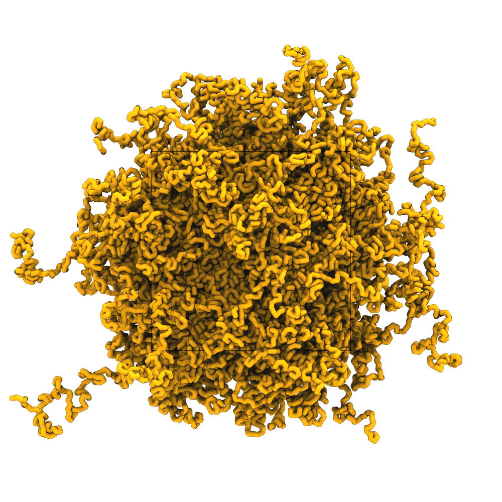
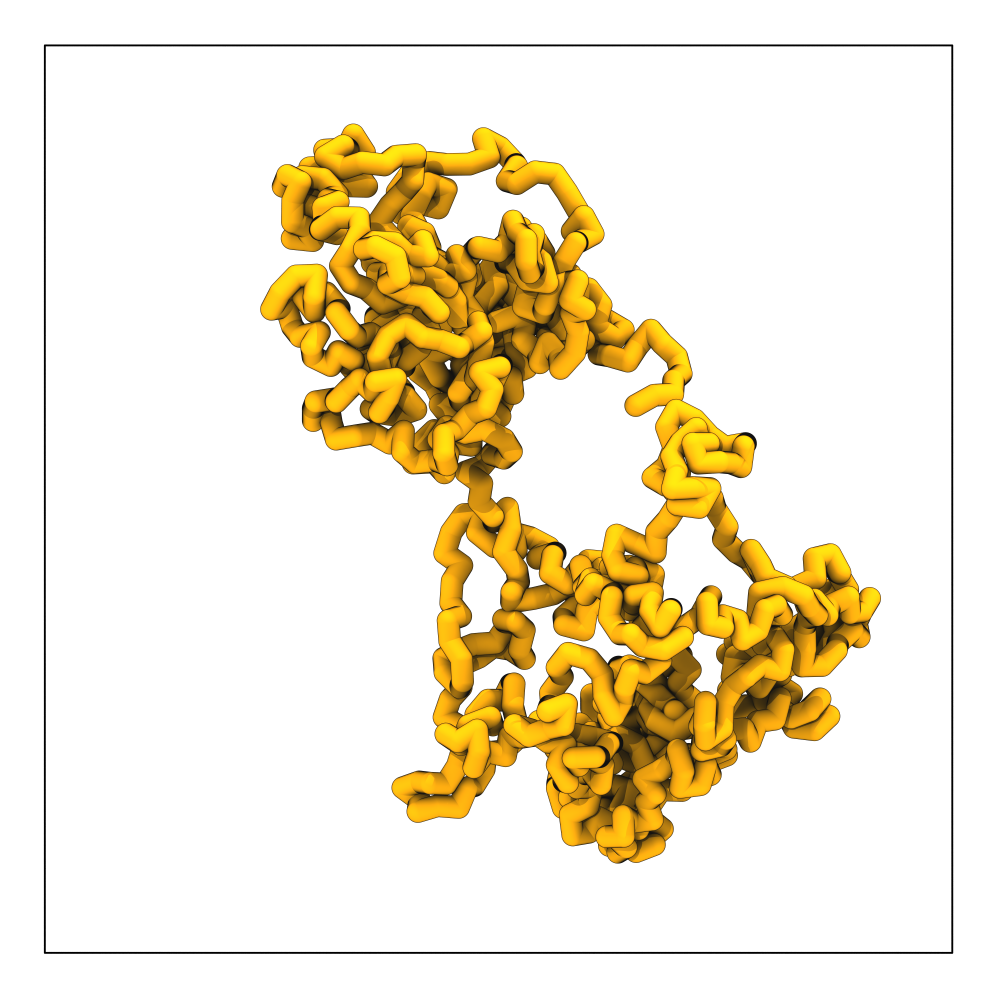
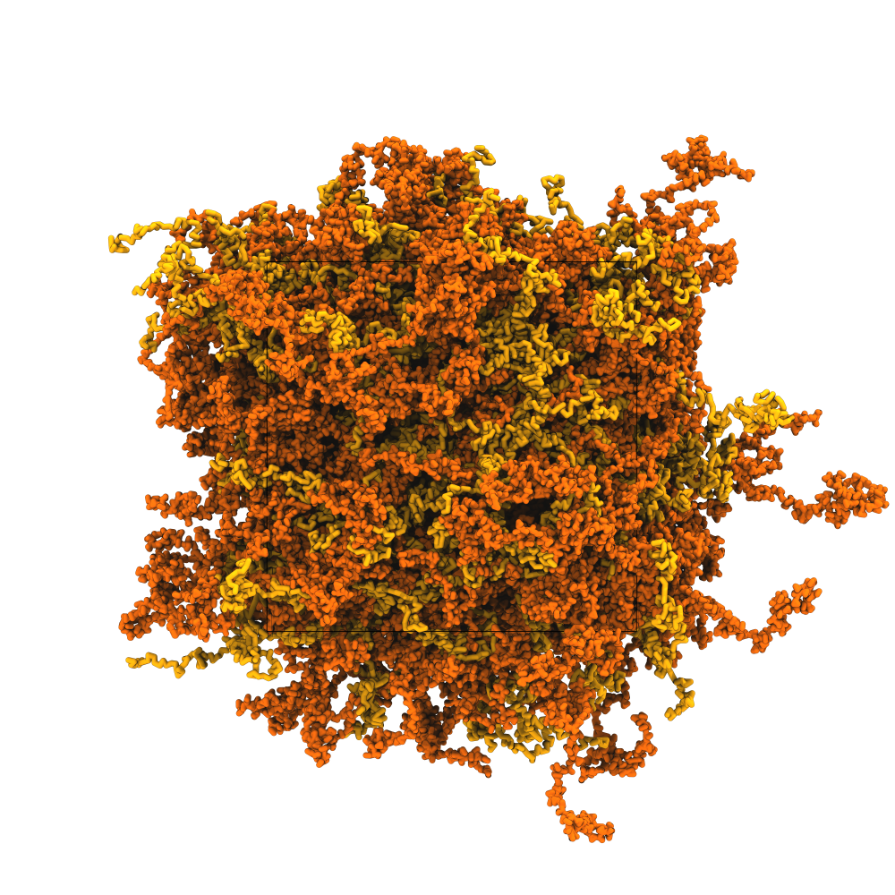

# Tutorial IV: Polymers with Polyply

> **Time:** ~30 minutes <br>
> **Software:** GROMACS 2024.3 · Polyply · VMD 2 <br>
> **Based on:** [Polyply documentation](https://polyply.github.io/polyply_1.0/) <br>

Many biological polymers are conformationally disordered. Examples
include ssDNA, RNA, intrinsically disordered proteins, and glycans. Their
structure is an ensemble of conformations rather than a single fold, so a
starting configuration cannot come from experiment or an AlphaFold model
and has to be generated by other means.

*Polyply*[^polyply] handles both parts of the setup. It generates the
topology from a sequence of building blocks, and generates coordinates
through a random walk at a target density that can be constrained to
arbitrary volumes. Polyply is force field agnostic and ships with
libraries for Martini (2 and 3), GROMOS, OPLS, and Parmbsc1.

In this tutorial we work through the Polyply workflow with polyethylene
oxide (PEO). We build a linear melt, confine a single long chain to a
sphere, and generate a PEO/PS blend.

---

### Overview

1. Generate the PEO topology.
2. Build a linear polymer melt.
3. Confine a long polymer to a sphere.
4. Build a mixed PEO/PS blend.

### Installation

*Polyply* is not shipped with the workshop environment. Install it with
pip:

```sh
pip install polyply
```

The `polyply` command becomes available in the terminal after installation.

### Get the files

```sh
cd 04_polymers_and_DNA
```

---

## 1. Generate the PEO topology

We first need a topology. Polyply builds `.itp` files by chaining together
residue building blocks from a force-field library. Each library contains
monomer definitions plus the links that connect them.

List the available libraries:

```sh
polyply -list-lib
```

The `martini3` library is one of them. To list its building blocks:

```sh
polyply -list-blocks martini3
```

The library includes PEO, polystyrene (PS), and many others. Not all
combinations of building blocks are linked, so check before combining
polymers of different types.

`polyply gen_params` builds an `.itp` file from a sequence of these
blocks. Generate a PEO chain of length 200:

```sh
polyply gen_params -lib martini3 -o PEO.itp -name PEO -seq PEO:200
```

The flags are:

- `-lib` — library name.
- `-o` — output `.itp` file.
- `-name` — molecule name in the topology.
- `-seq` — sequence of building blocks, formatted as `<residue>:<count>`.

Run `polyply gen_params -h` for more options, including how to provide a
sequence file (`-seqf`) for longer or branched polymers.

---

## 2. Linear polymer melt

A polymer melt is a dense assembly of chains without solvent. It is the
standard starting point for polymer simulations because it isolates
chain-chain interactions from solvent effects. Polyply builds one by
running a random walk for each chain at a target density. Any resulting
close contacts are relaxed by energy minimization.

Create `topol.top` for a melt of 200 PEO chains:

```text
#include "martini_v3.0.0/martini_v3.0.0.itp"
#include "PEO.itp"

[ system ]
PEO melt

[ molecules ]
PEO 200
```

Generate the coordinates at the Martini standard density of 1000 kg/m³:

```sh
polyply gen_coords -p topol.top -o melt.gro -name melt -dens 1000
```

The flags are:

- `-p` — topology file.
- `-o` — output coordinate file.
- `-name` — system name.
- `-dens` — target system density (kg/m³).

With `-dens`, Polyply picks a rectangular box size automatically.
Alternatively, set an explicit box with `-box <x> <y> <z>` (nm). Only
rectangular boxes are supported. Run `polyply gen_coords -h` for the
full option list.

The random walk ignores non-bonded interactions of the target force
field, so beads that end up close together may have very high initial
forces. Energy-minimize before running any MD:

```sh
mkdir -p em
gmx grompp -f mdp_files/em.mdp -p topol.top -c melt.gro -o em/em.tpr
gmx mdrun -v -deffnm em/em
```

Visualize the result:

```sh
vmd2 em/em.tpr em/em.gro
```

The chains should fill the box uniformly at melt density.

<div align="center">

<br>
<sub><i>Figure 1. Linear polymer melt. Starting structure of 200 PEO chains after energy minimization.</i></sub>
</div>

---

## 3. Confined polymer

Many biological polymers are spatially confined. Chromosomes fit in
nuclei, phage genomes in capsids, bacterial DNA inside cellular
envelopes. Polyply supports confinement through a *build file* that adds
geometric constraints on top of the standard random walk.

We generate a single long PEO chain and confine it to a sphere at the
center of the box, as a simplified analogue of a polymer packed inside a
compartment.

Generate a linear PEO chain of length 1000:

```sh
polyply gen_params -lib martini3 -o PEO_long.itp -name PEO_long -seq PEO:1000
```

Update `topol.top` for a single long chain:

```text
#include "martini_v3.0.0/martini_v3.0.0.itp"
#include "PEO_long.itp"

[ system ]
Confined PEO

[ molecules ]
PEO_long 1
```

Create a build file `build.bld` that constrains the chain to a sphere of
radius 7 nm at the center of a 16 × 16 × 16 nm box:

```text
[ molecule ]
PEO_long 0 1

[ sphere ]
PEO 0 1000 in 8.0 8.0 8.0 7.0
```

`[ molecule ]` selects the molecules the constraint applies to. Here, the
single `PEO_long` instance (index 0). `[ sphere ]` confines all 1000
residues named `PEO` to a sphere centered at (8, 8, 8) with radius 7 nm.
The `in` keyword makes the sphere a containment region; `out` would
exclude it instead.

Generate the coordinates in an explicit 16 × 16 × 16 nm box:

```sh
polyply gen_coords -p topol.top -b build.bld -o confined.gro -name confined -box 16 16 16
```

Energy-minimize:

```sh
mkdir -p em
gmx grompp -f mdp_files/em.mdp -p topol.top -c confined.gro -o em/em.tpr
gmx mdrun -v -deffnm em/em
```

Visualize:

```sh
vmd2 em/em.tpr em/em.gro
```

You should see a single PEO chain filling a spherical region in the
middle of the box, with no polymer beads outside the sphere.

<div align="center">

<br>
<sub><i>Figure 2. Confined PEO. A single 1000-residue chain confined to a spherical volume of radius 7 nm.</i></sub>
</div>

---

## 4. PEO/PS blend

Blends of multiple polymer types are set up by adding each polymer's
`.itp` to the topology and listing them together in `[ molecules ]`. The
random walk places both types at the target density in the same box.

Generate a polystyrene chain of length 200:

```sh
polyply gen_params -lib martini3 -o PS.itp -name PS -seq PS:200
```

Update `topol.top` to include both polymers:

```text
#include "martini_v3.0.0/martini_v3.0.0.itp"
#include "PEO.itp"
#include "PS.itp"

[ system ]
PEO/PS blend

[ molecules ]
PEO 200
PS 200
```

Generate the coordinates at the Martini standard density:

```sh
polyply gen_coords -p topol.top -o blend.gro -name blend -dens 1000
```

Energy-minimize:

```sh
mkdir -p em
gmx grompp -f mdp_files/em.mdp -p topol.top -c blend.gro -o em/em.tpr
gmx mdrun -v -deffnm em/em
```

Visualize:

```sh
vmd2 em/em.tpr em/em.gro
```

The two polymer types are randomly interspersed in the starting
configuration. In VMD, select `resname PEO` and `resname PS` separately
to see the two types. Any mixing or phase behavior develops during a
subsequent MD run.

<div align="center">

<br>
<sub><i>Figure 3. PEO/PS blend. Starting configuration with 200 PEO chains (green) and 200 PS chains (blue).</i></sub>
</div>

---

## Going further

Beyond the three examples above, Polyply supports:

- **Circular polymers.** Generate topology and coordinates for circular polymers. See the [circular DNA tutorial](https://github.com/marrink-lab/polyply_1.0/wiki/Tutorial:-Single-stranded-circular-DNA).
- **PEGylated proteins.** Attach polymer chains to specific residues on a protein. See the [PEGylated proteins tutorial](https://github.com/marrink-lab/polyply_1.0/wiki/Tutorial:-PEGylated-proteins).
- **PEGylated lipid bilayers.** Add polymer tails to lipid headgroups in a bilayer. See the [PEGylated lipid bilayers tutorial](https://github.com/marrink-lab/polyply_1.0/wiki/Tutorial:-PEGylated-lipid-bilayers).
- **IDP starting structures.** Use the polymer workflow to generate starting conformations for intrinsically disordered proteins in Martini. See the [Martini polymers tutorial](https://github.com/marrink-lab/polyply_1.0/wiki/Tutorial:-Martini-Polymers).

For the full build-file reference and more worked examples, see the
[Polyply documentation](https://polyply.github.io/polyply_1.0/).

---

## References

[^polyply]: Grünewald, F., Alessandri, R., Kroon, P. C., et al. (2022).
    Polyply; a python suite for facilitating simulations of macromolecules
    and nanomaterials. *Nat. Commun.*, 13, 68.
    [doi:10.1038/s41467-021-27627-4](https://doi.org/10.1038/s41467-021-27627-4)
