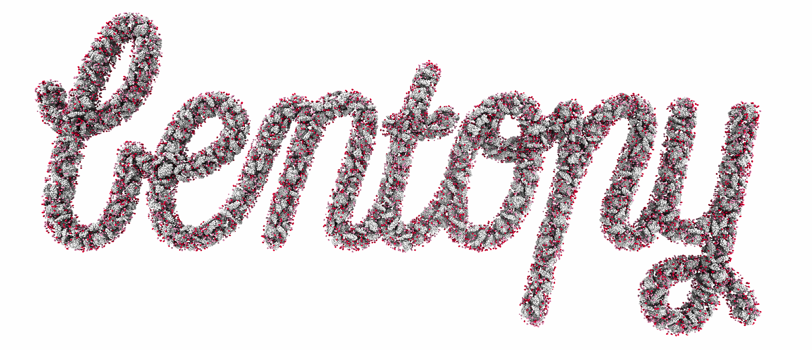
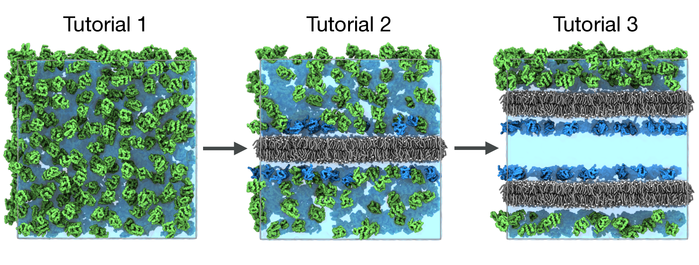
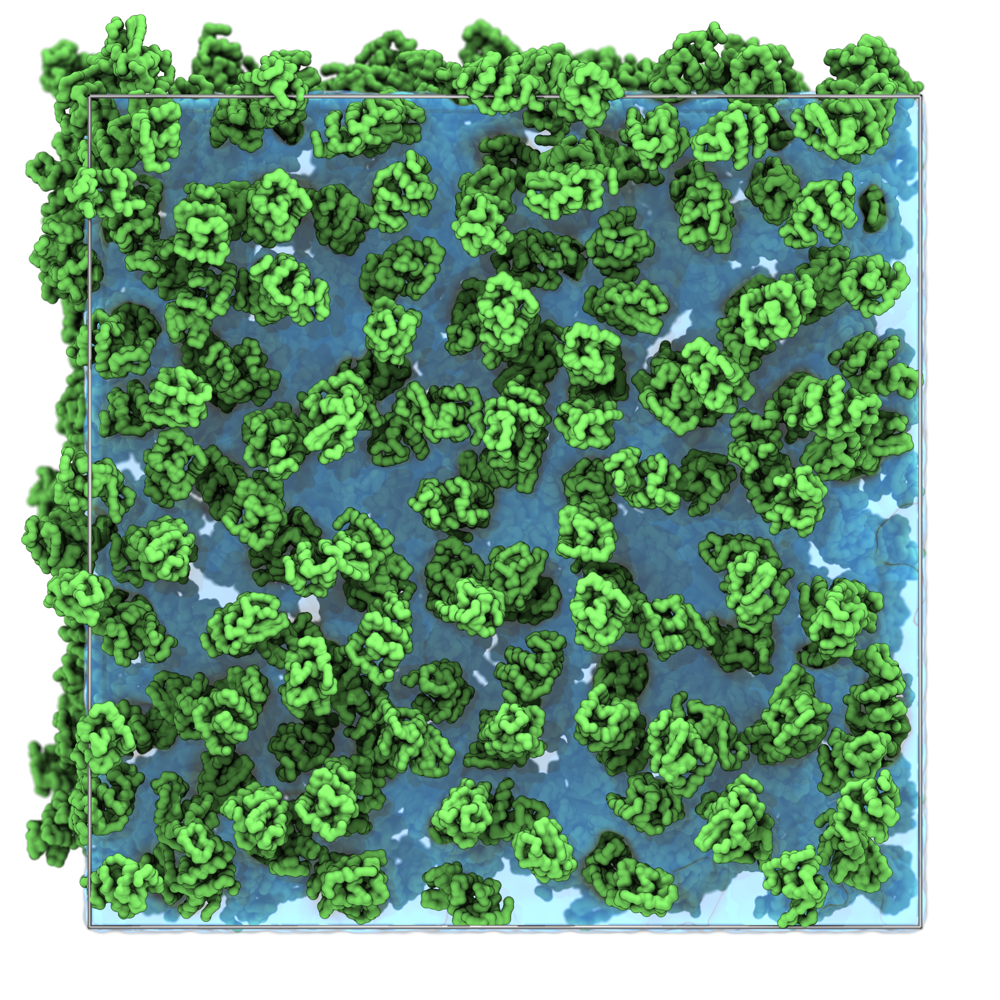
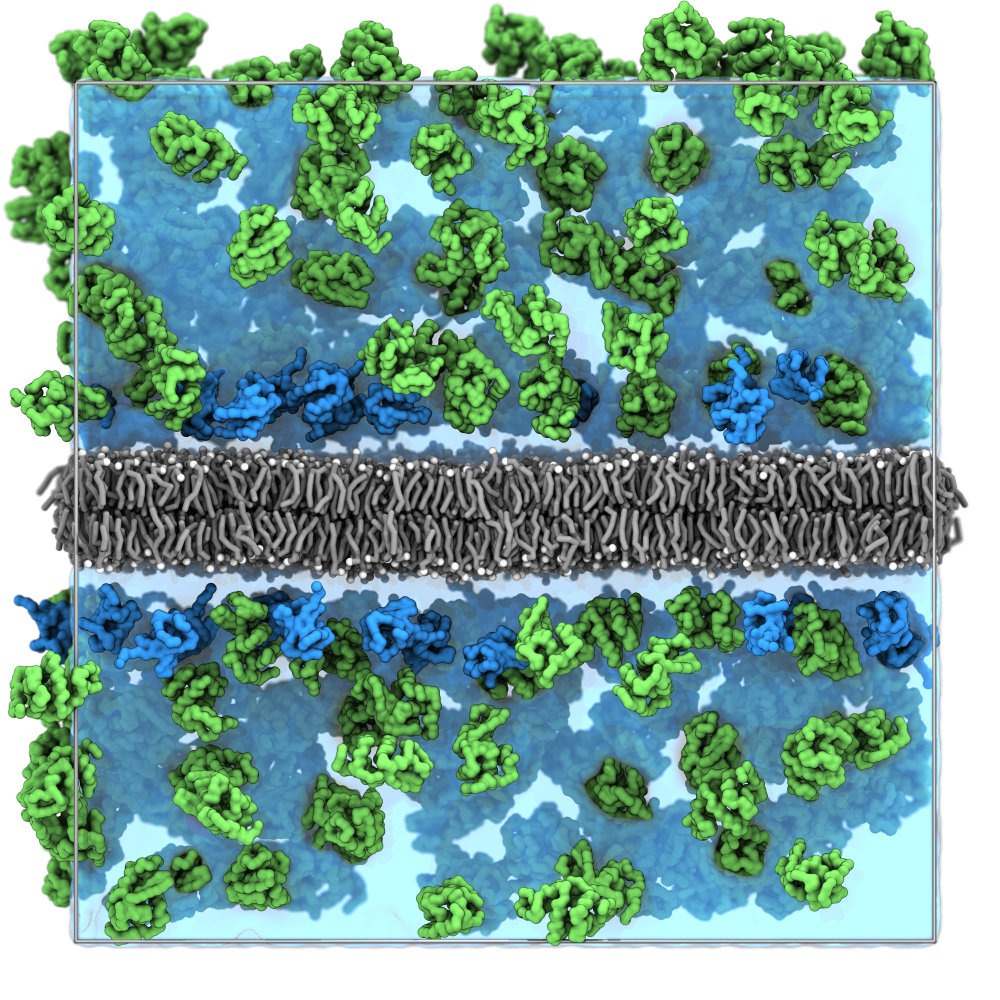
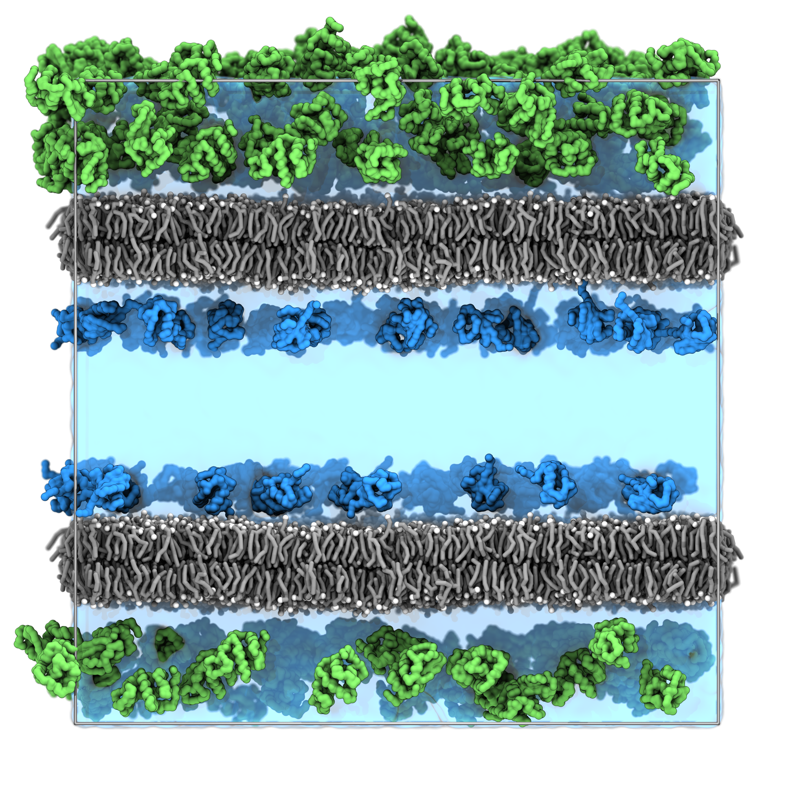
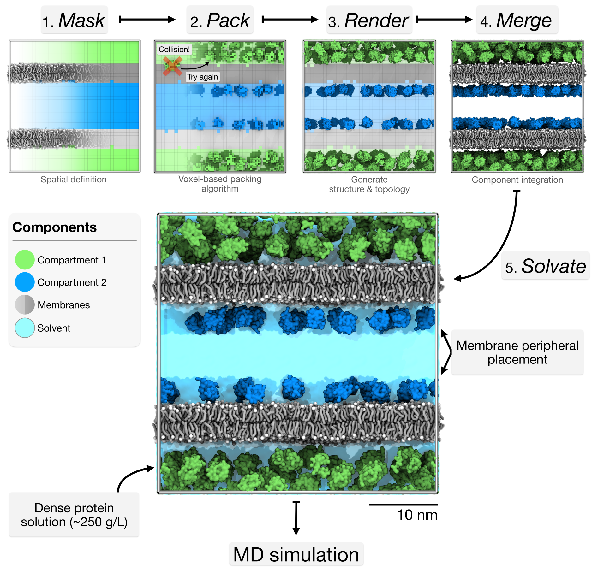

# Tutorial V: Packing Biomolecular Systems

> **Time:** ~30 minutes <br>
> **Software:** _GROMACS 2024.3_ · _bentopy_ · _VMD 2_ <br>
> **Based on:** [Bentopy workshop
> tutorial](https://cgmartini.nl/docs/tutorials/Martini3/Bentopy/) by J.A.
> Stevens and M.S.S. Westendorp<br>
> **Walkthrough video:** [YouTube](https://www.youtube.com/watch?v=C4LYZokS_t4) <br>

*Bentopy* is a tool for packing molecules in arbitrary volumes, designed
specifically for setting up large-scale molecular dynamics
simulations[^bentopy]. Through an efficient packing algorithm, *bentopy* can
assemble molecular structures into MD models with biological densities at
cellular scales.

*Bentopy* was built to create cellular-scale models by integrating multiple
structural components at physiological concentrations while ensuring simulation
compatibility. It uses voxels to represent space as a regular 3D grid,
providing computational efficiency for spatial operations such as collision
detection and placement. For example, this voxel approach enables
MDVContainment[^mdvcontainment] to automatically identify compartments within
molecular models, which is a central feature of *bentopy*.

<div align="center">

<br>
<sub><i>Figure 1: The bentopy logo, packed with bentopy. Those interested in
how this model was constructed may enjoy this <a
href="https://hachyderm.io/@ma3ke/114081904829438250">thread on the making of
this model</a>.</i>
</sub>
</div>
<br>

In this tutorial, we will showcase _bentopy_'s capabilities through three
progressively complex tutorials that build on each other:

1. **Simple packing.** Learn the basic workflow by packing proteins in empty
   space.
2. **Packing around existing structures.** Add a membrane and pack proteins
   around it.
3. **Multi-compartment systems.** Add a second membrane creating distinct
   compartments for different proteins.

Each tutorial builds on the previous one, showing how to evolve a simple system
into a complex model while using the standard bentopy workflow.

<div align="center">

<br>
<sub><i>Figure 2. Tutorial progression from simple protein packing to complex multi-compartment systems.</i></sub>
</div>
<br>

---

### Overview

1. Basic packing in empty space.
2. Packing around existing structures.
3. Multi-compartment systems with placement rules.

### Start the tutorial

*Bentopy* is not shipped with the workshop environment. Install it with pip:

```sh
pip install bentopy
```

This installs the `bentopy-*` command-line tools used throughout the tutorial.

Navigate to the tutorial directory.

```sh
cd 05_packing_the_cytoplasm
```

The tutorial directory contains:

- **`structures/`** — protein structures (`lysozyme.pdb`, `ubiquitin.pdb`) and membranes (`membrane.gro`, `double_membrane.gro`) and protein topologies (`lysozyme.itp`, `ubiquitin.itp`).
- **`mdp_files/`** — example GROMACS input files (`em.mdp`, `eq.mdp`, `md.mdp`).

Visualization throughout the tutorial uses VMD 2, provided as a module. Load
it into your environment now:

```sh
module use /projects/bgvl/alfiaparvez/modulefiles
module load vmd/2.0.0
```

---

## 1. Basic packing in empty space

We start with the basic *bentopy* workflow by packing proteins into a
simple cubic space. This section introduces:

- The `.bent` input file.
- Analytical mask definitions.
- The `bentopy-pack`, `bentopy-render`, and `bentopy-solvate` commands.

### Create the packing configuration

*Bentopy* uses input configuration files, called `.bent` files, to define
packing parameters. These files act as recipes for building systems. Their
format may be familiar to GROMACS users, and is designed to be approachable
and readable. Create a file called `simple_packing.bent`:

```ini
[ general ]
title "Proteins in a box"
seed 0

[ space ]
# All dimensions in bentopy are given in nanometers.
dimensions 40, 40, 40
resolution 0.5

[ includes ]
"martini_v3.0.0/martini_v3.0.0.itp"
"martini_v3.0.0/martini_v3.0.0_ffbonded_v2.itp"
"martini_v3.0.0/martini_v3.0.0_ions_v1.itp"
"martini_v3.0.0/martini_v3.0.0_solvents_v1.itp"
"martini_v3.0.0/martini_v3.0.0_phospholipids_PC_v2.itp"
"structures/lysozyme.itp"

[ compartments ]
system is all

[ segments ]
LYZ 650 from "structures/lysozyme.pdb" in system
```

Key parts of the recipe:

- **General.** Sets the system title and a random seed. Using a fixed seed makes results reproducible. Leave it unset for a random seed at runtime.
- **Space.** Defines a 40×40×40 nm³ simulation box with 0.5 nm voxel resolution.
- **Includes.** Topology files for GROMACS compatibility. These are included when we generate the final topology with `bentopy-render`.
- **Compartments.** The compartments available for placing segments. Here, `system` spans the entire space.
- **Segments.** The structures to pack and their target counts per compartment. Here, 650 lysozyme proteins are randomly placed in the `system` compartment. The segment name `LYZ` matches the molecule name in `topology/lysozyme.itp`.

### Pack the system

```sh
bentopy-pack simple_packing.bent placements.json
```

The output `placements.json` contains all the placement information in a
lightweight instance-based file format. We call this the *placement list*.

### Render the structure

Convert the placement list to a coordinate file:

```sh
bentopy-render placements.json system.gro -t topol.top
```

This creates `system.gro` with the protein coordinates and `topol.top`
with the simulation topology.

> [!NOTE]
> Splitting the computationally intensive packing step from writing the
> full coordinate file allows for more efficient workflows with large
> systems. It also improves shareability of models. Distributing the
> lightweight placement file is orders of magnitude more efficient than
> sharing the complete coordinate file.

### Solvate

Add water and ions to complete the system:

```sh
bentopy-solvate -i system.gro -o solvated_system.gro \
        -s NA,CL:0.15M \
        --charge neutral \
        -t topol.top
```

- `-s NA,CL:0.15M` adds 150 mM NaCl by substituting accepted water placements.
- `--charge neutral` neutralizes the total system charge by substituting additional ions. The total charge is determined automatically from the topology, so additional charge-neutralizing ions are added on top of the 150 mM NaCl.
- `-t topol.top` appends the solvent contents to the topology.

The system is now fully solvated at 150 mM NaCl and net-neutral, ready
for MD simulation.

> [!NOTE]
> `bentopy-solvate` is designed and optimized for solvating large-scale
> models with millions or billions of particles, where traditional
> solvation tools become impractically slow. It also works well for more
> modest systems like this one.

### Visualize

```sh
vmd solvated_system.gro
```

You should observe:

- The lysozyme proteins distributed uniformly throughout the simulation box.
- The lysozymes packed at cytoplasmic densities with no protein overlaps.

<div align="center">

<br>
<sub><i>Figure 3. Basic protein packing. Lysozyme proteins packed in a cubic box with water and ions, with non-overlapping placements.</i></sub>
</div>
<br>

<details>
<summary><b>Try a different analytical mask</b></summary>
<br>

Before moving to the next section, you can experiment by trying a different
analytical compartment shape. Replace the compartment definition in
`simple_packing.bent` to pack proteins inside a sphere instead of the entire
space:

```ini
[ compartments ]
system as sphere at center with radius 20
```

Or declare a smaller cuboid:

```ini
[ compartments ]
system as cuboid from 10, 10, 10 to 30, 30, 30
```

> [!WARNING]
> The available space to pack proteins has become smaller, so not all requested
> proteins will be placed. *Bentopy* indicates this with the `<` remark in the
> packing summary that gets printed to the terminal. It is advised to save this
> summary to a file. It contains all the relevant packing information for the
> project.

```text
Setting up compartments...
Loading segment structures...
Rearranging segments according to the Moment method... Done.
(  1/1) Attempting to pack   650 instances of segment 'LYZ'.
Packing process took 0.091 s.
idx     name          ok%   target  placed  time (s)  remark
----    ----------  ------  ------  ------  --------  ------
   0    LYZ          50.8%    650    330      0.09    <
                     50.8%    650    330      0.09    <
Writing placement list to "placements.json"... Done in 0.003 s.
```

</details>

---

## 2. Packing around existing structures

In this section, we add a membrane and treat it as excluded volume so that
proteins are not placed within it. We also introduce packing rules to place
specific proteins close to the membrane surface. This section introduces:

- Compartment definitions using voxel masks generated from existing structures.
- Proximity-based placement rules.
- The `bentopy-mask` and `bentopy-merge` commands.

### Inspect the mask compartments

Before creating masks, it is helpful to see which compartments *bentopy*
identifies in the system. Generate a visualization file:

```sh
bentopy-mask structures/membrane.gro --visualize-labels labels.gro
```

This creates a `labels.gro` file that contains a bead at every voxel position.
Each voxel bead is named after the compartment it resides in. Visualize the
voxel representation with VMD:

```sh
vmd labels.gro
```

Use the following selections to see the identified compartments:

- **Solvent regions** (outside, available for packing): `name "-1"`.
- **Membrane region** (excluded from packing): `name 1`.

The negative label (-1) typically represents the outermost compartment
(solvent), while positive labels (1) represent inner or solid structures
(membrane).

### Create the mask

Now that you know the compartments, create the mask that will guide
protein placement. Here we create a mask called `membrane_mask.npz` from
compartment `1`:

```sh
bentopy-mask structures/membrane.gro -l 1:membrane_mask.npz
```

### A new recipe

Create `membrane_packing.bent` to use the membrane mask and include a
proximity rule:

```ini
[ general ]
title "Proteins around a membrane"
seed 0

[ space ]
dimensions 40, 40, 40
resolution 0.5

[ includes ]
"martini_v3.0.0/martini_v3.0.0.itp"
"martini_v3.0.0/martini_v3.0.0_ffbonded_v2.itp"

"martini_v3.0.0/martini_v3.0.0_ions_v1.itp"
"martini_v3.0.0/martini_v3.0.0_solvents_v1.itp"
"martini_v3.0.0/martini_v3.0.0_phospholipids_PC_v2.itp"

"structures/lysozyme.itp"
"structures/ubiquitin.itp"

[ compartments ]
membrane from "membrane_mask.npz"
solvent combines not membrane
close-to-membrane around 5 of membrane

[ segments ]
LYZ:lyz 300 from "structures/lysozyme.pdb" in solvent
UBQ:ubq 100 from "structures/ubiquitin.pdb" in close-to-membrane
```

Key changes:

- The membrane mask is loaded from the file we created earlier.
- The `solvent` region is defined as the inverse (`not`) of `membrane`, using a *compartment combination*.
- `close-to-membrane` uses the `around` rule to define the region within 5 nm of the membrane surface.
- The lysozyme count is reduced since the membrane takes up part of the space.
- Ubiquitin is added with a proximity rule to stay within 5 nm of the membrane surface, but not inside it. See the Advanced features section for more on creating complex compartment combinations.
- Both segments now carry a tag (`:lyz`, `:ubq`) that overrides the residue names in the output `.gro` for easier visualization. Tags are particularly helpful in more complex models where the same structure appears in different compartments at different quantities.

> [!NOTE]
> Using tags overrides the original residue names in the output `.gro`.
> While this makes selecting subsets easier (e.g. `resname lyz` in VMD),
> it may cause issues with analysis tools that expect standard residue
> names. Use `--ignore-tags` with `bentopy-render` to disable this
> behavior. During the MD simulation, GROMACS assigns the correct
> chemical residue names from the topology file, so simulation output
> has proper naming.

### Pack the system

```sh
bentopy-pack membrane_packing.bent placements.json
```

<details>
<summary><b>How bentopy orders segments during placement</b></summary>
<br>

Now that we have two structures, it is worth mentioning how *bentopy*
orders them for packing. Larger structures are harder to pack because they
have fewer possible positions and orientations within the available space.
Moreover, small structures placed first may obstruct the placement of a
larger structure that could have been placed there, while the smaller
structure could have been placed in many other locations.

By default, *bentopy* uses a geometric moment heuristic (moment of inertia,
taking all particles to have unit mass) to rank structures by how tricky
they are to pack. Larger structures are placed first.

To change this behavior, add a `rearrange <method>` line to the input
file, or use the `--rearrange <method>` flag. The available methods are:

- `moment` (default), orders by geometric moment.
- `volume`, orders by molecular volume.
- `bounding-sphere`, orders by bounding sphere radius.
- `none`, keeps the order specified in the input file.

In our testing, `moment` works best for most systems, but for specific
use cases it may be worth experimenting with other options.

</details>

### Render and merge

Convert the placement list to a coordinate file and merge the packed
proteins with the membrane structure.

```sh
bentopy-render placements.json packed_proteins.gro -t topol.top

# Merge proteins with the membrane
bentopy-merge packed_proteins.gro structures/membrane.gro -o system.gro

# Add lipid molecules to the topology
echo "POPC    5408" >> topol.top
```

`bentopy-merge` appends the membrane structure to the packed proteins.

### Solvate

```sh
bentopy-solvate -i system.gro -o solvated_system.gro -t topol.top \
        -s NA,CL:0.15M --charge neutral
```

### Visualize

```sh
vmd solvated_system.gro
```

> [!TIP]
> Since we used tags, you can select `resname ubq` and `resname lyz` in
> VMD to visualize the two protein types separately.

You should observe:

- Lysozyme proteins distributed throughout the aqueous regions.
- Ubiquitin proteins concentrated near the membrane surfaces due to the proximity rule.
- No protein overlaps with the membrane structure.

<div align="center">

<br>
<sub><i>Figure 4. Membrane system with proximity rules. The membrane (grey)
creates excluded volume. Lysozyme proteins (green) are distributed throughout
the solvent region, and ubiquitin proteins (blue) are concentrated near the
membrane surface.</i></sub>
</div>
<br>

---

## 3. Multi-compartment systems with placement rules

Now we add more complexity by creating a double-membrane system that forms
distinct compartments, with different proteins placed in each compartment. This
section introduces compartment-specific protein placement.

We use the provided double membrane to create two distinct open compartments,
then place different proteins in each compartment.

### Inspect the double membrane structure

```sh
vmd structures/double_membrane.gro
```

The system has two lipid bilayers, creating four distinct regions: two spaces
between the two membranes, and the two membranes themselves. We could think of
one inter-membrane space as the "outside" and the other as the "inside",
similar to a vesicle or double-layer cell wall. However, the two inter-membrane
spaces cannot be distinguished due to the periodic nature of the box, so we
simply call them compartments **A** and **B**.

### Create compartment-specific masks

Generate masks for the different compartments created by the double
membrane. (The `-b` flag is short for `--visualize-labels`.)

```sh
bentopy-mask structures/double_membrane.gro -b compartment_labels.gro
```

Visualize the voxel representation:

```sh
vmd compartment_labels.gro
```

Double-check the different spatial compartments identified by the
containment algorithm:

- Compartment **A**: `name "-1"`.
- Compartment **B**: `name "-2"`.
- Membrane regions (excluded): `name 1 2`.

### Create separate masks for each compartment

```sh
bentopy-mask structures/double_membrane.gro \
        -l  -1:A_mask.npz \
        -l  -2:B_mask.npz \
        -l 1,2:membrane_mask.npz
```

Adding multiple `-l` entries writes out all necessary mask files at once.

### Update the configuration

Create `compartment_packing.bent` with multiple compartments and different
protein compositions.

```ini
[ general ]
title "Proteins in different compartments"
seed 0

[ space ]
dimensions 40, 40, 40
resolution 0.5

[ includes ]
"martini_v3.0.0/martini_v3.0.0.itp"
"martini_v3.0.0/martini_v3.0.0_ffbonded_v2.itp"

"martini_v3.0.0/martini_v3.0.0_ions_v1.itp"
"martini_v3.0.0/martini_v3.0.0_solvents_v1.itp"
"martini_v3.0.0/martini_v3.0.0_phospholipids_PC_v2.itp"

"structures/lysozyme.itp"
"structures/ubiquitin.itp"

[ compartments ]
membrane from "membrane_mask.npz"
A from "A_mask.npz"
B from "B_mask.npz"
membrane-neighborhood around 4 of membrane
B-close-to-membrane combines membrane-neighborhood and B

[ segments ]
LYZ:lyz 200 from "structures/lysozyme.pdb" in A
UBQ:ubq 100 from "structures/ubiquitin.pdb" in B-close-to-membrane
```

Key changes:

- The `A` and `B` compartments are added from the masks generated above.
- `B-close-to-membrane` demonstrates how combinations can include boolean operations between previously defined compartments.
- Lysozyme is placed only in compartment **A**.
- Ubiquitin is placed only in compartment **B** *and* close to the membrane.

### Pack the system

```sh
bentopy-pack compartment_packing.bent placements.json
```

### Render and merge

```sh
bentopy-render placements.json packed_proteins.gro -t topol.top

# Merge proteins with the double membrane
bentopy-merge packed_proteins.gro structures/double_membrane.gro -o system.gro

# Add lipid molecules to the topology
echo "POPC    10816" >> topol.top
```

### Solvate

```sh
bentopy-solvate -i system.gro -o solvated_system.gro -t topol.top \
        -s NA,CL:0.15M --charge neutral
```

### Visualize

```sh
vmd solvated_system.gro
```

You should observe:

- Lysozyme proteins distributed throughout compartment **A**.
- Ubiquitin proteins concentrated near the membrane surfaces in compartment
  **B**.
- No protein overlaps with the membrane structure.

<div align="center">

<br>
<sub><i>Figure 5. Multi-compartment double-membrane system. The double membrane
creates two distinct open compartments. Ubiquitin (blue) is confined to one
compartment between the membranes (A), while lysozyme (green) is placed only in
the other compartment (B).</i></sub>
</div>
<br>

### Run a simulation

With the complete solvated system, run a molecular dynamics simulation
using the provided input files.

```sh
# Energy minimization
gmx grompp -f mdp_files/em.mdp -c solvated_system.gro -p topol.top -o em.tpr
gmx mdrun -v -deffnm em

# Make index file
gmx make_ndx -f em.gro -o index.ndx << EOF
name 13 Lipid
r W | r ION
name 16 Solvent
q
EOF

# Equilibration
gmx grompp -f mdp_files/eq.mdp -c em.gro -p topol.top -o eq.tpr -n index.ndx
gmx mdrun -v -deffnm eq

# Production run
gmx grompp -f mdp_files/md.mdp -c eq.gro -p topol.top -o md.tpr -n index.ndx
gmx mdrun -v -deffnm md
```

You have now walked through the complete *bentopy* workflow from simple
packing to a complex MD model.

<div align="center">

<br>
<sub><i>Figure 6. Bentopy workflow overview. Models are built in consecutive
steps: mask preparation, packing configuration, structure rendering, merging,
and solvation.</i></sub>
</div>
<br>

---

## Advanced features and tips

For more on *bentopy*, see the [*bentopy*
wiki](https://github.com/marrink-lab/bentopy/wiki), which includes a [reference
document](https://github.com/marrink-lab/bentopy/wiki/Reference-for-bent) for
the `.bent` file format and additional example systems.

### Solvation options

*Bentopy* includes `bentopy-solvate`, optimized for large-scale systems. For
the complete documentation, see the [`bentopy-solvate`
README](https://github.com/marrink-lab/bentopy/blob/main/src/solvate/README.md).

**Ion substitutions with different quantities**

```sh
# Molarity: 150 mM NaCl.
bentopy-solvate -i system.gro -o solvated.gro -s NA,CL:0.15M

# Add ions with different valences.
bentopy-solvate -i system.gro -o solvated.gro -s CA,CL@2:0.10M
# This will add calcium chloride (CaCl₂) in the right stoichiometry.

# Molarity with respect to solvent volume (Ms instead of M).
# See https://github.com/marrink-lab/bentopy/blob/main/src/solvate/README.md#quantity
# for more details.
bentopy-solvate -i system.gro -o solvated.gro -s NA,CL:0.15Ms
# The number of ions to be placed is determined based on the amount of actual
# solvent in the system, rather than the system's box volume. In a dense
# system, naive ion count determination may lead to unexpectedly high ion
# concentrations.

# Add ions at different concentrations.
bentopy-solvate -i system.gro -o solvated.gro -s NA:0.30M -s CL:0.15M

# Fixed number: exactly 100 Na⁺ and 100 Cl⁻ ions.
bentopy-solvate -i system.gro -o solvated.gro -s NA,CL:100

# Ratio: replace 1% of water with Na⁺ ions.
bentopy-solvate -i system.gro -o solvated.gro -s NA:0.01
```

**Custom cutoff distances**

For models with compartments, fine-tuning the number of water beads in
the compartments is crucial for a well-solvated model. The `--cutoff`
flag controls the minimum distance between solvent and structure beads.
Increasing the cutoff creates more space around solutes (fewer waters);
decreasing it allows tighter packing (more waters). The `--solvent-cutoff`
flag sets the minimum solvent-solvent distance over periodic boundary
conditions.

```sh
bentopy-solvate -i system.gro -o solvated.gro --cutoff 0.5 --solvent-cutoff 0.25
```

**All-atom waters**

`bentopy-solvate` also works with atomistic models by setting
`--water-type tip3p`. When you switch water types, the default
solvent-structure collision distance is updated too.

### Render options for large systems

`bentopy-render` provides several options for managing visualization and
analysis of large systems.

**Limiting render regions** using `--limits`
(format: `minx,maxx,miny,maxy,minz,maxz`):

```sh
# Render a 10x10x10 nm cube from (40,40,40) to (50,50,50)
bentopy-render placements.json small_region.gro --limits 40,50,40,50,40,50

# Render a thin slice in the z-direction only
bentopy-render placements.json slice.gro --limits none,none,none,none,45,55
```

**Reduced atom rendering** with `--mode` for easier visualization:

```sh
# Only alpha carbons
bentopy-render placements.json alpha_only.gro --mode alpha

# One bead per residue
bentopy-render placements.json residue_beads.gro --mode residue

# One bead per protein instance
bentopy-render placements.json instance_beads.gro --mode instance
```

> [!NOTE]
> Reduced rendering modes cannot generate topology files, since these are only
> intended for visualization and validation. Use `--mode full` (default) when
> topology files are needed.

**Residue numbering control** with `--resnum-mode`:

```sh
# Each protein instance gets a unique residue number
bentopy-render placements.json system.gro --resnum-mode instance

# All instances of the same protein type share a residue number
bentopy-render placements.json system.gro --resnum-mode segment
```

**Residue name relabeling** during merging:

```sh
# Assign custom residue names using the colon syntax
bentopy-merge membrane.gro:MEM packed_proteins.gro:PROT -o complete_system.gro
bentopy-merge membrane.gro:MEM cytosol.gro:CYT chromosome.gro:CHR -o cell.gro
```

This allows easy selection and visualization of different system
components in molecular viewers.

### Configuration options

**Example configuration for starting new projects**

If you are starting a new project with *bentopy*, it may be helpful to
have a jumping-off point for the configuration file. Generate an example
input file:

```sh
bentopy-init example -o input.bent
```

The example lists and explains many of the available options with
placeholders to be filled in.

**Convert legacy `.json` input files to `.bent`**

Early adopters of *bentopy* may still have `.json` input files. These can
be converted with `bentopy-init`:

```sh
bentopy-init convert -i input.json -o output.bent
```

This command can also convert from `.bent` to `.bent`, in essence
functioning as a formatter. Comments will be stripped.

**Validate input files**

Input configuration files can be checked for errors and potential problems
using `bentopy-init validate`:

```sh
bentopy-init validate -i input.bent
```

**Formatting `.bent` files**

The parser is flexible about whitespace between keywords in any declaration,
which allows formatting input files in ways that suit readability preferences.
Long segment definitions can be written over multiple lines:

```ini
[ segments ]
LYZ:lyz
    0.5mM
    from "long/structures/path/lysozyme.pdb"
    in long, list, of, compartments
    satisfies even, some, constraints
```

**Concentrations instead of fixed copy numbers**

Molar concentrations (mol/L) can be used instead of absolute copy numbers:

```ini
[ segments ]
LYZ 5.0mM from "structures/lysozyme.pdb" in system
```

**Controlling protein rotations**

Constrain or set initial rotations for more realistic placement:

```ini
[ constraints ]
# Only rotate over the z-axis.
planar rotates z

[ segments ]
LYZ 50 from "structures/lysozyme.pdb" in system satisfies planar
```

The `rotates` constraint takes a comma-separated list of axes along which
random rotations may be applied.

**Compartment combinations**

Create complex spaces using boolean operations on compartments:

```ini
[ compartments ]
a as sphere at  7.5, 10, 10 with radius 7.5
b as sphere at 12.5, 10, 10 with radius 7.5
c combines a and b
d combines not c
e combines a or not (b or d)
```

These *combination expressions* can be nested and combined again. The
following syntax elements are available:

- `not <expr>` gives the inverse of `<expr>`.
- `<expr> and <expr>` gives the intersection between two expressions.
- `<expr> or <expr>` gives the union of two expressions.
- `( <expr> )` groups expressions.

### Command-line tips

**Inspect placement lists**

Use `jq` to view placement files in a pretty-printed, readable format.
Placement lists are not meant to be inspected directly, but it may be
interesting to take a look. The placement list stores translations and
rotations for all instances of each segment. Any important settings for
reproducing a placement list (seed, rearrange-method, max-tries-mult) are also
stored in its header.

```sh
jq . placements.json
```

### Troubleshooting common issues

**Packing failures**

- Check *bentopy*'s packing summary output to see which segments failed.
- Use the `--verbose` flag of `bentopy-pack` for detailed information on the
  packing process.
- Double-check molecule counts and concentrations against available space.
- Use `max-tries-mult <number>` in the `general` section of the `.bent` file to
  increase the number of placement attempts. The default value is 1000.

**Mask problems**

- Ensure mask dimensions match *space dimensions* ÷ *resolution*.
- Use `-b` (or `--visualize-labels`) with `bentopy-mask` to output a `.gro`
  visualization file for the voxel representation of the identified
  compartments.
- Try different containment/mask resolutions if too many compartments are
  identified.
- The `--morph` flag can be used to repair holes that might undesirably connect
  separate compartments, even at finer containment resolutions. By default it
  has the value `de`, meaning "dilate then erode", equivalent to a
  [morphological closing](https://en.wikipedia.org/wiki/Closing_(morphology))
  operation.
- Morphing can be disabled entirely with the `--no-morph` flag.

**Rendering errors**

- Verify that all structure paths in the placement list are accessible. If
  rendering in a different location than where the packing took place, the
  `--root <path>` option may be helpful. It sets the location from where input
  structure paths are resolved.
- Check structure file formats. `.pdb` and `.gro` files are supported for input
  structures.

**Topology issues**

- Ensure segment names in the `.bent` file match molecule names in the `.itp`
  files. Use tags to distinguish different segments of the same structure.
- Verify that all `.itp` files listed in the includes section exist and contain
  the expected topology information.

For additional support, examples, and updates, visit the [bentopy GitHub
repository](https://github.com/marrink-lab/bentopy).

---

## References

[^bentopy]: Westendorp, Marieke S. S., Stevens, Jan A., Brown, Chelsea M.,
    Dommer, Abigail C., Wassenaar, Tsjerk A., Bruininks, Bart M. H., & Marrink,
    Siewert J. (2026). Compartment-guided assembly of large-scale molecular
    models with bentopy. Protein Science, e70480.
    <https://doi.org/10.1002/pro.70480>

[^mdvcontainment]: Bruininks, Bart M. H., & Vattulainen, Ilpo. (2025).
    Classification of containment hierarchy for point clouds in periodic space.
    bioRxiv. <https://doi.org/10.1101/2025.08.06.668936>
