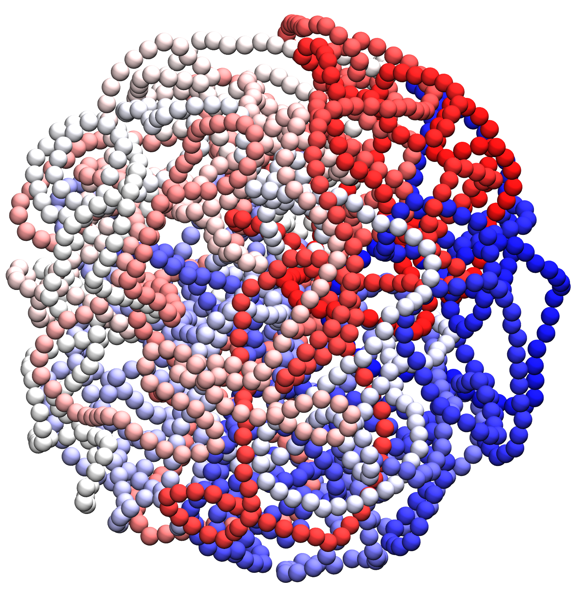
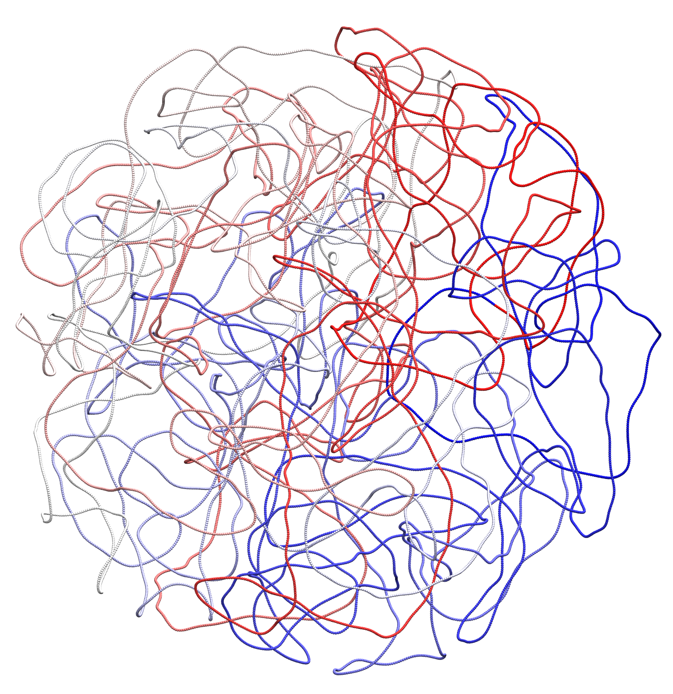
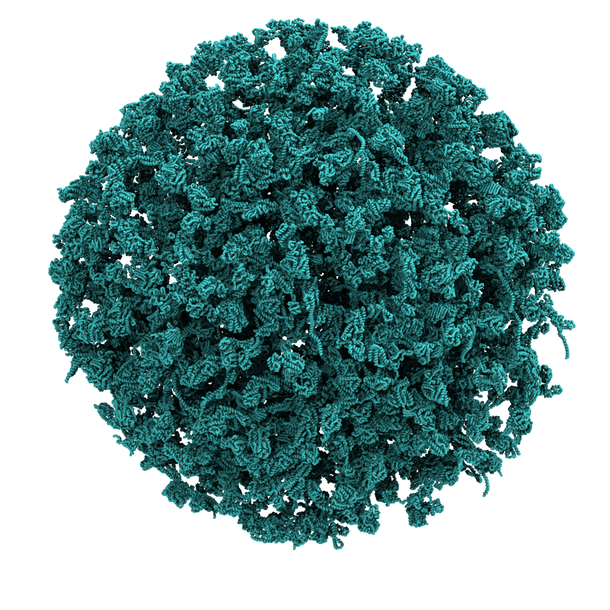

# Tutorial VI: Constructing a Martini Cell Model

> **Time:** ~30 minutes <br>
> **Software:** GROMACS 2024.3 · bentopy · polyply · TS2CG · martinize2 · VMD 2 <br>

The previous tutorials introduced the Martini CG force field and the ecosystem
of tools for building complex coarse-grained models. In this tutorial we bring
them together to construct a full cell model, based on the JCVI-Syn3A minimal
bacterium.

The model has three main components:

- A **chromosome**: a 20 kbp toy genome with a 3D structure obtained from
  BTreeChromo, and backmapped to Martini resolution with _polyply_.
- A **cell envelope**: a spherical lipid membrane containing a representative
  subset of the Syn3A membrane proteins, built with _TS2CG_.
- A **cytosol**: the full Syn3A proteome and metabolome at counts scaled down
  from experimental proteomics and metabolomics data, packed into the cytosolic
  space with _bentopy_.

We combine these into a single whole-cell model and run a short MD simulation
with _GROMACS_.

---

### Overview

| #   | Step                        | Tool        |
| :-: | :---                        | :---        |
| 1   | Build the chromosome        | _`polyply`_ |
| 2   | Build the cell envelope     | _`TS2CG`_   |
| 3   | Pack the cytosol            | _`bentopy`_ |
| 4   | Simulate the assembled cell | _`GROMACS`_ |

To start this tutorial, navigate to the respective folder in the workshop
repository.

```sh
cd 06_martini_cell
```

---

## 1. Chromosome

### Topology

For our cell model we build the chromosome from a random 20 kbp sequence
provided in `genome.ig`. There are no dedicated Martini 3 DNA parameters at the
time of writing. We use a placeholder force field, `fake.ff`, that follows the
Martini 2 DNA geometry but assigns all beads a single generic bead type. The
resulting topology preserves the shape of the chromosome, but the non-bonded
interactions are not chemically meaningful. Once Martini 3 DNA parameters
become available, we can apply the protocol below to generate a Martini 3
chromosome model, by replacing `fake.ff` with the Martini 3 force field file.

To generate the chromosome topology, run the command below.

```sh
polyply gen_params -f fake.ff -o chromosome.itp -name chromosome \
                   -seqf genome.ig -dsdna
```

The `-dsdna` flag tells _polyply_ that the sequence is double-stranded DNA.

### Backmap to Martini

The Martini coordinates for the chromosome come from backmapping a mesoscale polymer model. A one-bead-per-10-bp
representation is generated with bTreeChromo.
Polyply then fits a periodic B-spline through the monomer positions, samples
base-pair positions along the spline (10 bp per segment), and aligns Martini
base-pair templates onto them.

<div align="center">

<br>
<sub><i>Figure 1. Backmapping protocol. Steps used to generate Martini-resolution coordinates from a mesoscale polymer model.</i></sub>
</div> <br>

Backmapping a chromosome of this size takes long enough that running it
here is not practical, so a precomputed `chromosome.gro` is provided in
the current directory for the rest of the tutorial.

<div id="image-table">
    <table>
	    <tr>
    	    <td style="padding:10px" align="center">
                
      	    </td>
    	    <td style="padding:10px" align="center">
                
            </td>
        </tr>
        <tr></tr>
        <tr>
   	 	    <td style="padding:10px" align="center" colspan="3">
				
      	    </td>
        </tr>
    </table>
<center><i>Figure 2. Cell chromosome. Top left: mesoscale chromosome model from bTreeChromo. Top right: subsampled one-bead-per-base model used during backmapping. Bottom: backmapped Martini model of the chromosome.</i></center>
</div>


</div>

### Elastic network

The bonded interactions in `chromosome.itp` capture the correct base-pair
partitioning behavior, but they do not preserve the mesoscale conformation
on their own. A small helper script reads the coordinates and appends
harmonic restraints between beads within a cutoff, keeping the chromosome
close to its starting shape during MD:

```sh
python3 gen_elastic.py chromosome.gro chromosome.itp
```

> [!NOTE] An elastic network is needed to stabilize the Martini 2 DNA
> parameters. For Martini 3 DNA parameters, we hope they will be able to
> stabilize the geometry on their own.

Inspect `chromosome.gro` in VMD before continuing.

---

## 2. Cell envelope

The Syn3A cell is approximately spherical, so we model the cell membrane as
a spherical bilayer scaled to enclose the chromosome. The mesh is specified
in the triangulated surface file `sphere.tsi`. The lipid composition is
based on experimental lipidomics data, listed in the TS2CG settings file
`input.str`. The membrane proteins are a representative subset of the Syn3A
proteome, including ATP synthase, a proton symporter, SecDF, PtsG, a
potassium transporter, and an uncharacterized gene (JCVISYN3A_0005). Their
structures are provided in `structures/membrane_proteins/`.

### Pointillism

We first subsample the mesh to generate enough points to place the lipids and proteins:

```sh
TS2CG PLM -TSfile sphere.tsi -Mashno 2 -bilayerThickness 2.0
```

### Build the membrane

We use TS2CG to place the lipids and proteins and build the cell envelope:

```sh
TS2CG PCG -str input.str -Bondlength 0.2 -LLIB Martini3.LIB -defout membrane
```

Inspect `membrane.gro` in _`VMD`_ before continuing.

```sh
vmd membrane.gro
```

<div align="center">

<br>
<sub><i>Figure 3. Cell envelope. Spherical membrane with embedded proteins from the Syn3A proteome.</i></sub>
</div>


---

## 3. Cytosol

The space between the chromosome and the envelope represents the cytosol space.
We fill it with proteins and metabolites at physiological concentrations using
_bentopy_. The chromosome and membrane act as the scaffolding around which the
cytosolic components are packed.

### Merge the chromosome and envelope

Combine the two scaffolding structures. _Bentopy_ uses this merged model
to identify the available cytosolic space.

```sh
bentopy-merge chromosome.gro membrane.gro -o chromosome_membrane.gro
```

### Inspect the compartments

Generate a labeled voxel representation to see which compartments Bentopy
identifies:

```sh
bentopy-mask chromosome_membrane.gro -b labels.gro
```

The output prints a containment graph:

```text
Containment Graph with 3 components (component: nvoxels: rank):
└── [-2: 7942323: 3]
    └── [1: 1186249: 0]
        └── [-1: 4695428: 0]
```

Three compartments are identified. Label -1 is the inside of the vesicle
(the cytosol we want to pack). Label 1 is the space occupied by the
envelope and chromosome. Label -2 is the extracellular space.

Load `labels.gro` in VMD to verify visually. Select individual
compartments by atom name (quotes are needed for negative labels):

- `name "-1"` — cytosol.
- `name 1` — envelope and chromosome.
- `name "-2"` — outside.

### Create the cytosolic mask

Write out the cytosol compartment as a mask:

```sh
bentopy-mask chromosome_membrane.gro -l -1:cytosol_mask.npz
```

The accessible volume for proteins and metabolites in this model is
approximately 5 × 10⁵ nm³, or about 0.5 attoliters.

<div align="center">

| | |
| :--: | :--: |
|  |  |

<sub><i>Figure 4. Mask generation. Left: chromosome and envelope inside which the cytosol is packed. Right: mask generated by <code>bentopy-mask</code>, with occupied space (green), empty space inside the envelope (blue), and empty space outside (grey).</i></sub>

</div>

### Pack the cytosol

The `input.bent` file for this system is provided. It specifies:

- The cytosolic mask from the previous step as the packing compartment.
- Protein counts, scaled down from experimental proteomics data.
- Metabolite concentrations, taken from experimental measurements.

**TODO:** add in schematic representation of the .bent input file here.

Pack the system:

```sh
bentopy-pack input.bent placements.json
```

Bentopy places 10⁴–10⁵ instances in seconds because collision detection
runs on a voxel grid, which makes cell-scale packing tractable.

Render the placement list into a structure and topology:

```sh
bentopy-render placements.json cytosol.gro -t cytosol.top
```

### Assemble the final cell

Merge the chromosome, envelope, and cytosol into one structure:

```sh
bentopy-merge chromosome_membrane.gro cytosol.gro -o cell.gro
```

Assemble the final `topol.top` by combining three pieces:

- The Martini 3 force field includes (particle definitions, ffbonded, ions,
  solvents, and the lipid classes matching the composition).
- `chromosome.itp` from Section 1 and the membrane-protein topologies used
  in Section 2.
- The `[ molecules ]` entries written by _TS2CG_ (`membrane.top`) and by
  `bentopy-render` (`cytosol.top`).

Copy the `[ molecules ]` blocks from `membrane.top` and `cytosol.top` in
order (envelope first, then cytosol) and prepend the chromosome. Write the
result as `topol.top`:

```text
#include "martini_v3.0.0/martini_v3.0.0.itp"
#include "martini_v3.0.0/martini_v3.0.0_ffbonded_v2.itp"
#include "martini_v3.0.0/martini_v3.0.0_ions_v1.itp"
#include "martini_v3.0.0/martini_v3.0.0_solvents_v1.itp"
#include "martini_v3.0.0/martini_v3.0.0_phospholipids_PC_v2.itp"
#include "chromosome.itp"
#include "membrane_proteins.itp"
#include "proteins.itp"

[ system ]
Martini Syn3A cell

[ molecules ]
; from Section 1
chromosome   1
; from membrane.top (TS2CG)
ATP_synthase X
...
POPC         X
SSM          X
...
; from cytosol.top (bentopy-render)
005_monomer  X
...
ATPH         X
NADH         X
...
```

The exact molecule counts (X) come directly from `membrane.top` and
`cytosol.top`.

<div align="center">

| | |
| :--: | :--: |
|  |  |

<sub><i>Figure 5. Final cell model. Left: cytosolic proteins packed inside the mask. Right: full cell with chromosome, envelope, and cytosol combined.</i></sub>

</div>

Visualize the cell model:

```sh
vmd cell.gro
```

---

## 4. Simulate the cell model

Solvate the cell:

```sh
bentopy-solvate -i cell.gro -o solvated_cell.gro -t topol.top \
                -s NA,CL:0.15M --charge neutral
```

Energy-minimize:

```sh
gmx grompp -f mdp_files/em.mdp -c solvated_cell.gro -p topol.top \
           -o em.tpr -maxwarn 1
gmx mdrun -v -deffnm em
```

Build an index file with separate groups for the chromosome, lipids,
solvent, and metabolites. These groups are used during equilibration and
production to couple each to a separate thermostat:

```sh
gmx make_ndx -f em.gro -o index.ndx << 'EOF'
name 1 Chromosome
r POPC | r DOPG | r CHOL | r TOCL | r SSM
name 145 Lipids
r W | r ION
name 146 Solvent
r NADH | r ACOA | r 10MG | r 10FG | r 5FTF | r DFAD | r COA | r NADPH | r UDPA | r NAD | r DNAD | r NADP | r THFG | r UDPF | r DGDPH | r GTPH | r GDPH | r DADPH | r DGTPH | r 5MG | r DATPH | r UDPG | r PA | r ADPH | r DFMN | r DRBF | r RBF | r FMN | r SAM | r DTDPH | r ATPH | r DUDP | r DAMP | r DCTP | r DTTP | r TPPH | r GMP | r CTP | r A3P | r UTP | r AMP | r DUTP | r DGUO | r DGMP | r DCDP | r DADO | r UDP | r CMP | r DUMP | r CDP | r GUO | r UMP | r ADO | r DCMP | r DTMP | r NICR | r SPER | r THD | r PRPP | r S7P | r URD | r CYD | r PRP | r DURD | r DCYD | r GN6P | r FBP | r PALP | r LTYR | r MN6P | r GL6P | r LTRP | r RI5P | r X5P | r F6P | r LARG | r MANA | r LLYS | r LPHE | r GUA | r LHIS | r G6P | r M6P | r G1P | r ADE | r DR1P | r DR5P | r 3GPP | r R5P | r R1P | r E4P | r URA | r DHAP | r 3PG | r LGLN | r LMET | r LLEU | r PEP | r NIC | r LGLU | r GL2P | r LILE | r LTHR | r LVAL | r LASP | r LSER | r LCYS | r LPRO | r G3P | r G3H | r LALA | r GLR | r ACEP | r DPP | r PYR | r LGLY | r LAC | r PO4 | r O2 | r NH4 | r MG | r K | r ACET | r ACEH
name 147 Metabolites
q
EOF
```

Equilibrate and run production:

```sh
# Equilibration
gmx grompp -f mdp_files/eq.mdp -c em.gro -p topol.top -n index.ndx -o eq.tpr
gmx mdrun -v -deffnm eq

# Production
gmx grompp -f mdp_files/md.mdp -c eq.gro -p topol.top -n index.ndx -o md.tpr
gmx mdrun -v -deffnm md
```

**TODO:** insert short movie of the simulations and short proza around it.

---

## References

[^mdvc]: Bruininks, Bart M. H., & Vattulainen, Ilpo.
  Classification of containment hierarchy for point clouds in periodic space.
  _bioRxiv_. (2025)
  <https://doi.org/10.1101/2025.08.06.668936>

[^TS2CG]: Schuhmann, Fabian, Stevens, Jan A., Rahmani, Neda, Lindahl, Isabell,
  Brown, Chelsea M., Brasnett, Christopher, Anastasiou, Dimitrios, Vidal, Adrià
  Bravo, Geiger, Beatrice, Marrink, Siewert J., & Pezeshkian, Weria.
  TS2CG as a Membrane Builder.
  _J. of Chem. Theory and Comput._ **21** (18), 9136-9146. (2025)
  <https://doi.org/10.1021/acs.jctc.5c00833>

[^polyply]: Grünewald, Fabian, Alessandri, Riccardo, Kroon, Peter C.,
  Monticelli, Luca, Souza, Paulo C. T. & Marrink, Siewert J.
  Polyply; a python suite for facilitating simulations of macromolecules and nanomaterials.
  _Nat Commun_ **13**, 68. (2022)
  <https://doi.org/10.1038/s41467-021-27627-4>

[^bentopy]: Westendorp, Marieke S. S., Stevens, Jan A., Brown, Chelsea M.,
  Dommer, Abigail C., Wassenaar, Tsjerk A., Bruininks, Bart M. H., & Marrink,
  Siewert J.
  Compartment-guided assembly of large-scale molecular models with bentopy.
  _Protein Science_, **35**(3), e70480. (2026)
  <https://doi.org/10.1002/pro.70480>
