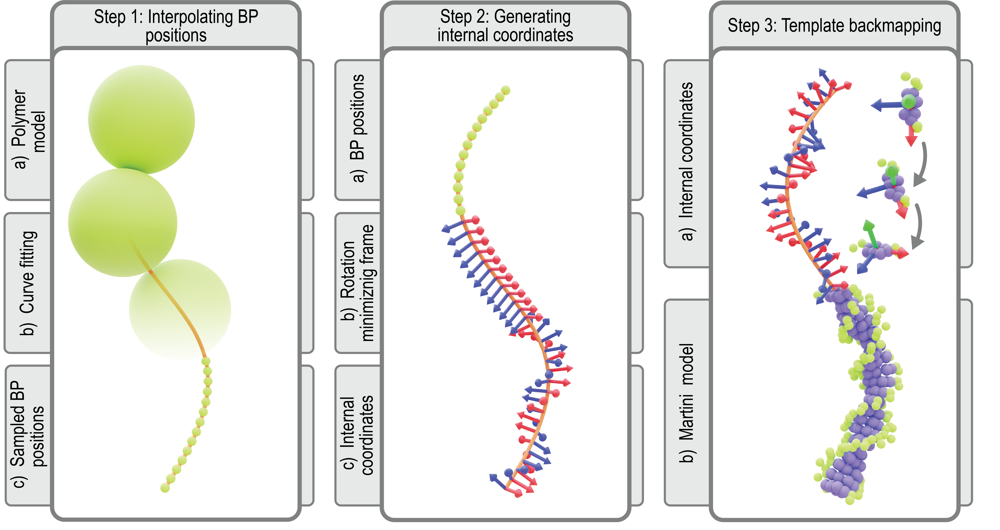
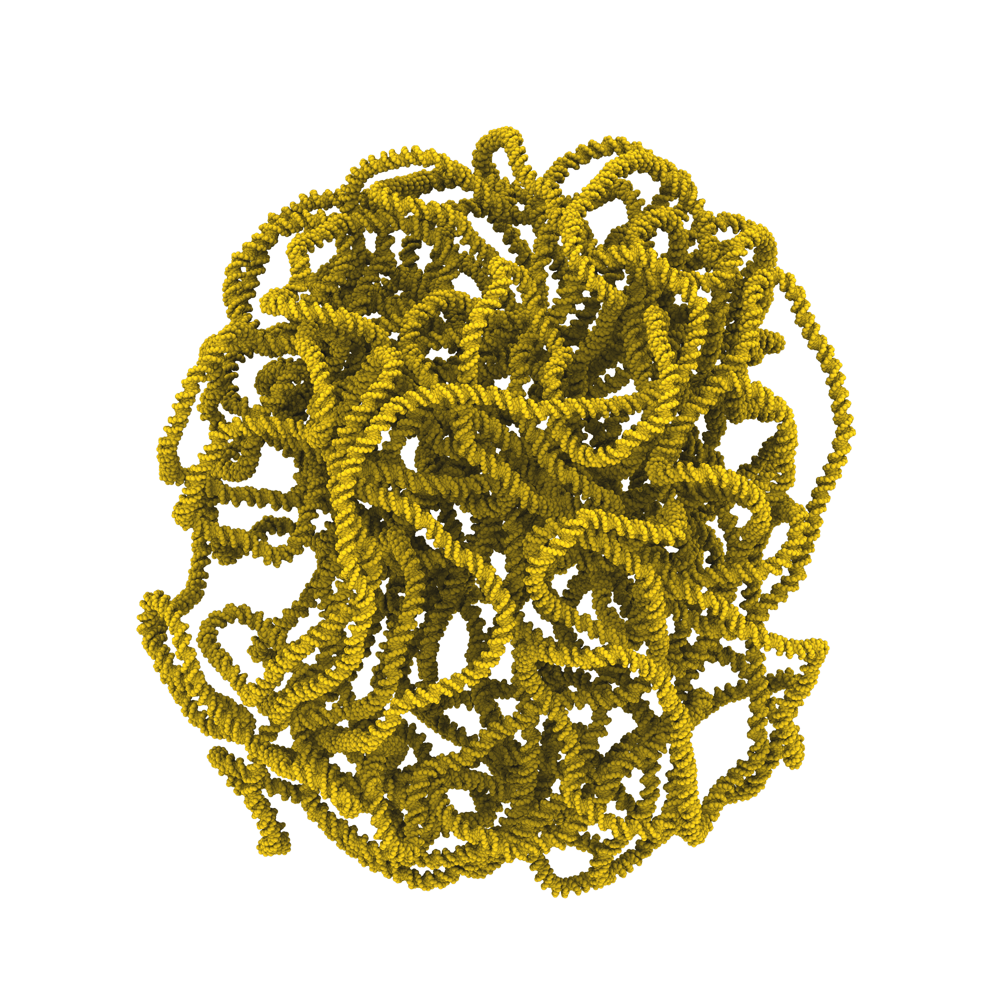
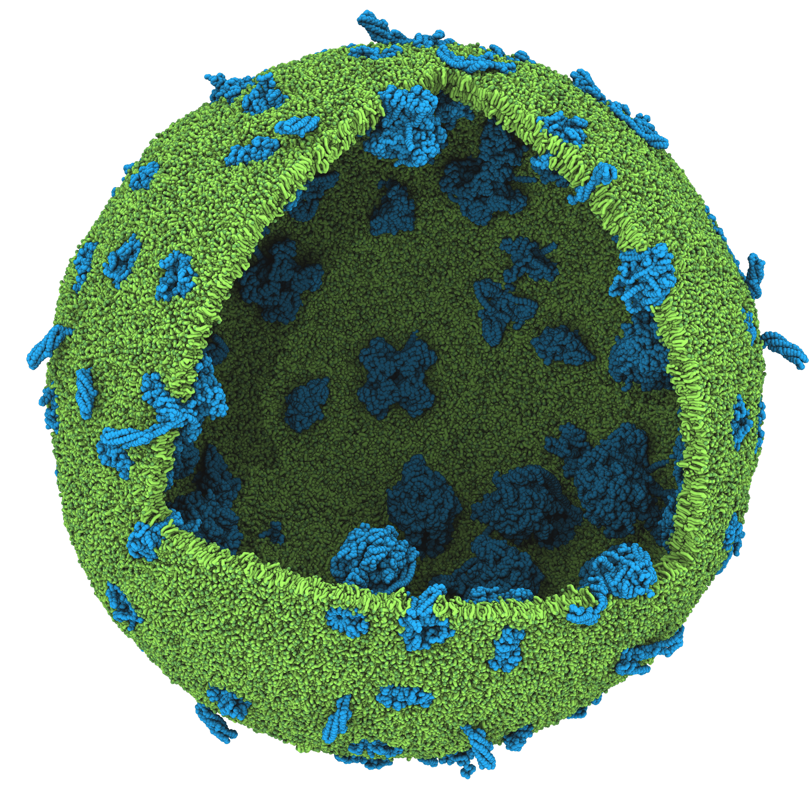
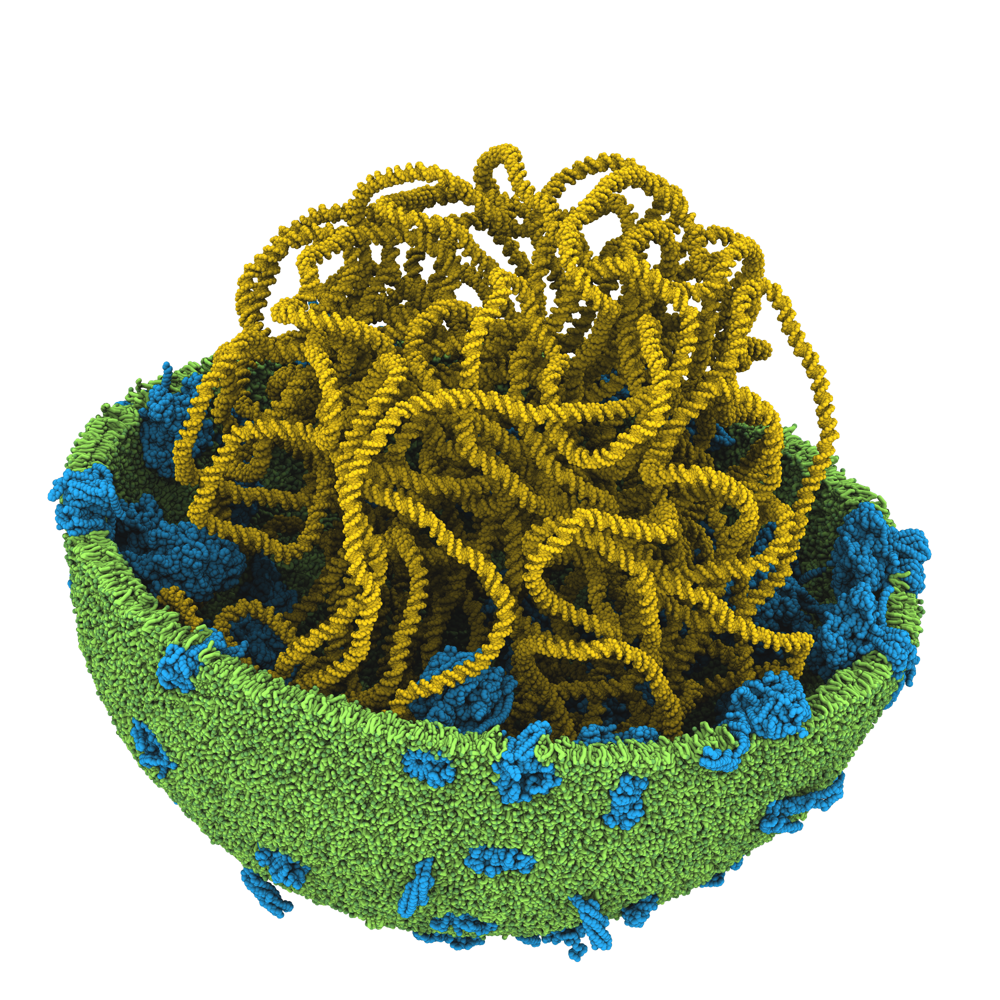
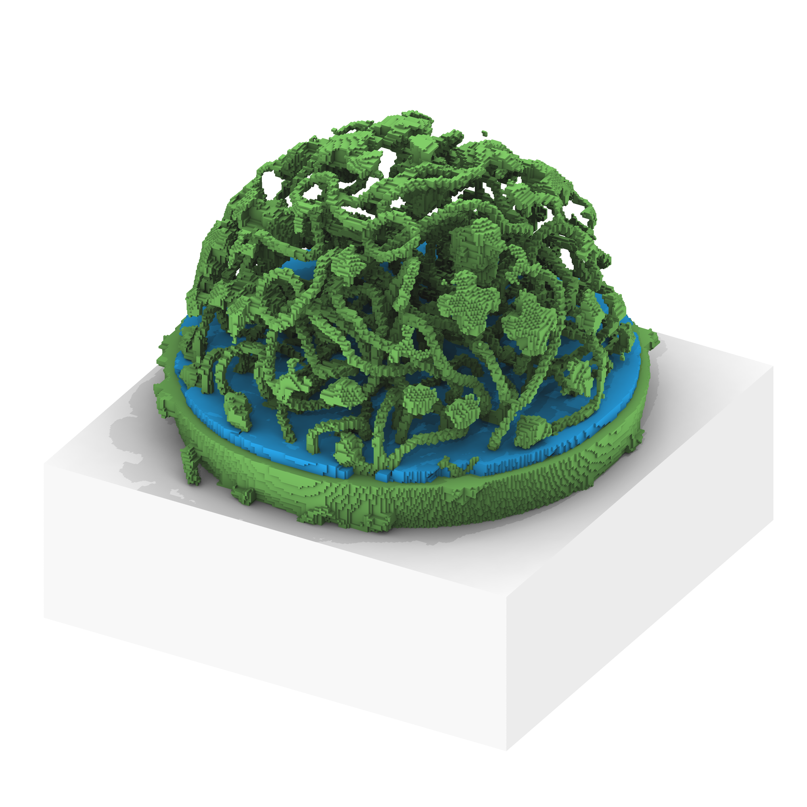
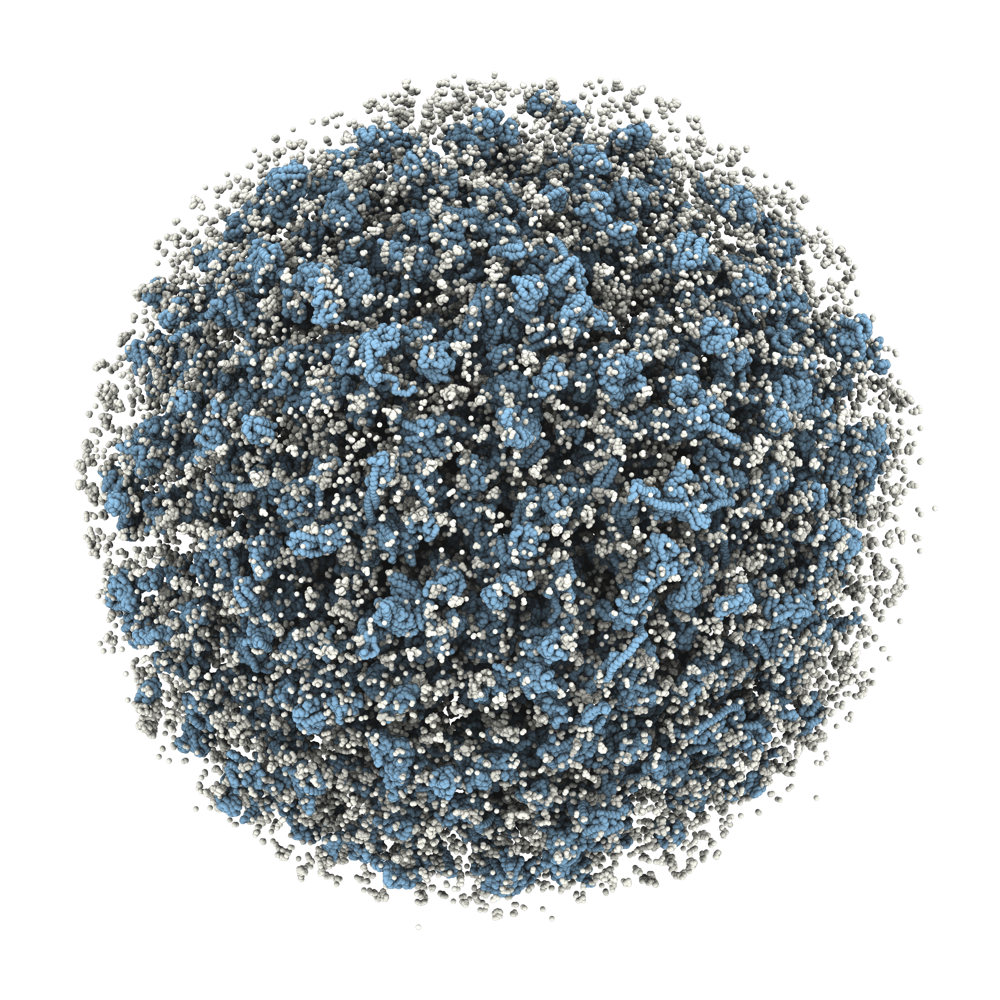
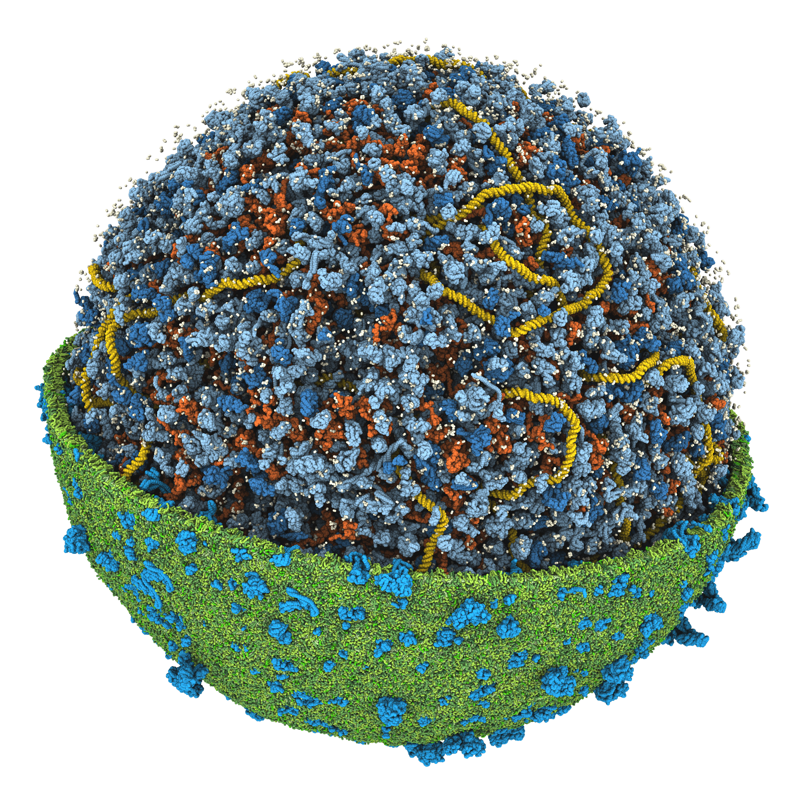

# Tutorial VI: Constructing a Martini Cell Model

> **Time:** ~30 minutes <br>
> **Software:** _GROMACS 2024.3_ · _bentopy_ · _polyply_ · _TS2CG_ · _martinize2_ · _VMD 2_ <br>

The previous tutorials introduced the Martini CG force field[^martini3] and the ecosystem
of tools for building complex coarse-grained models. In this tutorial we bring
them together to construct a full cell model[^cell], based on the JCVI-Syn3A minimal
bacterium.

The model has three main components:

- A **chromosome**: a 20 kbp toy genome with a 3D structure obtained from
  bTreeChromo, and backmapped to Martini resolution with _polyply_[^polyply].
- A **cell envelope**: a spherical lipid membrane containing a representative
  subset of the Syn3A membrane proteins, built with _TS2CG_[^TS2CG].
- A **cytosol**: the full Syn3A proteome and metabolome[^metabolome] at counts
  scaled down from experimental proteomics and metabolomics data, packed into
  the cytosolic space with _bentopy_[^bentopy].

We combine these into a single whole-cell model and run a short MD simulation
with _GROMACS_[^gromacs].

---

### Overview

| #   | Step                        | Tool        |
| :-: | :---                        | :---        |
| 1   | Prepare the chromosome      | _`polyply`_ |
| 2   | Build the cell envelope     | _`TS2CG`_   |
| 3   | Pack the cytosol            | _`bentopy`_ |
| 4   | Simulate the assembled cell | _`GROMACS`_ |

To start this tutorial, navigate to the respective folder in the workshop
repository.

```sh
cd 06_martini_cell
```

---

## 1. Chromosome

There are no Martini 3 DNA parameters yet, so we cannot parameterize the
chromosome properly. Instead we provide a placeholder as a `chromosome.gro`
and `chromosome.itp` pair. Its bonded terms follow the Martini 2 DNA geometry,
so the shape is right, but every bead shares one generic type and the
non-bonded interactions are not chemically meaningful.

Because `chromosome.itp` is a rather large file, it is included as a compressed file: `chromosome.itp.tar.gz`. You can decompress it as follows.

```sh
tar -xvzf chromosome.itp.tar.gz
```

The chromosome model coordinates were created by backmapping a mesoscale
polymer model. A one-bead-per-10-bp structure from bTreeChromo is resampled by
polyply along a periodic B-spline at base-pair spacing and fitted with Martini
base-pair templates (Figure 1). <br><br>

<div align="center">

<br>
<sub><i>Figure 1. Backmapping protocol. Martini-resolution coordinates are generated from a mesoscale polymer model.</i></sub>
</div> <br>

Inspect `chromosome.gro` in VMD before continuing. It should look similar to
Figure 2.

<div align="center">

<br>
<sub><i>Figure 2. Backmapped Martini model of the chromosome.</i></sub>
</div>

---

## 2. Cell envelope

The Syn3A cell is approximately spherical, so we model the cell membrane as
a spherical bilayer scaled to enclose the chromosome. The mesh is specified
in the triangulated surface file `sphere.tsi`, and the lipid composition
(based on experimental lipidomics data) is listed in the TS2CG settings
file `input.str`.

The membrane proteins are a representative subset of the Syn3A proteome:
ATP synthase, a proton symporter, SecDF, PtsG, a potassium transporter,
and an uncharacterized gene (JCVISYN3A_0005). Their structures are
provided in `structures/membrane_proteins/`.

### Pointillism

We first subsample the mesh to generate enough points to place the lipids and proteins:

```sh
TS2CG PLM -TSfile sphere.tsi -Mashno 2 -bilayerThickness 2.0
```

### Build the membrane

We use TS2CG to place the lipids and proteins and build the cell envelope:

```sh
TS2CG PCG -str input.str -LLIB Martini3.LIB -defout membrane
```

Inspect `membrane.gro` in VMD before continuing.

```sh
vmd membrane.gro
```

<div align="center">

<br>
<sub><i>Figure 3. Cell envelope. Spherical membrane with embedded proteins from the Syn3A proteome.</i></sub>
</div>


---

## 3. Cytosol

The space between the chromosome and the envelope is our cytosol. We fill
it with proteins and metabolites[^metabolome] at physiological concentrations
using _bentopy_, with the chromosome and membrane as the scaffolding that
defines the packing volume.

### Merge the chromosome and envelope

Combine the two scaffolding structures. _Bentopy_ uses this merged model
to identify the available cytosolic space.

```sh
bentopy-merge chromosome.gro membrane.gro -o chromosome_membrane.gro
```

### Inspect the compartments

Generate a labeled voxel representation to see which compartments Bentopy
identifies:

```sh
bentopy-mask chromosome_membrane.gro --morph ddee -b labels.gro
```

The `--morph ddee` flag smooths the voxel mask built from the underlying points
using a sequence of dilation and erosion steps. This improves compartment
detection for unequilibrated models, where the packing can leave small gaps in
the mask.

The output prints a containment graph:

```text
Containment Graph with 3 components (component: nvoxels: rank):
└── [-2: 7942323: 3]
    └── [1: 1186249: 0]
        └── [-1: 4695428: 0]
```

Three compartments are identified. Label -1 is the inside of the vesicle
(the cytosolic space we want to pack). Label 1 is the space occupied by the
envelope and chromosome. Label -2 is the extracellular space.

Load `labels.gro` in VMD to verify visually. Select individual
compartments by atom name (quotes are needed for negative labels):

- `name "-1"` — cytosol.
- `name 1` — envelope and chromosome.
- `name "-2"` — outside.

### Create the cytosolic mask

Write out the cytosol compartment as a mask:

```sh
bentopy-mask chromosome_membrane.gro --morph ddee -l -1:cytosol_mask.npz
```

The accessible volume for proteins and metabolites in this model is
approximately 5 × 10⁵ nm³, or about 0.5 attoliters.

<div align="center">

| | |
| :--: | :--: |
|  |  |

<sub><i>Figure 4. Mask generation. Left: chromosome and envelope inside which the cytosol is packed. Right: mask generated by <code>bentopy-mask</code>, with occupied space (green), empty space inside the envelope (blue), and empty space outside (grey).</i></sub>

</div>

### Pack the cytosol

The provided `input.bent` file specifies the cytosolic composition. The
`[ space ]` block sets the 120 nm cubic packing volume. The
`[ compartments ]` block loads the mask we just wrote. The `[ segments ]`
block lists the proteins as absolute counts (scaled down from experimental
proteomics data) and the metabolites as molar concentrations (from
experimental metabolomics). A simplified excerpt:

```text
[ general ]
title     "Syn3A cytoplasm"

[ space ]
dimensions  120, 120, 120
resolution  0.5

[ includes ]
"martini_v3.0.0/martini_v3.0.0.itp"
"martini_v3.0.0/martini_v3.0.0_ffbonded_v2.itp"
...
"cytosolic_proteins.itp"
"chromosome.itp"

[ compartments ]
cytosol  from "cytosol_mask.npz"

[ segments ]
# Proteins (counts from proteomics)
002_monomer  2  from "structures/cytosolic_proteins/002_monomer.pdb"  in cytosol
003_monomer  1  from "structures/cytosolic_proteins/003_monomer.pdb"  in cytosol
...

# Metabolites (concentrations from metabolomics)
ATPH  0.00365M    from "structures/metabolites/ATPH.gro"  in cytosol
GLR   0.000956M   from "structures/metabolites/GLR.gro"   in cytosol
...
```

Pack the system:

```sh
bentopy-pack input.bent placements.json
```

Bentopy places 10⁴–10⁵ instances in seconds because collision detection
runs on a voxel grid, which makes cell-scale packing tractable.

Render the placement list into a structure and topology:

```sh
bentopy-render placements.json cytosol.gro -t cytosol.top
```

### Assemble the final cell

Merge the chromosome, envelope, and cytosol into one structure:

```sh
bentopy-merge chromosome_membrane.gro cytosol.gro -o cell.gro
```

Assemble the final `topol.top` by combining three pieces:

- The Martini 3 force field includes (particle definitions, ffbonded, ions,
  solvents, and the lipid classes matching the composition).
- `chromosome.itp` from Section 1 and the membrane-protein topologies used
  in Section 2.
- The `[ molecules ]` entries written by _TS2CG_ (`membrane.top`) and by
  `bentopy-render` (`cytosol.top`).

Copy the `[ molecules ]` blocks from `membrane.top` and `cytosol.top` in
order (envelope first, then cytosol) and prepend the chromosome. Write the
result as `topol.top`:

```text
; from cytosol.top (bentopy)
#include "martini_v3.0.0/martini_v3.0.0.itp"
#include "martini_v3.0.0/nucleotide_ffbonded.itp"
#include "martini_v3.0.0/martini_v3.0.0_ffbonded_v2.itp"

#include "martini_v3.0.0/martini_v3.0.0_ions_v1.itp"
#include "martini_v3.0.0/martini_v3.0.0_solvents_v1.itp"

#include "chromosome.itp"

#include "membrane_proteins.itp"
#include "martini_v3.0.0/martini_v3.0.0_sterols_v1.itp"
#include "martini_v3.0.0/martini_v3.0.0_phospholipids_CL_v2.itp"
#include "martini_v3.0.0/martini_v3.0.0_phospholipids_PC_v2.itp"
#include "martini_v3.0.0/martini_v3.0.0_phospholipids_PG_v2.itp"
#include "martini_v3.0.0/martini_v3.0.0_phospholipids_SM_v2.itp"

#include "cytosolic_proteins.itp"
#include "martini_v3.0.0/metabolites.itp"
#include "martini_v3.0.0/small_molecules.itp"
#include "martini_v3.0.0/martini_v3.0.0_fattyacids_v2.itp"

[ system ]
Martini Syn3A cell

[ molecules ]
; from Section 1
chromosome   1
; from membrane.top (TS2CG)
ATP_synthase X
...
POPC         X
SSM          X
...
; from cytosol.top (bentopy)
002_monomer  X
...
ATPH         X
NADH         X
...
```

The exact molecule counts (X) come directly from `membrane.top` and
`cytosol.top`.

<div align="center">

| | |
| :--: | :--: |
|  |  |

<sub><i>Figure 5. Final cell model. Left: cytosolic proteins packed inside the mask. Right: full cell with chromosome, envelope, and cytosol combined.</i></sub>

</div>

Visualize the cell model:

```sh
vmd cell.gro
```

---

## 4. Simulate the cell model

We will now simulate the cell with a short protocol. We minimize the packed
model in vacuum, solvate it, minimize again, then equilibrate and run a
production simulation.

The vacuum minimization comes first. TS2CG builds the bilayer compact so it
relaxes into a well-packed membrane, but the initial configuration has some
beads, mainly the lipids, overlapping more than they will at equilibrium. These
overlaps give high initial forces, and clearing them in vacuum resolves the
worst problems while the particle count is still low.

Minimizing before solvation helps in two smaller ways. Water would add forces
of its own to the minimization, and it would settle into the space the lipids
expand into as they relax. After the vacuum step we add water and minimize
again to settle the solute-water interface. Both minimizations run in double
precision, because the forces in a freshly packed cell can exceed what
single-precision GROMACS represents reliably.

Install the double-precision, non-MPI GROMACS build:

```sh
micromamba install "gromacs=2024.3=nompi_dblprec_*"
```

Run the vacuum minimization:

```sh
mkdir -p vacuum_em
gmx_d grompp -f mdp_files/em.mdp -c cell.gro -p topol.top \
             -o vacuum_em/em.tpr -maxwarn 1
gmx_d mdrun -v -deffnm vacuum_em/em
```

Solvate the relaxed structure:

```sh
bentopy-solvate -i vacuum_em/em.gro -o solvated_cell.gro -t topol.top \
                -s NA,CL:0.15M --charge neutral
```

Minimize again, still in double precision, now with solvent:

```sh
mkdir -p em
gmx_d grompp -f mdp_files/em.mdp -c solvated_cell.gro -p topol.top \
             -o em/em.tpr -maxwarn 1
gmx_d mdrun -v -deffnm em/em
```

With the cell minimized, switch to the CUDA single-precision GROMACS build
for equilibration and production:

```sh
micromamba install "gromacs=2024.3=nompi_cuda_h*"
```

Build an index file with separate groups for the chromosome, lipids,
solvent, and metabolites. These groups are used during equilibration and
production to couple each to a separate thermostat:

```sh
gmx make_ndx -f em/em.gro -o index.ndx << 'EOF'
name 1 Chromosome
r POPC DOPG CHOL TOCL SSM
name 145 Lipids
r W ION
name 146 Solvent
r NADH ACOA 10MG 10FG 5FTF DFAD COA NADPH UDPA NAD DNAD NADP THFG UDPF DGDPH GTPH GDPH DADPH DGTPH 5MG DATPH UDPG PA ADPH DFMN DRBF RBF FMN SAM DTDPH ATPH DUDP DAMP DCTP DTTP TPPH GMP CTP A3P UTP AMP DUTP DGUO DGMP DCDP DADO UDP CMP DUMP CDP GUO UMP ADO DCMP DTMP NICR SPER THD PRPP S7P URD CYD PRP DURD DCYD GN6P FBP PALP LTYR MN6P GL6P LTRP RI5P X5P F6P LARG MANA LLYS LPHE GUA LHIS G6P M6P G1P ADE DR1P DR5P 3GPP R5P R1P E4P URA DHAP 3PG LGLN LMET LLEU PEP NIC LGLU GL2P LILE LTHR LVAL LASP LSER LCYS LPRO G3P G3H LALA GLR ACEP DPP PYR LGLY LAC PO4 O2 NH4 MG K ACET ACEH
name 147 Metabolites
q
EOF
```

Equilibrate and run production:

```sh
# Equilibration
mkdir -p eq
gmx grompp -f mdp_files/eq.mdp -c em/em.gro -p topol.top -n index.ndx -o eq/eq.tpr -maxwarn 2
gmx mdrun -v -deffnm eq/eq

# Production
mkdir -p md
gmx grompp -f mdp_files/md.mdp -c eq/eq.gro -p topol.top -n index.ndx -o md/md.tpr
gmx mdrun -v -deffnm md/md
```

The cell model is simulated as a single system, and its components begin to
equilibrate with respect to one another. Over the trajectory the lipids diffuse
in the envelope and the packed cytosol relaxes around the chromosome.

<div align="center">
<video src="../figures/06_cell_trajectory.mp4" width="65%" controls></video>
<br>
<sub><i>Video 1. Simulation trajectory of the Martini cell model.</i></sub>
</div>

---

## References
[^martini3]: Souza, Paulo C. T., Alessandri, Riccardo, Barnoud, Jonathan, et
    al. Martini 3: a general purpose force field for coarse-grained molecular
    dynamics. _Nat. Methods_ **18**, 382–388. (2021)
    <https://doi.org/10.1038/s41592-021-01098-3>

[^cell]: Stevens, J. A., Bozoflu, M., Westendorp, M. S. S., Grünewald, L.,
    Brown, C. M., Bruininks, B. M. H., Grünewald, F., Luthey-Schulten, Z.,
    Lindahl, E., & Marrink, S. J. Emergent Organization in a Molecular Dynamics
    Simulation of a Bacterial Cell. Manuscript in preparation.

[^TS2CG]: Schuhmann, Fabian, Stevens, Jan A., Rahmani, Neda, Lindahl, Isabell,
    Brown, Chelsea M., Brasnett, Christopher, Anastasiou, Dimitrios, Vidal,
    Adrià Bravo, Geiger, Beatrice, Marrink, Siewert J., & Pezeshkian, Weria.
    TS2CG as a Membrane Builder. _J. of Chem. Theory and Comput._ **21** (18),
    9136-9146. (2025) <https://doi.org/10.1021/acs.jctc.5c00833>

[^polyply]: Grünewald, Fabian, Alessandri, Riccardo, Kroon, Peter C.,
    Monticelli, Luca, Souza, Paulo C. T. & Marrink, Siewert J. Polyply; a
    python suite for facilitating simulations of macromolecules and
    nanomaterials. _Nat Commun_ **13**, 68. (2022)
    <https://doi.org/10.1038/s41467-021-27627-4>

[^bentopy]: Westendorp, Marieke S. S., Stevens, Jan A., Brown, Chelsea M.,
    Dommer, Abigail C., Wassenaar, Tsjerk A., Bruininks, Bart M. H., & Marrink,
    Siewert J. Compartment-guided assembly of large-scale molecular models with
    bentopy. _Protein Science_, **35**(3), e70480. (2026)
    <https://doi.org/10.1002/pro.70480>

[^gromacs]: Abraham, Mark James, Murtola, Teemu, Schulz, Roland, Páll,
    Szilárd, Smith, Jeremy C., Hess, Berk, & Lindahl, Erik. GROMACS: High
    performance molecular simulations through multi-level parallelism from
    laptops to supercomputers. _SoftwareX_ **1–2**, 19–25. (2015)
    <https://doi.org/10.1016/j.softx.2015.06.001>

[^metabolome]: Brasnett, Christopher, Brown, Chelsea M., Grünewald, Linus,
    Stevens, Jan A., & Marrink, Siewert J. (2026). Martini 3 Metabolome.
    Journal of Chemical Theory and Computation, 22(11), 5858-5866.
    <https://doi.org/10.1021/acs.jctc.6c00463>
