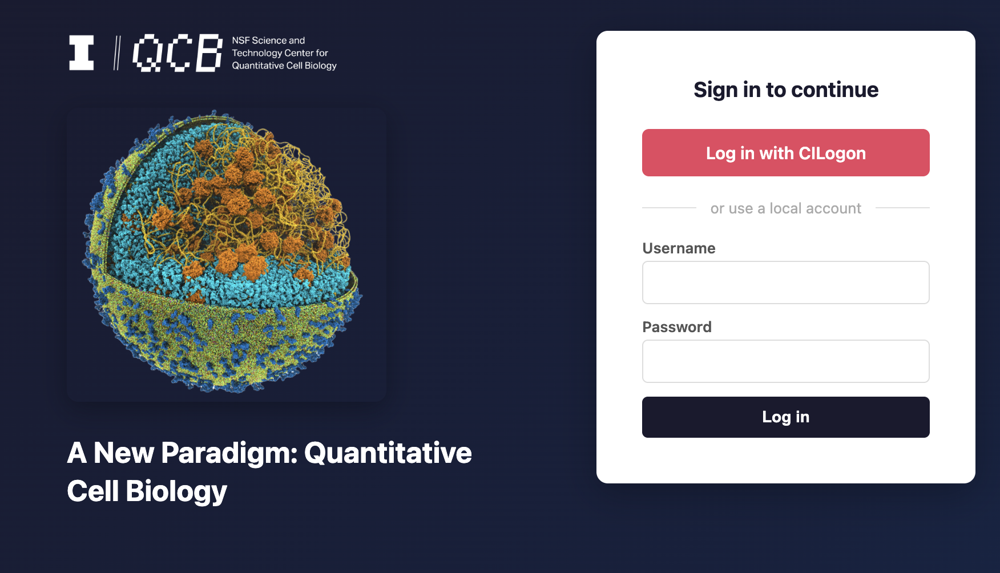
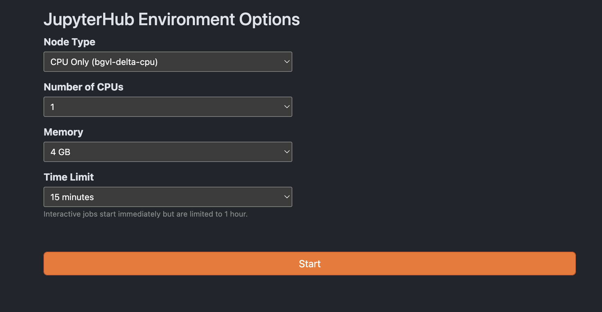
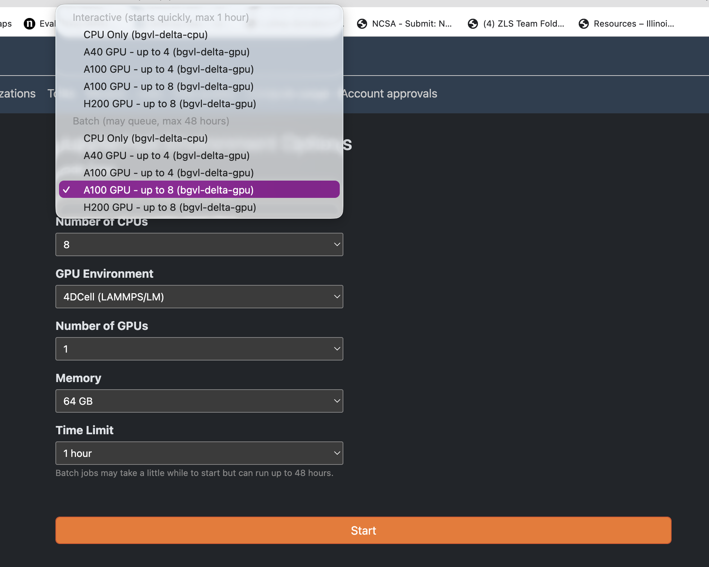
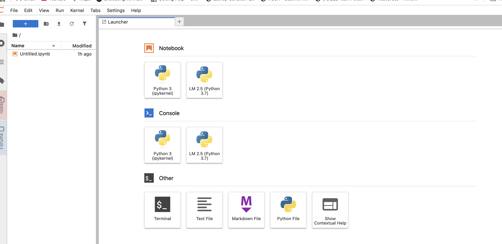

# QCB Delta Gateway setup

The Jupyter tutorials run through the **QCB Delta Gateway** — a JupyterHub front-end on Delta. Set it up once, then open notebooks from any module.

**Step 1: Open an SSH tunnel**

Open a terminal on your laptop and run the following command. Replace `USERNAME` with your NCSA username:

```bash
ssh -L 8000:dt-svc-bbkw01.hsn.cm.delta.internal.ncsa.edu:8000 USERNAME@login.delta.ncsa.illinois.edu
```

You will be prompted for your **NCSA password** and **two-factor authentication (2FA)**. Once you're in, **leave the terminal open** — closing it tears down the tunnel.

**Step 2: Open the gateway in your browser**

Once the SSH tunnel is up, open this URL in any browser on your laptop:

```
https://dt-svc-bbkw01.delta.ncsa.illinois.edu:8000/hub/org/
```

Click on the **QCB Gateway** tab. You should see the **JupyterHub login page** for the QCB Delta Gateway.



Click **CI Logon** and sign in with your NCSA Delta credentials.



> [!NOTE]
> If your Gateway account is not approved, please ask the admin, Alfia Parvez, at alfiap@illinois.edu to approve it first.

**Step 3: Allocate resources**

After logging in, the Gateway will ask you to choose compute resources before starting your Jupyter session.

**CME, RDME, DNA, Martini tutorials** — use:

| Setting | Value |
| --- | --- |
| **Allocation** | **A100 GPU - up to 8 (bgvl-delta-gpu)** — choose the **Batch** (non-interactive) option, not Interactive |
| **Number of CPUs** | **8** |
| **GPU Environment** | **4DCell (LAMMPS/LM)** |
| **Number of GPUs** | **1** |
| **Memory** | **64 GB** |
| **Time limit** | **4 hours** |

**4D Whole Cell (4DWCM) production runs** use SSH + Slurm on Delta, not the Gateway. See [`4DWCM/4DWCM_Simulation/README.md`](4DWCM/4DWCM_Simulation/README.md).

> [!IMPORTANT]
> Always select the **non-interactive** session with the **8-GPU** (`A100 GPU - up to 8 (bgvl-delta-gpu)`) option.



Click **Start**.

Jobs may take a short time to queue before your session opens. Once the server is ready, clone the repository from the notebook that starts automatically (Step 4).

**Step 4: Clone the repository**

When your Jupyter session starts, an **Untitled.ipynb** notebook will already be open in JupyterLab.



In a **code cell**, run:

```python
!git clone https://github.com/Luthey-Schulten-Lab/SummerSchool_2026.git
%cd SummerSchool_2026
```

- **Tutorials:** open the tutorial folder for respective module and follow its `README.md`

---

**Step 5 (optional): Minecraft world from 4DWCM — terminal**

After a **completed 4DWCM Slurm run**, your group leader moves `4dwcm_run` into `/projects/bgvl/Groups_4DWCM/Group1` (or `Group2` / `Group3`). Any group member can build the world from a **Delta login node** or **Gateway terminal** (no Jupyter needed):

```bash
bash /projects/bgvl/alfiaparvez/SummerSchool_2026/4DWCM/minecraft/run_generate_world.sh --group Group1
```

Output goes to **your own folder**:

```
/projects/bgvl/$USER/minecraft/Minecraft_Cell_Animation_World/
```

**Demo** (before your group run finishes):

```bash
bash /projects/bgvl/alfiaparvez/SummerSchool_2026/4DWCM/minecraft/run_generate_world.sh --shared
```

**Your own run** (still under `/projects/bgvl/$USER/4dwcm_run/`):

```bash
bash /projects/bgvl/alfiaparvez/SummerSchool_2026/4DWCM/minecraft/run_generate_world.sh
```

Copy that `Minecraft_Cell_Animation_World` folder to your laptop Minecraft `saves/` folder to play.

Shared env (instructor, once): `bash .../setup_shared_env.sh` → `/projects/bgvl/SummerSchool_2026/conda-envs/minecraft`

