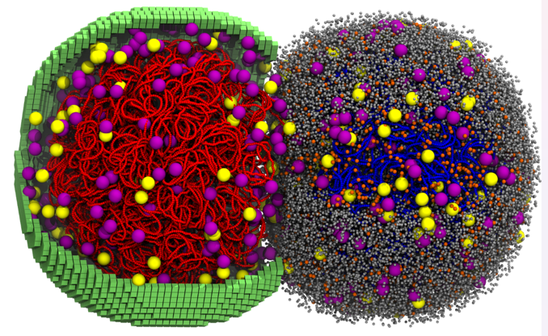
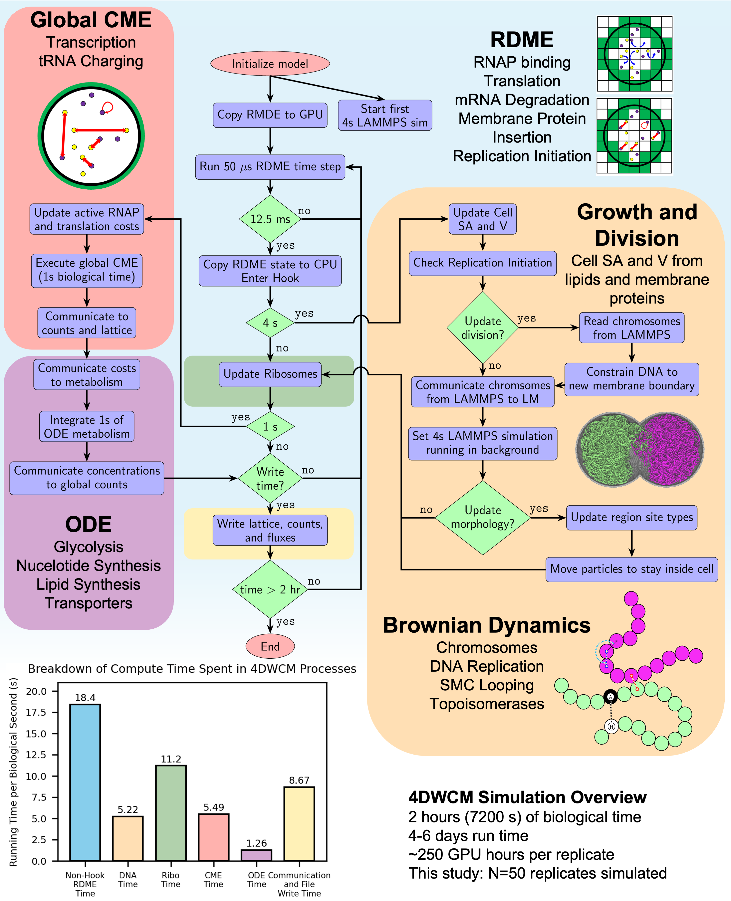
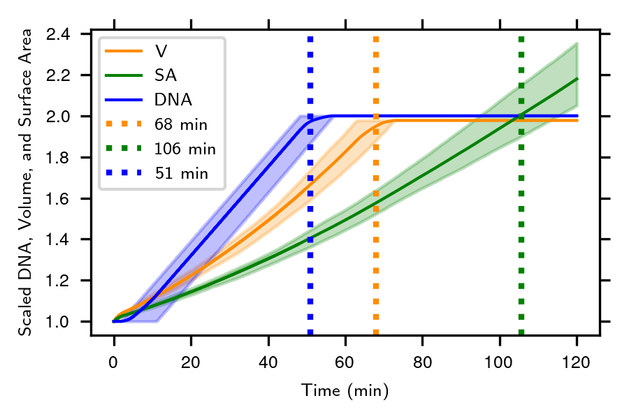

# 4D Whole-Cell Model (4DWCM) of *JCVI-syn3A*

## Description:

| | &nbsp; &nbsp; &nbsp; &nbsp; &nbsp; &nbsp; &nbsp; &nbsp; &nbsp; &nbsp; &nbsp;|
|---|---:|
| In the ***4D Whole-Cell Model (4DWCM) of JCVI-syn3A*** tutorial, you will explore the trajectories of the most comprehensive computational model of a living minimal cell. The 4DWCM integrates four numerical algorithms (RDME-CME-ODE-BD) to simulate every molecular event during the entire 105-minute division cycle of the genetically minimal bacterium JCVI-syn3A. You will analyze and visualize spatially heterogeneous trajectories from pre-computed simulations, examining how reaction-diffusion master equations (RDME) on GPUs capture the spatial organization of cellular processes including protein synthesis, mRNA degradation, and complex assembly. | <br><em>Source: Thornburg et al., 2025</em> |

*This tutorial was prepared for the STC-QCB Summer School 2026.*

## Outline:

1. Set up the tutorial on QCB Delta Gateway
2. Open the gateway in your browser
3. Allocate compute resources on the Gateway
4. Open the shared workshop folder on bgvl
5. Get familiar with RDME — Tutorials 1 and 2
6. Analyze pre-computed 4DWCM trajectories
7. Model overview and hybrid simulation flowchart
8. Geometry: surface area, volume and DNA doubling
9. Complex assembly and active counts
10. Proteomics relative to replication initiation
11. Whole-cell energetics: ATP production and expenditure

## 1. Set up the tutorial on QCB Delta Gateway

> You are in the **RDME** module. Complete steps 1–4 below once to set up the Gateway, then work through sections 5–11 in order.

See the [Getting Started: QCB Delta Gateway](../README.md#getting-started-qcb-delta-gateway) section in the top-level README for full instructions. In short:

Open a terminal on your laptop and run the following command. Replace `USERNAME` with your NCSA username:

```bash
ssh -L 8000:dt-svc-bbkw01.hsn.cm.delta.internal.ncsa.edu:8000 USERNAME@login.delta.ncsa.illinois.edu
```

You will be prompted for your **NCSA password** and **two-factor authentication (2FA)**. Once you're in, **leave the terminal open** — closing it tears down the tunnel.

## 2. Open the gateway in your browser

Once the SSH tunnel is up, open this URL in any browser on your laptop:

```
https://dt-svc-bbkw01.delta.ncsa.illinois.edu:8000/hub/org/
```

Click on the **QCB Gateway** tab. You should see the **JupyterHub login page** for the QCB Delta Gateway.


Click **CI Logon** and sign in with your NCSA Delta credentials.


> [!NOTE]
> If your Gateway account is not approved, please ask the admin, Alfia Parvez, at alfiap@illinois.edu to approve it first.

After logging in, choose compute resources before your Jupyter session starts (see **Step 3** below).

## 3. Allocate compute resources on the Gateway

After logging in, choose the following settings on the resource allocation form (see [Step 3 in the top-level README](../README.md#getting-started-qcb-delta-gateway) for all screenshots):

| Setting | Value |
| --- | --- |
| **Allocation** | **A100 GPU - up to 8 (bgvl-delta-gpu)** — **Batch** (non-interactive) |
| **Number of CPUs** | **8** |
| **GPU Environment** | **4DCell (LAMMPS/LM)** |
| **Number of GPUs** | **1** |
| **Memory** | **64 GB** |
| **Time limit** | **4 hours** |


Click **Start** and wait for your session to launch.

## 4. Open the shared workshop folder on bgvl

The Gateway runs on the **bgvl** allocation. All tutorial materials and pre-computed 4DWCM data live in one shared read-only folder — **no copying required**.

When your Jupyter session starts, an **Untitled.ipynb** notebook will already be open in JupyterLab.


In a **code cell**, go to the workshop folder:

```python
%cd /projects/bgvl/SummerSchool_2026/RDME
```

In the Jupyter file browser, open **`/projects/bgvl/SummerSchool_2026/RDME/`**. You should see:

```
/projects/bgvl/SummerSchool_2026/RDME/
├── TutR1_Bimolecule/       # spatial bimolecular RDME (§5)
├── TutR2_GIP/              # spatial GIP RDME (§5)
├── 4DWCM_analysis.ipynb    # ensemble analysis (§6)
├── analysis_scripts/       # Python helpers + sim_properties_1_9.pkl
├── data/                   # 50 pre-computed counts_and_fluxes.*.csv files
├── trajectory/             # MinCell_1–4.lm for VMD
└── readme.md               # you are here
```

Since the computational cost of running the whole-cell model is very high, we analyze **pre-computed trajectories** stored in `data/` and `trajectory/` above. The original data are archived on [Zenodo:15579159](https://zenodo.org/records/15579159).

> [!NOTE]
> For RDME notebooks, select the **LM 2.5 (Python 3.7)** kernel when prompted.

Analysis plots are written to your personal results folder so users do not overwrite each other:

```python
import os
os.makedirs(f'/projects/bgvl/{os.environ["USER"]}/SummerSchool_2026/RDME/results', exist_ok=True)
```

---

## 5. Get familiar with RDME — Tutorials 1 and 2

Work through these notebooks **in order** before the 4DWCM analysis. After `%cd` to the workshop folder (§4), open the subfolders below in the **Jupyter file browser**.

### TutR1 — Bimolecular reactions in RDME

In the Jupyter file browser, open **`/projects/bgvl/SummerSchool_2026/RDME/TutR1_Bimolecule/`** and run:

| Order | Notebook | Description |
| --- | --- | --- |
| 1 | [`TutR1.1_bimolecular_uni.ipynb`](TutR1_Bimolecule/TutR1.1_bimolecular_uni.ipynb) | Uniform bimolecular reaction on an RDME lattice |
| 2 | [`TutR1.2_bimolecular_polardistribute.ipynb`](TutR1_Bimolecule/TutR1.2_bimolecular_polardistribute.ipynb) | Polar distribution of reactants in RDME |

### TutR2 — Genetic information processing in RDME

In the Jupyter file browser, open **`/projects/bgvl/SummerSchool_2026/RDME/TutR2_GIP/`** and run:

| Notebook | Description |
| --- | --- |
| [`TutR2_GeneticInfoProcessing.ipynb`](TutR2_GIP/TutR2_GeneticInfoProcessing.ipynb) | Spatial genetic information processing with RDME |

To run a cell, press **Shift+Enter** or **Ctrl+Enter**. To run the entire notebook, click **Run → Run All Cells**.

---

## 6. Analyze pre-computed 4DWCM trajectories

In the Jupyter file browser, open [`4DWCM_analysis.ipynb`](4DWCM_analysis.ipynb) in **`/projects/bgvl/SummerSchool_2026/RDME/`** (navigate there with `%cd` as in §4) to explore ensemble averages from 50 pre-computed whole-cell trajectories. Sections 7–11 below walk through the key results shown in that notebook.

For VMD visualization of spatial trajectories, see [vmd_guide.md](vmd_guide.md).

---

## 7. Model Overview and Hybrid Simulation Flowchart

The 4DWCM [1] integrates four numerical algorithms so that every molecular event of a living minimal cell can be followed for its entire 105-min division cycle:

1. A **reaction-diffusion master-equation (RDME) solver** on the GPU advances Brownian motion and local reactions in 10 nm lattice voxels with 50 µs steps. Every 12.5 ms of biological time the RDME is paused and three auxiliary solvers are called:

2. A **global chemical-master-equation module** for low-copy, well-stirred reactions such as transcription initiation and tRNA charging

3. An **ordinary-differential-equation solver** for the 493-reaction metabolic network

4. A **Brownian-dynamics simulation** running on a second GPU that evolves the coarse-grained chromosome, replication forks and SMC-loop extrusion

**Figure 1:** 4DWCM hybrid simulation flowchart showing the integration of four numerical algorithms [^thornburg2025].



### 7.1 Initialization

* The simulation begins by **initializing the model**
* **RDME state is copied to the GPU**, and the first **4-second LAMMPS simulation** is launched (LAMMPS handles particle-level dynamics for DNA and its interaction with cell membrane)

### 7.2 Core Hybrid Loop (Iterates over 2 hours of biological time)

#### ⏱ Hook Timings:

* Every **RDME** timestep is 50 μs
* After every **12.5 ms**, the RDME state is:
  * **Copied back to the CPU**, and
  * **Hook routines are executed** to determine whether further biological updates are needed

* If **4 seconds** of simulation time have passed:
  * **Update Ribosomes** (to check translation states)

* If **1 second** of biological time has passed:
  * **Update Global CME** (for transcription and tRNA charging):
    * Update RNAP/translation costs
    * Execute **global CME for 1 s** of biological time
    * Communicate molecule usage back to **ODE metabolism module**
  * Run **ODE metabolism** (glycolysis, nucleotide/lipid synthesis)
  * **Communicate new concentrations** back to global counts

### 7.3 Spatial Cell Modeling with Brownian Dynamics

* When **growth or division** is triggered:
  * **Cell surface area and volume (SA/V)** are updated from lipid/protein data
  * If a new division event occurs:
    * Read **chromosomes from LAMMPS**
    * **Constrain DNA to daughter cell boundaries**
    * Update the **morphology** of the cell (region site types)
    * **Move particles to stay inside** the membrane
  * **New 4-second LAMMPS simulation** is triggered in the background

### 7.4 Output and Termination

* Every second, the workflow checks whether **data should be written**
* If simulation time exceeds **2 biological hours**, the run ends
* If not, it loops back to the next 50 μs RDME step

### 7.5 Functional Process Handling 

| Module                       | Processes Handled                                     |
| ---------------------------- | ----------------------------------------------------- |
| **Global CME**               | Transcription, tRNA charging, cost propagation       |
| **ODE**                      | Metabolism, nucleotide & lipid synthesis             |
| **RDME**                     | Translation, protein insertion, mRNA degradation     |
| **Brownian Dynamics/LAMMPS** | DNA replication, chromosome movement, topoisomerases |
| **Free-DTS**                 | Cell morphology                                       |

---

## 8. Geometry: Surface Area, Volume and DNA Doubling

The simulated cell begins as a sphere of radius 200 nm and grows isotropically until its volume doubles (~68 min), after which an invagination appears and constriction proceeds until cytokinesis at ~106 min. Membrane synthesis continues throughout, so surface area does not plateau until division is complete. DNA replication initiates after a short B-period of ~5 min, finishes at ~51 min, and the combined timing of DNA and membrane growth predicts an ori:ter ratio of 1.28, remarkably close to the experimental value of 1.21. The staggered vertical lines in the figure below mark, respectively, the mean times at which DNA, volume and surface area have doubled in the 50-cell ensemble.

**Figure 2:** Cell geometry dynamics showing surface area, volume, and DNA doubling over time.



## 9. Complex Assembly and Active Counts

By the time the average cell reaches the division point (~105 min) it contains 881 ribosomes, 176 RNA polymerases and 192 degradosomes. Because the subunits of RNAP and the degradosome are placed unassembled at t = 0, these complexes self-assemble within the first biological second and then track gene expression demand throughout the cycle. Roughly 55% of ribosomes are translating, 70% of RNAP are elongating, and 10% of degradosomes are actively degrading at any instant, values that fall within the broad ranges measured for bacteria with richer proteomes.

**Figure 3:** Complex assembly statistics and active counts for the first 5 trajectories.


## 10. Proteomics Relative to Replication Initiation

Replication typically starts five minutes after birth but can be delayed to as late as 46 min in outlier cells.  When the same cells are inspected at 105 min, the distribution of the "scaled protein count" (protein copies at 105 min divided by the initial copy number) peaks just below two, revealing that the model falls slightly short of perfect protein doubling for the average gene, especially for long, slow-translated proteins . The corresponding mRNA distribution is broader—owing to stochastic transcription–degradation—but its median also lies beneath 2, confirming that underproduction of transcripts is a principal cause of the modest protein shortfall.

**Figure 4:** Protein distribution relative to replication initiation timing.


## 11. Whole-Cell Energetics: ATP Production and Expenditure

The figure below parses every ATP-consuming reaction each second of the cycle. Averaged over the population, the biosynthetic and maintenance costs of translation, transcription, transport, lipid insertion and other processes nearly match the ATP made by glycolysis and substrate-level phosphorylation; a narrow surplus keeps the nucleotide triphosphate pool from depletion. Because DNA synthesis draws ATP only while forks are active, a transient shoulder appears in the fractional-cost curve during replication. The shoulder broadens into a 60–90 min plateau because the one cell that delayed initiation until 46 min remained in C-period after its peers had already finished. In single-cell traces (Subfigure C) the ATP demand fluctuates sharply with bursts of gene expression and septal growth, whereas the population mean appears smooth, highlighting the role of stochastic expression in metabolic load balancing.

**Figure 5:** ATP production and expenditure analysis showing whole-cell energetics.


## References
[^thornburg2025]: Thornburg, Z.R. et al. (2025) 'Bringing the genetically minimal cell to life on a computer in 4D', bioRxiv, p. 2025.06.10.658899. Available at: https://doi.org/10.1101/2025.06.10.658899.
