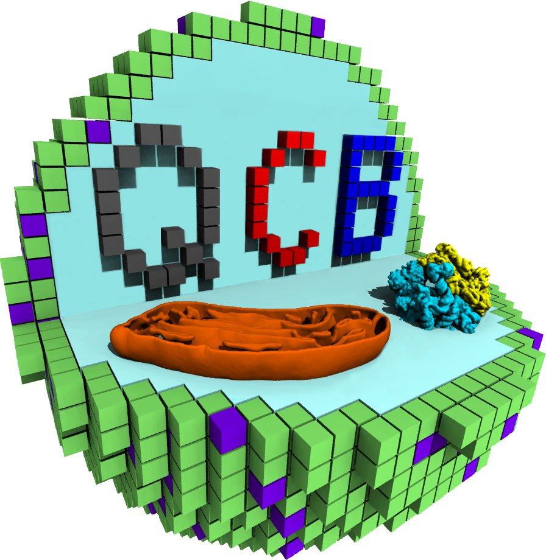

# STC-QCB Summer School 2026  *Modeling the Minimal Bacterial Cell JCVI-Syn3A*

<table>
<tr>
<td width="75%" valign="top">

**Welcome to the STC-QCB Summer School 2026!**

These tutorials are part of the 2026 annual summer school ([Full program information here](https://qcb.lineupr.com/2026-summer-school/schedule)) organized by the NSF Science and Technology Center for Quantitative Cell Biology (STC-QCB) at UIUC.

</td>
<td width="25%" align="center" valign="top">

</td>
</tr>
</table>

### Getting started

The workshop is split into modules, where each module focuses on a different method in wholce-cell modelling. Work through them in the order below, opening a module to begin its session:

|   Day   | Module                                   | Topic                                                                                               |
| :------ | :--------------------------------------- | :-------------------------------------------------------------------------------------------------- |
| Mon–Tue | [Martini](Martini/README.md)             | The Martini ecosystem of tools and whole-cell Martini simulations, ending in a toy JCVI-Syn3A cell. |
| Wed AM  | [DNA](DNA/README.md)                     | Simulating a bacterial chromosome.                                                                  |
| Wed PM  | [Lattice Microbes](LM/README.md)         | Stochastic whole-cell simulations (CME and RDME).                                                   |
| Thu AM  | [CME-ODE](CMEODE_WCM/README.md)          | CME-ODE model of the minimal cell.                                                                  |
| Thu PM  | [4DWCM](4DWCM/README.md)                 | 4D whole-cell modeling with Lattice Microbes.                                                       |

Before the first session, set up your Delta access and confirm you can log in:

- **[QCB Gateway setup](QCB_Gateway_setup.md)** — set up and log in to the QCB Delta Gateway. Covers the SSH tunnel, login, resource allocation, and cloning this repository. Start here.
- **[vmd guide](vmd_guide.md)** — log in to the Open OnDemand Desktop for VMD visualization.

### Useful links

- [STC-QCB website](https://qcb.illinois.edu/): the center behind the school, and its other events.
- [Delta documentation](https://docs.ncsa.illinois.edu/systems/delta/en/latest/): the NCSA cluster the tutorials run on.
- [Jupyter basics](https://www.dataquest.io/blog/jupyter-notebook-tutorial/): the notebook interface, for the modules that run in Jupyter.
- [VMD](https://www.ks.uiuc.edu/Research/vmd/): the visualization program used across the modules.

>[!NOTE]
> These tutorials were written by teaching assistants: Abner Apsley (LM), Enguang Fu (4DWCM and CME-ODE), Andrew Maytin (DNA), and Marieke Westendorp and Jan Stevens (Martini). Technical infrastructure and support by Alfia Parvez.
